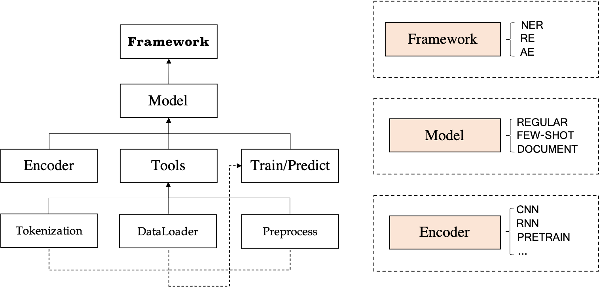

<p align="center">
    <a href="https://github.com/zjunlp/deepke"> </a>
<p>
<p align="center">  
    <a href="http://121.36.172.141">
        
    </a>
</p>

<h4 align="center">
    <p>
        <b>简体中文</b> |
        <a href="https://github.com/zjunlp/DeepKE/blob/test_new_deepke/README_ENGLISH.md">English</a> 
    <p>
</h4>

<h3 align="center">
    <p>基于深度学习的开源中文知识图谱抽取框架</p>
</h3>

DeepKE 提供了多种知识抽取模型。

## 在线演示
在线演示 [demo](http://121.36.172.141/)


## 模型架构
Deepke的架构图如下所示

<h3 align="center">
    
</h3>

DeepKE包括了三个模块，可以进行关系抽取、实体命名识别以及属性抽取的任务，在各个模块下包括各自的子模块。其中关系抽取模块就有常规模块、文档级抽取模块以及低资源少样本模块。在每一个子模块中，分为分词、预处理等的一个工具集合，以及编码和训练预测部分。


## 快速上手

1. RE

   关系抽取是从非结构化的文本中抽取出实体之间的关系，以下为几个样式范例，数据为csv文件：

   |                        Sentence                        | Relation |    Head    | Head_offset |    Tail    | Tail_offset |
   | :----------------------------------------------------: | :------: | :--------: | :---------: | :--------: | :---------: |
   | 《岳父也是爹》是王军执导的电视剧，由马恩然、范明主演。 |   导演   | 岳父也是爹 |      1      |    王军    |      8      |
   |  《九玄珠》是在纵横中文网连载的一部小说，作者是龙马。  | 连载网站 |   九玄珠   |      1      | 纵横中文网 |      7      |
   |  提起杭州的美景，西湖总是第一个映入脑海的词语。     | 所在城市 |    西湖    |      8      |    杭州    |      2      |
   
   具体流程请进入详细的README中，RE包括了以下三个子功能
   
   **[STANDARD](https://github.com/zjunlp/deepke/blob/test_new_deepke/example/re/standard)** ： 
   常规模块为常用的深度学习模型，有CNN、RNN、Capsule、GCN、Transforemer以及预训练模型，可进入其目录，修改数据集以及conf文件夹下的目录，```python run.py```即可训练，```python predict.py```即可预测。
   
   FEW-SHORT
   
   DOCUMENT

2. NER

   数据为txt文件，样式范例为：

   |                           Sentence                           |           Person           |   Location   |          Organization          |
   | :----------------------------------------------------------: | :------------------------: | :----------: | :----------------------------: |
   | 本报北京9月4日讯记者杨涌报道：部分省区人民日报宣传发行工作座谈会9月3日在4日在京举行。 |            杨涌            |   北京，京   |            人民日报            |
   | 《红楼梦》是中央电视台和中国电视剧制作中心根据中国古典文学名著《红楼梦》摄制于1987年的一部古装连续剧，由王扶林导演，周汝昌、王蒙、周岭等多位红学家参与制作。 | 王扶林，周汝昌，王蒙，周岭 |      /       | 中央电视台，中国电视剧制作中心 |
   | 秦始皇兵马俑位于陕西省西安市，1961年被国务院公布为第一批全国重点文物保护单位，是世界八大奇迹之一。 |           秦始皇           | 陕西省西安市 |             国务院             |

   具体流程请进入详细的README中：

   **[STANDARD](https://github.com/zjunlp/deepke/blob/test_new_deepke/example/ner/standard)** ：
    常规模块为预训练模型，可进入其目录，修改数据集以及conf文件夹下的目录，```python run.py```即可训练，```python predict.py```即可预测。


   **[FEW-SHOT](https://github.com/zjunlp/DeepKE/tree/test_new_deepke/example/ner/few-shot)** ：
   少样本模块使用了LightNER模型，可进入其目录，模型加载和保存位置以及配置可以在shell脚本中修改```bash run_conll2003.sh```训练conll2003,```bash run_fewshot.sh "mit-movie" False```不加载模型，直接进行few-shot训练,```bash run_fewshot.sh "mit-movie" True```加载模型，进行few-shot训练,```bash run_predict.sh```进行预测。


3. AE

   数据为csv文件，样式范例为：

   |                        Sentence                        | Attribute | Entity | Entity_offset | Attribute_value | Attribute_value_offset |
   | :----------------------------------------------------: | :-----: | :-----: | :---: | :-----: | :------: |
   | 张冬梅，女，汉族，1968年2月生，河南淇县人，1988年7月加入中国共产党，1989年9月参加工作，中央党校经济管理专业毕业，中央党校研究生学历 | 民族 | 张冬梅 | 0 | 汉族 | 6 |
   | 杨缨，字绵公，号钓溪，松溪县人，祖籍将乐，是北宋理学家杨时的七世孙  | 朝代 | 杨缨 | 0 | 北宋 | 22 |
   | 2014年10月1日许鞍华执导的电影《黄金时代》上映，冯绍峰饰演与之差别极大的民国东北爷们萧军，演技受到肯定| 上映时间 | 黄金时代 | 19 | 2014年10月1日 | 0 |

   具体流程请进入详细的README中:

   **[STANDARD](https://github.com/zjunlp/deepke/blob/test_new_deepke/example/ae/standard)** ：
    常规模块为常用的深度学习模型，有CNN、RNN、Capsule、GCN、Transforemer以及预训练模型，可进入其目录，修改数据集以及conf文件夹下的目录，```python run.py```即可训练，```python predict.py```即可预测。


## 备注（常见问题）
1. 使用 Anaconda 时，建议添加国内镜像，下载速度更快。如[清华镜像](https://mirrors.tuna.tsinghua.edu.cn/help/anaconda/)。

1. 使用 pip 时，建议使用国内镜像，下载速度更快，如阿里云镜像。

1. 安装后提示 `ModuleNotFoundError: No module named 'past'`，输入命令 `pip install future` 即可解决。

1. 使用语言预训练模型时，在线安装下载模型比较慢，更建议提前下载好，存放到 pretrained 文件夹内。具体存放文件要求见文件夹内的 readme.md。

## 致谢


## 引用
