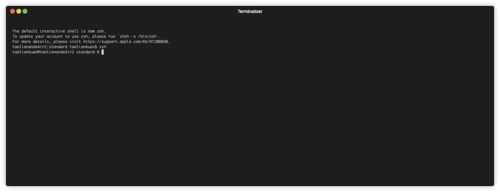

<p align="center">
    <a href="https://github.com/zjunlp/deepke"> </a>
<p>
<p align="center">  
    <a href="http://deepke.zjukg.cn">
        
    </a>
    <a href="https://pypi.org/project/deepke/#files">
        
    </a>
    <a href="https://github.com/zjunlp/DeepKE/blob/master/LICENSE">
        
    </a>
    <a href="http://zjunlp.github.io/DeepKE">
        
    </a>
    <a href="https://colab.research.google.com/drive/1vS8YJhJltzw3hpJczPt24O0Azcs3ZpRi?usp=sharing">
        
    </a>
</p>


<h1 align="center">
    <p>基于深度学习的开源中文知识图谱抽取框架</p>
</h1>


DeepKE 是一个支持<b>低资源、长篇章</b>的知识抽取工具，可以基于<b>PyTorch</b>实现<b>命名实体识别</b>、<b>关系抽取</b>和<b>属性抽取</b>功能。<br>同时为初学者提供了详尽的[文档](https://zjunlp.github.io/DeepKE/)，[Google Colab教程](https://colab.research.google.com/drive/1vS8YJhJltzw3hpJczPt24O0Azcs3ZpRi?usp=sharing)和[在线演示](http://deepke.zjukg.cn/CN/index.html)。

<br>

# 目录

* [新版特性](#新版特性)
* [预测演示](#预测演示)
* [模型架构](#模型架构)
* [快速上手](#快速上手)
   * [环境依赖](#环境依赖)
   * [具体功能介绍](#具体功能介绍)
      * [1. 命名实体识别NER](#1-命名实体识别ner)
      * [2. 关系抽取RE](#2-关系抽取re)
      * [3. 属性抽取AE](#3-属性抽取ae)
* [Notebook教程](#notebook教程)
* [备注（常见问题）](#备注常见问题)
* [未来计划](#未来计划)
* [引用](#引用)
* [项目成员](#项目成员)

<br>

# 新版特性

## 2022年1月

- 发布论文 [DeepKE: A Deep Learning Based Knowledge Extraction Toolkit for Knowledge Base Population](https://arxiv.org/abs/2201.03335)

## 2021年12月
- 加入`dockerfile`以便自动创建环境
## 2021年11月
- 发布DeepKE demo页面，支持实时抽取，无需部署和训练模型
- 发布DeepKE文档，包含DeepKE源码和数据集等详细信息
## 2021年10月
- `pip install deepke`
- deepke-v2.0发布
## 2021年5月
- `pip install deepke`
- deepke-v1.0发布
<br>

# 预测演示
下面使用一个demo展示预测过程<br>


<br>

# 模型架构

Deepke的架构图如下所示

<h3 align="center">
    
</h3>

- DeepKE为三个知识抽取功能（命名实体识别、关系抽取和属性抽取）设计了一个统一的框架
- 可以在不同场景下实现不同功能。比如，可以在标准全监督、低资源少样本和文档级设定下进行关系抽取
- 每一个应用场景由三个部分组成：Data部分包含Tokenizer、Preprocessor和Loader，Model部分包含Module、Encoder和Forwarder，Core部分包含Training、Evaluation和Prediction


<br>

# 快速上手

DeepKE支持pip安装使用，以常规全监督设定关系抽取为例，经过以下6个步骤就可以实现一个常规关系抽取模型

**Step 1**：下载代码 ```git clone https://github.com/zjunlp/DeepKE.git```（别忘记star和fork哈！！！）

**Step 2**：使用anaconda创建虚拟环境，进入虚拟环境（提供Dockerfile源码可自行创建镜像，位于docker文件夹中）

```
conda create -n deepke python=3.8

conda activate deepke
```
1） 基于pip安装，直接使用

```
pip install deepke
```

2） 基于源码安装

```
python setup.py install

python setup.py develop
```

**Step 3** ：进入任务文件夹，以常规关系抽取为例

```
cd DeepKE/example/re/standard
```

**Step 4**：下载数据集
```
wget 120.27.214.45/Data/re/standard/data.tar.gz

tar -xzvf data.tar.gz
```

**Step 5** ：模型训练，训练用到的参数可在conf文件夹内修改

DeepKE使用*wandb*支持可视化调参

```
python run.py
```

**Step 6** ：模型预测。预测用到的参数可在conf文件夹内修改

修改`conf/predict.yaml`中保存训练好的模型路径。
```
python predict.py
```

<br>

## 环境依赖

> python == 3.8

- torch == 1.5
- hydra-core == 1.0.6
- tensorboard == 2.4.1
- matplotlib == 3.4.1
- transformers == 3.4.0
- jieba == 0.42.1
- scikit-learn == 0.24.1
- pytorch-transformers == 1.2.0
- seqeval == 1.2.2
- tqdm == 4.60.0
- opt-einsum==3.3.0
- ujson

<br>

## 具体功能介绍

### 1. 命名实体识别NER

- 命名实体识别是从非结构化的文本中识别出实体和其类型。数据为txt文件，样式范例为：

  |                           Sentence                           |           Person           |    Location    |          Organization          |
  | :----------------------------------------------------------: | :------------------------: | :------------: | :----------------------------: |
  | 本报北京9月4日讯记者杨涌报道：部分省区人民日报宣传发行工作座谈会9月3日在4日在京举行。 |            杨涌            |      北京      |            人民日报            |
  | 《红楼梦》是中央电视台和中国电视剧制作中心根据中国古典文学名著《红楼梦》摄制于1987年的一部古装连续剧，由王扶林导演，周汝昌、王蒙、周岭等多位红学家参与制作。 | 王扶林，周汝昌，王蒙，周岭 |      中国      | 中央电视台，中国电视剧制作中心 |
  | 秦始皇兵马俑位于陕西省西安市，1961年被国务院公布为第一批全国重点文物保护单位，是世界八大奇迹之一。 |           秦始皇           | 陕西省，西安市 |             国务院             |

- 具体流程请进入详细的README中
  - **[常规全监督STANDARD](https://github.com/zjunlp/DeepKE/tree/main/example/ner/standard)** 
  
     **Step1**: 进入`DeepKE/example/ner/standard`，下载数据集
     
     ```bash
     wget 120.27.214.45/Data/ner/standard/data.tar.gz
     
     tar -xzvf data.tar.gz
     ```
     
     **Step2**: 模型训练<br>
     
     数据集和参数配置可以分别在`data`和`conf`文件夹中修改
     
     ```
     python run.py
     ```
     
     **Step3**: 模型预测
     ```
     python predict.py
     ```
     
  - **[少样本FEW-SHOT](https://github.com/zjunlp/DeepKE/tree/main/example/ner/few-shot)** 
  
    **Step1**: 进入`DeepKE/example/ner/few-shot`，下载数据集
    
    ```bash
    wget 120.27.214.45/Data/ner/few_shot/data.tar.gz
    
    tar -xzvf data.tar.gz
    ```
    
    **Step2**：低资源场景下训练模型<br>
    
    模型加载和保存位置以及参数配置可以在`conf`文件夹中修改
    
     ```
     python run.py +train=few_shot
     ```
    
    若要加载模型，修改`few_shot.yaml`中的`load_path`；<br>
    
    **Step3**：在`config.yaml`中追加`- predict`，`predict.yaml`中修改`load_path`为模型路径以及`write_path`为预测结果的保存路径，完成修改后使用
    
    ```
    python predict.py
    ```

### 2. 关系抽取RE

- 关系抽取是从非结构化的文本中抽取出实体之间的关系，以下为几个样式范例，数据为csv文件：

  |                        Sentence                        | Relation |    Head    | Head_offset |    Tail    | Tail_offset |
  | :----------------------------------------------------: | :------: | :--------: | :---------: | :--------: | :---------: |
  | 《岳父也是爹》是王军执导的电视剧，由马恩然、范明主演。 |   导演   | 岳父也是爹 |      1      |    王军    |      8      |
  |  《九玄珠》是在纵横中文网连载的一部小说，作者是龙马。  | 连载网站 |   九玄珠   |      1      | 纵横中文网 |      7      |
  |     提起杭州的美景，西湖总是第一个映入脑海的词语。     | 所在城市 |    西湖    |      8      |    杭州    |      2      |

- 具体流程请进入详细的README中，RE包括了以下三个子功能
  - **[常规全监督STANDARD](https://github.com/zjunlp/DeepKE/tree/main/example/re/standard)**  

    **Step1**：进入`DeepKE/example/re/standard`，下载数据集
  
    ```bash
    wget 120.27.214.45/Data/re/standard/data.tar.gz
    
    tar -xzvf data.tar.gz
    ```
  
    **Step2**：模型训练<br>

    数据集和参数配置可以分别进入`data`和`conf`文件夹中修改
  
    ```
    python run.py
    ```
  
    **Step3**：模型预测
  
    ```
    python predict.py
    ```
  
  - **[少样本FEW-SHOT](https://github.com/zjunlp/DeepKE/tree/main/example/re/few-shot)**
  
    **Step1**：进入`DeepKE/example/re/few-shot`，下载数据集

    ```bash
    wget 120.27.214.45/Data/re/few_shot/data.tar.gz
    
    tar -xzvf data.tar.gz
    ```
  
    **Step2**：模型训练<br>
  
    - 数据集和参数配置可以分别进入`data`和`conf`文件夹中修改
  
    - 如需从上次训练的模型开始训练：设置`conf/train.yaml`中的`train_from_saved_model`为上次保存模型的路径，每次训练的日志默认保存在根目录，可用`log_dir`来配置
  
    ```
    python run.py
    ```
  
    **Step3**：模型预测
  
    ```
    python predict.py
    ```
  
  - **[文档级DOCUMENT](https://github.com/zjunlp/DeepKE/tree/main/example/re/document)** <br>
    
    **Step1**：进入`DeepKE/example/re/document`，下载数据集
    
    ```bash
    wget 120.27.214.45/Data/re/document/data.tar.gz
    
    tar -xzvf data.tar.gz
    ```
    
    **Step2**：模型训练<br>
    
    - 数据集和参数配置可以分别进入`data`和`conf`文件夹中修改
    - 如需从上次训练的模型开始训练：设置`conf/train.yaml`中的`train_from_saved_model`为上次保存模型的路径，每次训练的日志默认保存在根目录，可用`log_dir`来配置；
    
    ```
    python run.py
    ```
    **Step3**：模型预测
    
    ```
    python predict.py
    ```

### 3. 属性抽取AE

- 数据为csv文件，样式范例为：

  |                           Sentence                           |   Att    |   Ent    | Ent_offset |      Val      | Val_offset |
  | :----------------------------------------------------------: | :------: | :------: | :--------: | :-----------: | :--------: |
  |          张冬梅，女，汉族，1968年2月生，河南淇县人           |   民族   |  张冬梅  |     0      |     汉族      |     6      |
  | 诸葛亮，字孔明，三国时期杰出的军事家、文学家、发明家。 |   朝代   |   诸葛亮   |     0      |     三国时期      |     8     |
  |        2014年10月1日许鞍华执导的电影《黄金时代》上映         | 上映时间 | 黄金时代 |     19     | 2014年10月1日 |     0      |

- 具体流程请进入详细的README中
  - **[常规全监督STANDARD](https://github.com/zjunlp/DeepKE/tree/main/example/ae/standard)**  
    
    **Step1**：进入`DeepKE/example/ae/standard`，下载数据集
    
    ```bash
    wget 120.27.214.45/Data/ae/standard/data.tar.gz
    
    tar -xzvf data.tar.gz
    ```
    
    **Step2**：模型训练<br>

    数据集和参数配置可以分别进入`data`和`conf`文件夹中修改
    
    ```
    python run.py
    ```
    
    **Step3**：模型预测
    
    ```
    python predict.py
    ```

<br>

# Notebook教程

本工具提供了若干Notebook和Google Colab教程，用户可针对性调试学习。

- 常规设定：

    [命名实体识别Notebook](https://github.com/zjunlp/DeepKE/blob/main/tutorial-notebooks/ner/standard/standard_ner_tutorial.ipynb)

    [命名实体识别Colab](https://colab.research.google.com/drive/1rFiIcDNgpC002q9BbtY_wkeBUvbqVxpg?usp=sharing)
    
    [关系抽取Notebook](https://github.com/zjunlp/DeepKE/blob/main/tutorial-notebooks/re/standard/standard_re_BERT_tutorial.ipynb)

    [关系抽取Colab](https://colab.research.google.com/drive/1o6rKIxBqrGZNnA2IMXqiSsY2GWANAZLl?usp=sharing)
   
    [属性抽取Notebook](https://github.com/zjunlp/DeepKE/blob/main/tutorial-notebooks/ae/standard/standard_ae_tutorial.ipynb)

    [属性抽取Colab](https://colab.research.google.com/drive/1pgPouEtHMR7L9Z-QfG1sPYkJfrtRt8ML?usp=sharing)

- 低资源：

    [命名实体识别Notebook](https://github.com/zjunlp/DeepKE/blob/main/tutorial-notebooks/ner/few-shot/fewshot_ner_tutorial.ipynb)

    [命名实体识别Colab](https://colab.research.google.com/drive/1Xz0sNpYQNbkjhebCG5djrwM8Mj2Crj7F?usp=sharing)

    [关系抽取Notebook](https://github.com/zjunlp/DeepKE/blob/main/tutorial-notebooks/re/few-shot/fewshot_re_tutorial.ipynb)
    
    [关系抽取Colab](https://colab.research.google.com/drive/1o1ly6ORgerkm1fCDjEQb7hsN5WKyg3JH?usp=sharing)
    
- 篇章级：

    [关系抽取Notebook](https://github.com/zjunlp/DeepKE/blob/main/tutorial-notebooks/re/document/document_re_tutorial.ipynb)
    
    [关系抽取Colab](https://colab.research.google.com/drive/1RGUBbbOBHlWJ1NXQLtP_YEUktntHtROa?usp=sharing)

<br>

# 备注（常见问题）

1. 使用 Anaconda 时，建议添加国内镜像，下载速度更快。如[镜像](https://mirrors.tuna.tsinghua.edu.cn/help/anaconda/)。
2. 使用 pip 时，建议使用国内镜像，下载速度更快，如阿里云镜像。
3. 安装后提示 `ModuleNotFoundError: No module named 'past'`，输入命令 `pip install future` 即可解决。
4. 使用语言预训练模型时，在线安装下载模型比较慢，更建议提前下载好，存放到 pretrained 文件夹内。具体存放文件要求见文件夹内的 `README.md`。
5. DeepKE老版本位于[deepke-v1.0](https://github.com/zjunlp/DeepKE/tree/deepke-v1.0)分支，用户可切换分支使用老版本，老版本的能力已全部迁移到标准设定关系抽取([example/re/standard](https://github.com/zjunlp/DeepKE/blob/main/example/re/standard/README.md))中。
6. 更多的低资源抽取工作可查阅论文 [Knowledge Extraction in Low-Resource Scenarios: Survey and Perspective](https://arxiv.org/pdf/2202.08063.pdf).

<br>

# 未来计划

- 在DeepKE的下一个版本中加入多模态知识抽取
- 我们提供长期技术维护和答疑解惑。如有疑问，请提交issues

<br>

# 引用

如果使用DeepKE，请按以下格式引用

```bibtex
@article{zhang2022deepke,
  title={DeepKE: A Deep Learning Based Knowledge Extraction Toolkit for Knowledge Base Population},
  author={Zhang, Ningyu and Xu, Xin and Tao, Liankuan and Yu, Haiyang and Ye, Hongbin and Xie, Xin and Chen, Xiang and Li, Zhoubo and Li, Lei and Liang, Xiaozhuan and others},
  journal={arXiv preprint arXiv:2201.03335},
  year={2022}
}
```

<br>

# 项目成员

浙江大学：张宁豫、陶联宽、徐欣、余海洋、叶宏彬、乔硕斐、谢辛、陈想、黎洲波、李磊、梁孝转、姚云志、邓淑敏、张文、郑国轴、陈华钧

阿里巴巴：熊飞宇、陈辉、陈强

阿里巴巴达摩院：张珍茹、谭传奇、黄非
