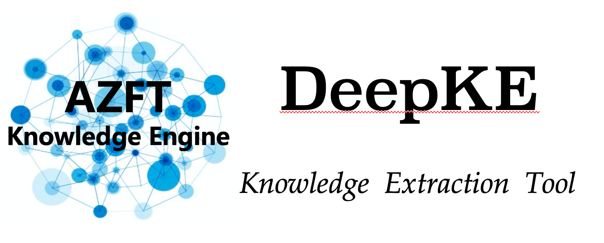
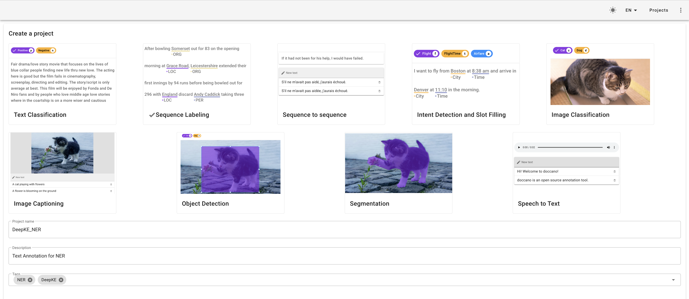
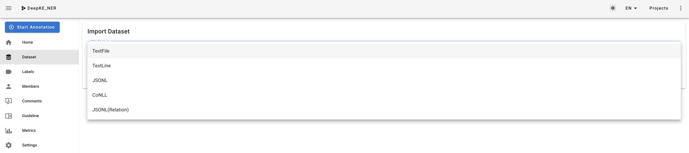
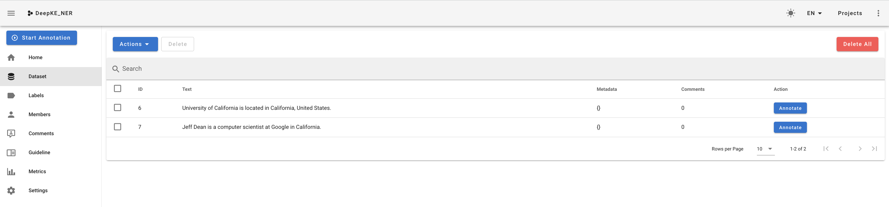
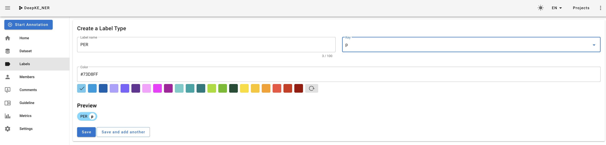
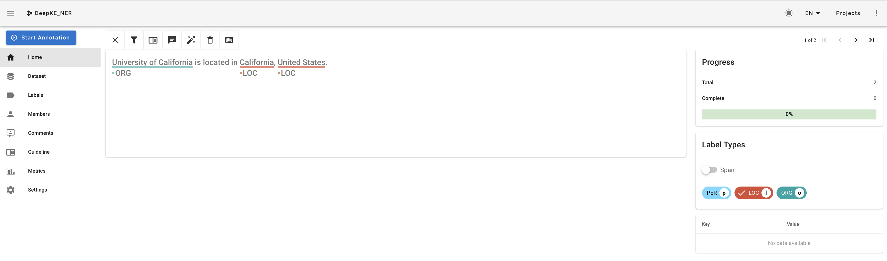
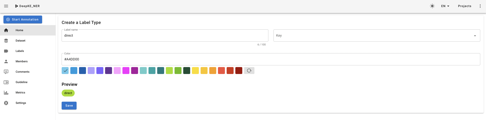
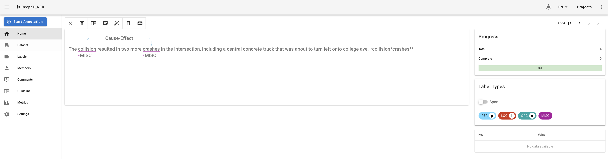

<p align="center">
    <a href="https://github.com/zjunlp/deepke"> </a>
<p>
<p align="center">  
    <a href="http://deepke.zjukg.cn">
        
    </a>
    <a href="https://pypi.org/project/deepke/#files">
        
    </a>
    <a href="https://github.com/zjunlp/DeepKE/blob/master/LICENSE">
        
    </a>
    <a href="http://zjunlp.github.io/DeepKE">
        
    </a>
    <a href="https://colab.research.google.com/drive/1vS8YJhJltzw3hpJczPt24O0Azcs3ZpRi?usp=sharing">
        
    </a>
</p>
<p align="center">
    <b> English | <a href="https://github.com/zjunlp/DeepKE/blob/main/README_TAG_CN.md">简体中文</a> </b>
</p>

<h1 align="center">
    <p>Data Annotation Instructions</p>
</h1>


DeepKE is an open source knowledge graph extraction and construction tool that supports **low-resource, long-text and multi-modal** knowledge extraction tools. Based on PyTorch, it can realize named **entity recognition, relation extraction and attribute extraction functions**. This version, DeepKE-cnSchema, is an out-of-the-box version that allows users to download the model for entity and relational knowledge extraction that supports cnSchema.

---

## Content Introduction

| Chapter                   | Description                                             |
| ------------------------- | ------------------------------------------------------- |
| [Introduction](#Introduction)             | The basic principles and supported data types of DeepKE |
| [Manual Data Annotation](#Manual-Data-Annotation)  | How to manually annotate data                           |
| [Automatic Data Annotation](#Automatic-Data-Annotation) | How to automatically annotate data based on DeepKE      |
| [FAQ](#FAQ)                       | Frequently Asked Questions                              |
| [References](#References)                | Technical reports for this catalogue                    |

## Introduction

DeepKE is an open source knowledge graph extraction and construction tool that supports low-resource, long-text and multi-modal knowledge extraction tools. Based on PyTorch, it can realize named entity recognition, relationship extraction and attribute extraction functions. Also available for beginners are detailed [documentation](https://zjunlp.github.io/DeepKE/), [Google Colab tutorials](https://colab.research.google.com/drive/1vS8YJhJltzw3hpJczPt24O0Azcs3ZpRi?usp=sharing),  [online presentations](http://deepke.zjukg.cn/)and [slideshows](https://github.com/zjunlp/DeepKE/blob/main/docs/slides/Slides-DeepKE-cn.pdf).

It is well known that data is very important for model training. To facilitate the use of this tool, DeepKE provides detailed annotation of entity identification and relationship extraction data, so that users can obtain training data manually or automatically. The annotated data can be directly used by DeepKE for model training.

## Manual Data Annotation

<div align="center">
  
</div>

`doccano` is an open source manual data annotation tool. It provides annotation  functions for **text classification**, **sequence labeling**, and **sequence-to-sequence**. So you can create labeled data for sentiment analysis, named entity recognition, text summaries, and so on. Simply create a project and upload the data and start labeling, and you can build a dataset ready for `DeepKE` training in a matter of hours. Using `doccano` to extract annotation data for entity recognition and relationships is described below.

For details about doccano installation and configuration, see [Github(doccano)](https://github.com/doccano/doccano)

Once the server is installed and started, point your browser to  `http://0.0.0.0:8000` and click  **Log in**.

<div align="center">
  
</div>

### Entity Recognition

#### Create a Project

- Create a Project. Click `Create` in the upper left corner to jump to the following interface.

  - Select the Sequence Labeling task.
  - Fill in the necessary information, such as Project name and Description.
  - Check configurable attributes such as Allow overlapping entity and Use relation labeling **as required**.

<div align="center">
  
</div>

 * When creation is complete, you will automatically be redirected to the project's home page.

#### Adding the corpus

<div align="center">
  
</div>


- `doccano` supports a variety of text formats. The differences are as follows:
  - `Textfile`：The uploaded file is in the format of `txt`. When marking, a whole `txt` file is displayed as one page of content.
  - `TextLine`：The uploaded file is in the format of `txt`. When marking, a line of text in the `txt` file is displayed as a page of content.
  - `JSONL`：Short for `JSON Lines`, where each line is a valid `JSON` value;
  - `CoNLL`： A file in `CoNLL` format. Each line contains a series of tab-separated words.

<div align="center">
  
</div>

* Click on the tabs of the **Dataset** again, and you'll see that text has been added to the project, one by one, and then you'll mark the text.

#### Data Annotations

- Add task labels

  - The extraction task includes two label types: `Span` and `Relation`. Here, `Span` refers to the target information fragment in the original text, that is, the entity of a certain type in entity recognition.
  - Fill in the name of the label. In entity recognition, you can write `PER`, `LOC`, `ORG`, etc.
  - Add the shortcut key corresponding to this label (e.g. set the shortcut key `p` for the `PER` label) and define the label color.

  <div align="center">
  
  </div>

  - Then just add the other tags you need in the same way.

- Task annotation

  - Annotate data. Click the `Annotate` button to the far right of each data to annotate.
  - The example defines two `Span` type tags for people and places.

  <div align="center">
  
  </div>

#### Exporting training data

- Click on `Options`, `Export Dataset` in the Dataset column to export the annotated data.
- The markup data is stored in the same text file, one line per sample and in `jsonl` format, which contains the following fields：
  - `id`: The unique identifier `ID` of the sample in the dataset.
  - `text`: Raw text data.
  - `entities`: The `Span` tags contained in the data, each `Span` tag contains four fields：
    - `id`: The unique identification ID of `Span` in the dataset.
    - `start_offset`: The starting position of `Span`.
    - `end_offset`: The next position from the end of `Span`.
    - `label`: Type of `Span`.

- Example of exported data

```json
{
    "id":10,
    "text":"University of California is located in California, United States.",
    "entities":[
        {
            "id":15,
            "label":"ORG",
            "start_offset":0,
            "end_offset":24
        },
        {
            "id":16,
            "label":"LOC",
            "start_offset":39,
            "end_offset":49
        },
        {
            "id":17,
            "label":"LOC",
            "start_offset":51,
            "end_offset":64
        }
    ],
    "relations":[
        
    ]
}
```

- The input data format for the entity recognition task in `DeepKE` is a `txt` file, with each line including words, separators and labels (see `CoNLL` data format). The exported data will be pre-processed into the `DeepKE` input format for training, please go to the detailed README 
  - [Regular Full Supervision STANDARD](https://github.com/zjunlp/DeepKE/tree/main/example/ner/standard)

### Relation Extraction

- [Create a Project](#Create-a-Project)
  - Same operation as entity identification, just refer to above.
- [Adding the corpus](#Adding-the-corpus)
  - Same operation as entity identification, just refer to above.
  - **In the input text, the text format `{text}*{head entity}*{tail entity}*{head entity type}*{tail entity type}`, where the head and tail entity types can be empty.**

#### Data Annotations

- Add task labels

  - The extraction task contains two label types: `Span`and `Relation`. The `Relation` type is used here. `Relation` refers to the relation between `Span` in the original text, that is, the relation between two entities in the relation extraction.
  - Fill in the name of the relationship type. In relation extraction, you can write `Graduation`, `Causal`, etc.
  - Add the shortcut key corresponding to this relationship type (e.g. set the shortcut key `b` for the `Graduation` label) and define the label color.

  <div align="center">
  
  </div>

  - Then just add the other tags you need in the same way.

- Task annotation

  - Annotate data. Click the `Annotate` button to the far right of each data to annotate.
  - First click on the label of the relationship to be annotated, then click on the corresponding head and tail entities in turn to complete the relationship annotation.
  - The example defines two `Span` type tags, `PER` and `LOC`, followed by the relationship tag `Graduation` between entities. The `Relation` tag points from the `Subject` corresponding entity to the `Object` corresponding entity.

  <div align="center">
  
  </div>

#### Exporting training data

- Click on `Options`, `Export Dataset` in the Dataset column to export the annotated data.
- The markup data is stored in the same text file, one line per sample and in `jsonl` format, which contains the following fields：

  - `id`: The unique identifier `ID` of the sample in the dataset.
  - `text`: Raw text data.
  - `entities`: The `Span` tags contained in the data, each `Span` tag contains four fields：
    - `id`: The unique identification ID of `Span` in the dataset.
    - `start_offset`: The starting position of `Span`.
    - `end_offset`: The next position from the end of `Span`.
    - `label`: Type of `Span`.

  - `relations`: `Relation` tags contained in the data, each `Relation` tag contains four fields：
    - `id`: (`Span1`, `Relation`, `Span2`)Triples are uniquely identified in the dataset by their `ID`, and the same  triple in different samples corresponds to the same `ID`.
    - `from_id`: The identifier `ID` corresponding to `Span1`.
    - `to_id`: The identifier `ID` corresponding to `Span2`.
    - `type`: Type of `Relation` .

- Example of exported data

```json
{
    "id":13,
    "text":"The collision resulted in two more crashes in the intersection, including a central concrete truck that was about to turn left onto college ave. *collision*crashes**",
    "entities":[
        {
            "id":20,
            "label":"MISC",
            "start_offset":4,
            "end_offset":13
        },
        {
            "id":21,
            "label":"MISC",
            "start_offset":35,
            "end_offset":42
        }
    ],
    "relations":[
        {
            "id":2,
            "from_id":20,
            "to_id":21,
            "type":"Cause-Effect"
        }
    ]
}
```

## Automatic Data Annotation

### Entity Recognition

In order for users to better use `DeepKE` to complete entity recognition tasks, we provide an easy-to-use **dict matching based** entity recognition **automatic annotation** tool.

#### Dict

- The format of Dict：

  <h3 align="left">
      
  </h3>

- Two entity Dicts (one in Chinese and one in English) are provided in advance, and the samples are automatically tagged using the entity dictionary + jieba part-of-speech tagging.

  - In Chinese example dict, we adapt [The People's Daily Dataset](https://github.com/OYE93/Chinese-NLP-Corpus/tree/master/NER/People's Daily) . It is a dataset for NER, concentrating on their types of named entities related to persons(PER), locations(LOC), and organizations(ORG).
  - In English example dict，we adapt Conll dataset. It contains named entities related to persons (PER), locations(LOC), and others (MISC).You can get the Conll dataset with the following command.

  ```shell
  wget 120.27.214.45/Data/ner/few_shot/data.tar.gz
  ```

  - Pre-provided dict from Google Drive：
    - [CN(vocab_dict_cn), EN(vocab_dict_en)](https://drive.google.com/drive/folders/1PGANizeTsvEQFYTL8O1jrDLZwk_MPqO0?usp=sharing)
  - From BaiduNetDisk ： 
    - [CN(vocab_dict_cn), EN(vocab_dict_en)](https://pan.baidu.com/s/1a07W42ZByeZ00MZp5pZgxg) 
    - (x7ba)

- **If you need to build a domain self-built dictionary, please refer to the pre-provided dictionary format (csv)**

  | Entity     | Label |
  | ---------- | ----- |
  | Washington | LOC   |
  | ...        | ...   |

#### Source File

- **The input dictionary** format is `csv` (contains two columns, entities and corresponding labels).

- **Data to be automatically marked** (txt format and separated by lines, as shown in the figure below) should be placed under the `source_data` path, the script will traverse all txt format files in this folder, and automatically mark line by line.

  <h3 align="left">
      
  </h3>

#### Output File

- **The output file**(the distribution ratio of `training set`, `validation set`, and `test set` can be customized) can be directly used as training data in DeepKE.

<h3 align="left">
    
</h3>


#### Environment

Implementation Environment:

- jieba = 0.42.1

#### Args Description

- `language`: `cn` or `en`
- `source_dir`: Corpus path (traverse all files in txt format under this folder, automatically mark line by line, the default is `source_data`)
- `dict_dir`: Entity dict path (defaults to `vocab_dict.csv`)
- `test_rate, dev_rate, test_rate`: The ratio of training_set, validation_set, and test_set (please make sure the sum is `1`, default `0.8:0.1:0.1`)

#### Run

- **Chinese**

```bash
python prepare_weaksupervised_data.py --language cn --dict_dir vocab_dict_cn.csv
```

- **English**

```bash
python prepare_weaksupervised_data.py --language en --dict_dir vocab_dict_en.csv
```

### Relation extraction

We provide a simple **distant supervised** based tool to label relation labels for our RE tasks.

#### Source File

We specify the source file (dataset to be labeled) as `.json` format and include **one** pair of entities, head entity and tail entity respectively. Each piece of data should contain at least the following five items: `sentence`, `head`, `tail`, `head_offset`, `tail_offset`. The detailed json pattern is as follows:

```json
[
  {
    "sentence": "This summer, the United States Embassy in Beirut, Lebanon, once again made its presence felt on the cultural scene by sponsoring a photo exhibition, an experimental jazz performance, a classical music concert and a visit from the Whiffenpoofs, Yale University's a cappella singers.",
    "head": "Lebanon",
    "tail": "Beirut",
    "head_offset": "50",
    "tail_offset": "42",
    //...
  },
  //... 
]
```

#### Triple File

Entity pairs in source file will be matched with the triples in the triple file. The entity pairs will be labeled with the relation type if matched with the triples in triple file. If there is no triples match, the pairs will be labeled as `None` type.

We provide an [English](https://drive.google.com/drive/folders/1HHkm3RBI3okiu8jGs-Wn0vP_-0hz7pb2?usp=sharing) and a [Chinese](https://drive.google.com/file/d/1YpaMpivodG39p53MM9sMpB41q4EoiQhH/view?usp=sharing) triple file respectively. The English triple file comes from `NYT` dataset which contains the following relation types:

```python
"/business/company/place_founded",
"/people/person/place_lived",
"/location/country/administrative_divisions",
"/business/company/major_shareholders",
"/sports/sports_team_location/teams",
"/people/person/religion",
"/people/person/place_of_birth",
"/people/person/nationality",
"/location/country/capital",
"/business/company/advisors",
"/people/deceased_person/place_of_death",
"/business/company/founders",
"/location/location/contains",
"/people/person/ethnicity",
"/business/company_shareholder/major_shareholder_of",
"/people/ethnicity/geographic_distribution",
"/people/person/profession",
"/business/person/company",
"/people/person/children",
"/location/administrative_division/country",
"/people/ethnicity/people",
"/sports/sports_team/location",
"/location/neighborhood/neighborhood_of",
"/business/company/industry"
```

The Chinese triple file are from [here](https://github.com/DannyLee1991/ExtractTriples) with the following relation types:

```json
{"object_type": "地点", "predicate": "祖籍", "subject_type": "人物"}
{"object_type": "人物", "predicate": "父亲", "subject_type": "人物"}
{"object_type": "地点", "predicate": "总部地点", "subject_type": "企业"}
{"object_type": "地点", "predicate": "出生地", "subject_type": "人物"}
{"object_type": "目", "predicate": "目", "subject_type": "生物"}
{"object_type": "Number", "predicate": "面积", "subject_type": "行政区"}
{"object_type": "Text", "predicate": "简称", "subject_type": "机构"}
{"object_type": "Date", "predicate": "上映时间", "subject_type": "影视作品"}
{"object_type": "人物", "predicate": "妻子", "subject_type": "人物"}
{"object_type": "音乐专辑", "predicate": "所属专辑", "subject_type": "歌曲"}
{"object_type": "Number", "predicate": "注册资本", "subject_type": "企业"}
{"object_type": "城市", "predicate": "首都", "subject_type": "国家"}
{"object_type": "人物", "predicate": "导演", "subject_type": "影视作品"}
{"object_type": "Text", "predicate": "字", "subject_type": "历史人物"}
{"object_type": "Number", "predicate": "身高", "subject_type": "人物"}
{"object_type": "企业", "predicate": "出品公司", "subject_type": "影视作品"}
{"object_type": "Number", "predicate": "修业年限", "subject_type": "学科专业"}
{"object_type": "Date", "predicate": "出生日期", "subject_type": "人物"}
{"object_type": "人物", "predicate": "制片人", "subject_type": "影视作品"}
{"object_type": "人物", "predicate": "母亲", "subject_type": "人物"}
{"object_type": "人物", "predicate": "编剧", "subject_type": "影视作品"}
{"object_type": "国家", "predicate": "国籍", "subject_type": "人物"}
{"object_type": "Number", "predicate": "海拔", "subject_type": "地点"}
{"object_type": "网站", "predicate": "连载网站", "subject_type": "网络小说"}
{"object_type": "人物", "predicate": "丈夫", "subject_type": "人物"}
{"object_type": "Text", "predicate": "朝代", "subject_type": "历史人物"}
{"object_type": "Text", "predicate": "民族", "subject_type": "人物"}
{"object_type": "Text", "predicate": "号", "subject_type": "历史人物"}
{"object_type": "出版社", "predicate": "出版社", "subject_type": "书籍"}
{"object_type": "人物", "predicate": "主持人", "subject_type": "电视综艺"}
{"object_type": "Text", "predicate": "专业代码", "subject_type": "学科专业"}
{"object_type": "人物", "predicate": "歌手", "subject_type": "歌曲"}
{"object_type": "人物", "predicate": "作词", "subject_type": "歌曲"}
{"object_type": "人物", "predicate": "主角", "subject_type": "网络小说"}
{"object_type": "人物", "predicate": "董事长", "subject_type": "企业"}
{"object_type": "Date", "predicate": "成立日期", "subject_type": "机构"}
{"object_type": "学校", "predicate": "毕业院校", "subject_type": "人物"}
{"object_type": "Number", "predicate": "占地面积", "subject_type": "机构"}
{"object_type": "语言", "predicate": "官方语言", "subject_type": "国家"}
{"object_type": "Text", "predicate": "邮政编码", "subject_type": "行政区"}
{"object_type": "Number", "predicate": "人口数量", "subject_type": "行政区"}
{"object_type": "城市", "predicate": "所在城市", "subject_type": "景点"}
{"object_type": "人物", "predicate": "作者", "subject_type": "图书作品"}
{"object_type": "Date", "predicate": "成立日期", "subject_type": "企业"}
{"object_type": "人物", "predicate": "作曲", "subject_type": "歌曲"}
{"object_type": "气候", "predicate": "气候", "subject_type": "行政区"}
{"object_type": "人物", "predicate": "嘉宾", "subject_type": "电视综艺"}
{"object_type": "人物", "predicate": "主演", "subject_type": "影视作品"}
{"object_type": "作品", "predicate": "改编自", "subject_type": "影视作品"}
{"object_type": "人物", "predicate": "创始人", "subject_type": "企业"}
```

You can also use your customized triple file, but the file format should be `.csv` and with the following parttern:

| head    | tail   | rel                         |
| ------- | ------ | --------------------------- |
| Lebanon | Beirut | /location/location/contains |
| ...     | ...    | ...                         |

#### Output File

The output file names are `labeled_train.json`, `labeled_dev.json`, `labeled_test.json` for the `train`, `dev`, `test` dataset. The format of the output file is as follows:

```json
[
	{
    "sentence": "This summer, the United States Embassy in Beirut, Lebanon, once again made its presence felt on the cultural scene by sponsoring a photo exhibition, an experimental jazz performance, a classical music concert and a visit from the Whiffenpoofs, Yale University's a cappella singers.",
    "head": "Lebanon",
    "tail": "Beirut",
    "head_offset": "50",
    "tail_offset": "42",
    "relation": "/location/location/contains",
    //...
	},
  //...
]
```

We automatically split the source data into three splits with the rate `0.8:0.1:0.1`.You can set your own split rate.

#### Args Description

- `language`: `en` or `cn`
- `source_file`: data file to be labeled
- `triple_file`: triple file path
- `test_rate, dev_rate, test_rate`: The ratio of training_set, validation_set, and test_set (please make sure the sum is `1`, default `0.8:0.1:0.1`)

#### Run

```bash
python ds_label_data.py --language en --source_file source_data.json --triple_file triple_file.csv
```

## FAQ

- **Q: How much data do I need to mark?**
  - A：Labeling is a labor-intensive and time-consuming process that can be very costly. Ideally, the more data that is labeled, the better the model will be. But in practice, this is not always possible. On the one hand, it is necessary to combine practical resources and time; on the other hand, it is important to consider the impact of increasing data volume on the improvement of model effectiveness. In entity identification, relationship extraction usually requires a data volume of `10K` or so.


- **Q: Is there any labeled data available?**
  - A: In entity recognition, two entity dictionaries (one each in English and Chinese) are pre-provided to enable automatic annotation of samples.
- **Q: Automatic labeling of data training models does not work**
  - A: There are several possible reasons for the poor results of the model：
    - Automatically annotated, manually annotated data contains a high level of noise 
    - Small data size: Large models with many parameters are overfitted on small datasets. 
  - solution：
    - Consider checking the quality of the data
    - Using strategies such as **semi-supervised** training or `Self-Traning`
    - Increase the volume of data using data enhancement

## References

If the resources or techniques in this project have been useful to your research, you are welcome to cite the following paper in your thesis.

```
@article{zhang2022deepke,
  title={DeepKE: A Deep Learning Based Knowledge Extraction Toolkit for Knowledge Base Population},
  author={Zhang, Ningyu and Xu, Xin and Tao, Liankuan and Yu, Haiyang and Ye, Hongbin and Qiao, Shuofei and Xie, Xin and Chen, Xiang and Li, Zhoubo and Li, Lei and Liang, Xiaozhuan and others},
  journal={arXiv preprint arXiv:2201.03335},
  year={2022}
}
```

## Disclaimers

**The contents of this project are for technical research purposes only and are not intended as a basis for any conclusive findings. Users are free to use the model as they wish within the scope of the licence, but we cannot be held responsible for direct or indirect damage resulting from the use of the contents of the project.** 

## Feedback

If you have any questions, please submit them in the GitHub Issue.
