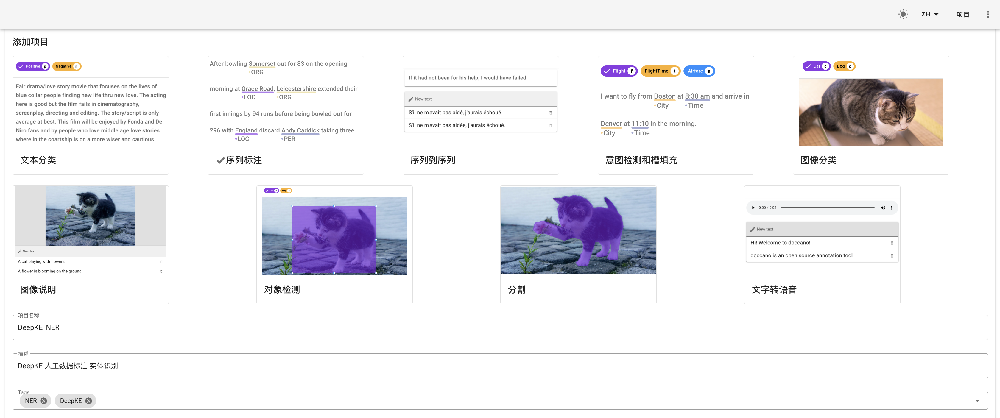
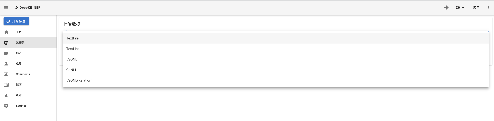
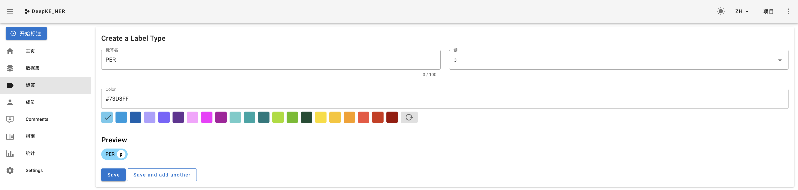
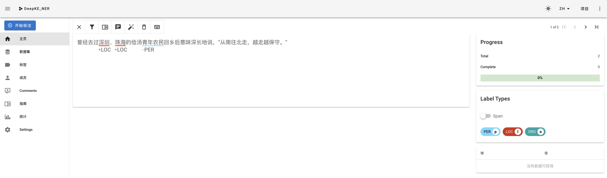
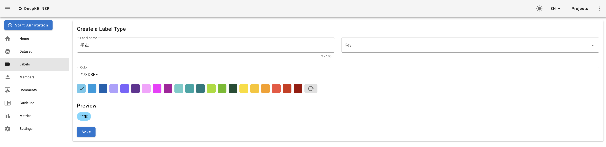
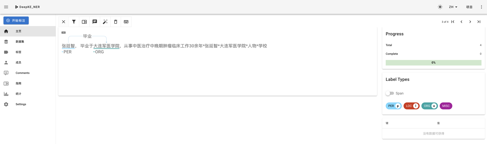

<p align="center">
    <a href="https://github.com/zjunlp/deepke"> </a>
<p>
<p align="center">  
    <a href="http://deepke.zjukg.cn">
        
    </a>
    <a href="https://pypi.org/project/deepke/#files">
        
    </a>
    <a href="https://github.com/zjunlp/DeepKE/blob/master/LICENSE">
        
    </a>
    <a href="http://zjunlp.github.io/DeepKE">
        
    </a>
    <a href="https://colab.research.google.com/drive/1vS8YJhJltzw3hpJczPt24O0Azcs3ZpRi?usp=sharing">
        
    </a>
</p>

<p align="center">
    <b> <a href="https://github.com/zjunlp/DeepKE/blob/main/README_CNSCHEMA.md">English</a> | 简体中文 </b>
</p>

<h1 align="center">
    <p>数据标注说明</p>
</h1>

DeepKE 是一个开源的知识图谱抽取与构建工具，支持<b>低资源、长篇章、多模态</b>的知识抽取工具，可以基于<b>PyTorch</b>实现<b>命名实体识别</b>、<b>关系抽取</b>和<b>属性抽取</b>功能。此版本DeepKE-cnSchema为开箱即用版本，用户下载模型即可实现支持cnSchema的实体和关系知识抽取。

---

## 内容导引

| 章节                      | 描述                   |
| ----------------------- | -------------------- |
| [简介](#简介)               | 介绍DeepKE基本原理和支持的数据类型 |
| [人工数据标注](#人工数据标注)       | 介绍如何人工标注数据           |
| [自动数据标注](#自动数据标注) | 介绍如何基于DeepKE自动标注数据   |
| [FAQ](#FAQ)             | 常见问题答疑               |
| [引用](#引用)               | 本目录的技术报告             |

## 简介

DeepKE 是一个开源的知识图谱抽取与构建工具，支持低资源、长篇章、多模态的知识抽取工具，可以基于PyTorch实现命名实体识别、关系抽取和属性抽取功能。同时为初学者提供了详尽的[文档](https://zjunlp.github.io/DeepKE/)，[Google Colab教程](https://colab.research.google.com/drive/1vS8YJhJltzw3hpJczPt24O0Azcs3ZpRi?usp=sharing)，[在线演示](http://deepke.zjukg.cn/)和[幻灯片](https://github.com/zjunlp/DeepKE/blob/main/docs/slides/Slides-DeepKE-cn.pdf)。

众所周知，数据对模型训练非常重要。为方便用户使用本工具，DeepKE提供了详细的实体识别、关系抽取数据标注说明，以方便用户通过人工或自动方式得到训练数据，标注好的数据可以直接供DeepKE进行模型训练。

## 人工数据标注

<div align="center">
  
</div>

`doccano`是一个开源的人工数据标注工具。它为**文本分类**、**序列标记**和**序列到序列**提供标注功能。因此您可以为情感分析、命名实体识别、文本摘要等任务创建标记数据。只需创建一个项目并上传数据并开始标记，您可以在数小时内构建可供`DeepKE`训练的数据集。下面会介绍使用`doccano`为实体识别和关系抽取标注数据。

doccano的安装与配置可参考 [Github(doccano)](https://github.com/doccano/doccano)

安装并启动server后，在浏览器中访问`http://0.0.0.0:8000`，并点击**登陆**。

<div align="center">
  
</div>

### 实体识别

#### 创建项目

- 创建项目。点击左上角的`创建`，跳转至以下界面。

    - 选择序列标注（Sequence Labeling）任务。
    - 填写项目名称（Project name）、描述（Description）等必要信息。
    - **按需勾选**允许实体重叠（Allow overlapping entity）、使用关系标注（Use relation labeling）等可配置属性。

<div align="center">
  
</div>

 * 在创建完成后，会自动跳转到项目的主页。

#### 添加语料库

<div align="center">
  
</div>


- `doccano`支持多种格式的文本，它们的区别如下：
    - `Textfile`：上传的文件为`txt`格式，打标时一整个`txt`文件显示为一页内容；
    - `Textline`：上传的文件为`txt`格式，打标时`txt`文件的一行文字显示为一页内容；
    - `JSONL`：`JSON Lines`的简写，每行是一个有效的`JSON`值；
    - `CoNLL`： `CoNLL`格式的文件，每行均带有一系列制表符分隔的单词；

<div align="center">
  
</div>

* 再点击**数据集**的标签，就可以看到一条一条的文本已经被添加到项目中了，之后我们将对这些文本进行打标。

#### 数据标注

- 添加任务标签
    - 抽取式任务包含`Span`与`Relation`两种标签类型，此处采用`Span`类型，`Span`指原文本中的目标信息片段，即实体识别中某个类型的实体。
    - 填入标签的名字。在实体识别中，可以写`PER`、`LOC`、`ORG`等。
    - 添加该标签对应的快捷键（例如给`PER`标签设置为快捷键`p`），并定义标签颜色。

    <div align="center">
    
    </div>

    - 之后以同样的方法添加其他所需要的标签即可。

- 任务标注
    - 标注数据，点击每条数据最右边的`Annotate`按钮开始标注。
    - 示例中定义了人物、地点两种`Span`类型标签。

    <div align="center">
    
    </div>

#### 导出训练数据

- 在数据集一栏点击`操作`、`导出数据集`导出已标注的数据。
- 标注数据保存在同一个文本文件中，每条样例占一行且存储为`jsonl`格式，其包含以下字段
    - `id`: 样本在数据集中的唯一标识`ID`。
    - `text`: 原始文本数据。
    - `entities`: 数据中包含的`Span`标签，每个`Span`标签包含四个字段：
        - `id`: `Span`在数据集中的唯一标识ID。
        - `start_offset`: `Span`的起始位置。
        - `end_offset`: `Span`结束位置的下一个位置。
        - `label`: `Span`的类型。

- 导出数据示例

```json
{
    "id":8,
    "text":"曾经去过深圳、珠海的俭汤青年农民回乡后意味深长地说，从南往北走，越走越保守。",
    "entities":[
        {
            "id":9,
            "label":"LOC",
            "start_offset":4,
            "end_offset":6
        },
        {
            "id":10,
            "label":"LOC",
            "start_offset":7,
            "end_offset":9
        },
        {
            "id":11,
            "label":"PER",
            "start_offset":12,
            "end_offset":16
        }
    ],
    "relations":[

    ]
}
```

- `DeepKE`中实体识别任务输入数据格式为`txt`文件，每行包括单词、分隔符、标签（可参考`CoNLL`数据格式）。将导出后的数据预处理成`DeepKE`可输入的格式即可进行训练，具体流程请进入详细的README中。
    - [常规全监督STANDARD](https://github.com/zjunlp/DeepKE/tree/main/example/ner/standard)

### 关系抽取

- [创建项目](#创建项目)
    - 与实体识别操作一致，参考以上即可。
- [添加语料库](#添加语料库)
    - 与实体识别操作一致，参考以上即可。
    - **输入文本中，文本格式`{文本}*{头实体}*{尾实体}*{头实体类型}*{尾实体类型}`，其中头和尾实体类型可为空。**

#### 数据标注

- 添加任务标签
    - 抽取式任务包含`Span`与`Relation`两种标签类型，此处采用`Relation`类型，`Relation`指原文本中`Span`之间的关系，即关系抽取中两个实体间的关系。
    - 填入关系类型的名字。在关系抽取中，可以写`毕业`、`因果`等。
    - 添加该关系类型对应的快捷键（例如给`毕业`标签设置为快捷键`b`），并定义标签颜色。

    <div align="center">
    
    </div>

    - 之后以同样的方法添加其他所需要的标签即可。

- 任务标注
    - 标注数据，点击每条数据最右边的`Annotate`按钮开始标注。
    - 首先点击待标注的关系标签，接着依次点击相应的头尾实体可完成关系标注。
    - 示例中定义了`PER`和`LOC`两种`Span`类型标签，之后标注实体间的关系标签`毕业`。`Relation`标签由`Subject`对应实体指向`Object`对应实体。

    <div align="center">
    
    </div>

#### 导出训练数据

- 在数据集一栏点击`操作`、`导出数据集`导出已标注的数据。
- 标注数据保存在同一个文本文件中，每条样例占一行且存储为`jsonl`格式，其包含以下字段
    - `id`: 样本在数据集中的唯一标识`ID`。
    - `text`: 原始文本数据。
    - `entities`: 数据中包含的`Span`标签，每个`Span`标签包含四个字段：
        - `id`: `Span`在数据集中的唯一标识ID。
        - `start_offset`: `Span`的起始位置。
        - `end_offset`: `Span`结束位置的下一个位置。
        - `label`: `Span`的类型。
    - `relations`: 数据中包含的`Relation`标签，每个`Relation`标签包含四个字段：
        - `id`: (`Span1`, `Relation`, `Span2`)三元组在数据集中的唯一标识`ID`，不同样本中的相同三元组对应同一个`ID`。
        - `from_id`: `Span1`对应的标识`ID`。
        - `to_id`: `Span2`对应的标识`ID`。
        - `type`: `Relation`类型。

- 导出数据示例

```json
{
    "id":12,
    "text":"张廷智， 毕业于大连军医学院，从事中医治疗中晚期肿瘤临床工作30余年*张延智*大连军医学院*人物*学校",
    "entities":[
        {
            "id":18,
            "label":"PER",
            "start_offset":0,
            "end_offset":3
        },
        {
            "id":19,
            "label":"ORG",
            "start_offset":8,
            "end_offset":14
        }
    ],
    "relations":[
        {
            "id":1,
            "from_id":18,
            "to_id":19,
            "type":"毕业"
        }
    ]
}
```

## 自动数据标注

### 实体识别

为了用户更好的使用`DeepKE`完成实体识别任务，我们提供一个简单易用的**基于词典匹配**的实体识别**自动标注工具**。

#### 词典
- 词典格式如下所示：
    <h3 align="left">
        
    </h3>
- 预提供了两个实体词典（中英文各一个），使用实体词典+jieba词性标注对样本进行自动标注。

    - 中文示例词典中, 我们采用[(人民日报)数据集](https://github.com/OYE93/Chinese-NLP-Corpus/tree/master/NER/People's%20Daily). 它是NER相关的数据集，包含人员 (PER)、位置 (LOC) 和组织 (ORG) 相关的命名实体识别。

    - 英文示例词典中，我们采用Conll数据集。它包含人员 (PER)、位置 (LOC) 和其他 (MISC) 相关的命名实体识别。你可通过如下命令获得Conll数据集

    ```shell
    wget 120.27.214.45/Data/ner/few_shot/data.tar.gz
    ```

    - 预提供词典Google Drive下载链接： 
        - [中文(vocab_dict_cn), 英文(vocab_dict_en)](https://drive.google.com/drive/folders/1PGANizeTsvEQFYTL8O1jrDLZwk_MPqO0?usp=sharing)
    - 百度网盘下载链接： 
        - [中文(vocab_dict_cn), 英文(vocab_dict_en)](https://pan.baidu.com/s/1a07W42ZByeZ00MZp5pZgxg) 
        - 提取码(x7ba)

- **若需要构建领域自建词典，请参照预提供词典格式(csv)**

    | 实体 | 词性 |
    |  --------  | ------  |
    |  杭州  | LOC  |
    |  ...  | ...  |

#### 源文件

- **输入的词典**格式为`csv`（包含两列，分别是实体以及对应的标签）。

- **待自动打标的数据**（txt格式按行分隔，如下图所示）应放在`source_data`路径下，脚本会遍历此文件夹下的所有txt格式的文件，逐行进行自动打标。具体示例如下：
    <h3 align="left">
        
    </h3>


#### 输出文件

- 输出文件包含三个：`example_train_cn.txt`, `example_dev_cn.txt`, `example_test_cn.txt`，分别对应训练集、验证集和测试集。我们自动将源文件数据划分为三份，比例为`0.8:0.1:0.1`。输出文件的格式如下：
    <h3 align="left">
        
    </h3>

#### 环境
运行环境:  
- jieba = 0.42.1

#### 参数解释

- `language`: 可选cn(中文)或en(英文)
- `source_dir`: 语料库路径（遍历此文件夹下的所有txt格式的文件，逐行进行自动打标，默认为`source_data`）
- `dict_dir`: 实体词典路径（默认为`vocab_dict.csv`）
- `test_rate, dev_rate, test_rate`: 训练集、验证集、测试集占比（请确保总和为`1`，默认`0.8:0.1:0.1`）

#### 运行

- **中文**
```bash
python prepare_weaksupervised_data.py --language cn --dict_dir vocab_dict_cn.csv
```

- **英文**
```bash
python prepare_weaksupervised_data.py --language en --dict_dir vocab_dict_en.csv
```


### 关系抽取

为了用户更好的使用`DeepKE`完成关系抽取任务，我们提供一个简单易用的基于远程监督的关系标注工具。

#### 源文件

用户提供的源文件需要为`.json`形式，并且每条数据只包含一个实体对，分别为头实体和尾实体。数据中必须至少包含以下四个字段：sentence(句子), head(头实体), tail(尾实体), head_offset(头实体在句子中的偏移位置), tail_offset(尾实体在句子中的偏移位置)。具体的json字典形式如下：

```json
[
  {
    "sentence": "如何演好自己的角色，请读《演员自我修养》《喜剧之王》周星驰崛起于穷困潦倒之中的独门秘笈",
    "head": "周星驰",
    "tail": "喜剧之王",
    "head_offset": "26",
    "tail_offset": "21",
    //...
	},
  //...
]
```

#### 三元组文件

源文件中的实体对将会与三元组文件中的三元组进行字符串全匹配。如果匹配成功实体对将会被标记为三元组的关系标签，如果没有匹配项则被标记为`None`。

我们分解提供了一个[英文](https://drive.google.com/drive/folders/1HHkm3RBI3okiu8jGs-Wn0vP_-0hz7pb2?usp=sharing)和一个[中文](https://drive.google.com/file/d/1YpaMpivodG39p53MM9sMpB41q4EoiQhH/view?usp=sharing)三元组文件。英文三元组来自`NYT`数据集，包含如下关系类型：

```python
"/business/company/place_founded",
"/people/person/place_lived",
"/location/country/administrative_divisions",
"/business/company/major_shareholders",
"/sports/sports_team_location/teams",
"/people/person/religion",
"/people/person/place_of_birth",
"/people/person/nationality",
"/location/country/capital",
"/business/company/advisors",
"/people/deceased_person/place_of_death",
"/business/company/founders",
"/location/location/contains",
"/people/person/ethnicity",
"/business/company_shareholder/major_shareholder_of",
"/people/ethnicity/geographic_distribution",
"/people/person/profession",
"/business/person/company",
"/people/person/children",
"/location/administrative_division/country",
"/people/ethnicity/people",
"/sports/sports_team/location",
"/location/neighborhood/neighborhood_of",
"/business/company/industry"
```

中文三元组来自GitHub[链接](https://github.com/DannyLee1991/ExtractTriples)，包含如下关系类型：

```json
{"object_type": "地点", "predicate": "祖籍", "subject_type": "人物"}
{"object_type": "人物", "predicate": "父亲", "subject_type": "人物"}
{"object_type": "地点", "predicate": "总部地点", "subject_type": "企业"}
{"object_type": "地点", "predicate": "出生地", "subject_type": "人物"}
{"object_type": "目", "predicate": "目", "subject_type": "生物"}
{"object_type": "Number", "predicate": "面积", "subject_type": "行政区"}
{"object_type": "Text", "predicate": "简称", "subject_type": "机构"}
{"object_type": "Date", "predicate": "上映时间", "subject_type": "影视作品"}
{"object_type": "人物", "predicate": "妻子", "subject_type": "人物"}
{"object_type": "音乐专辑", "predicate": "所属专辑", "subject_type": "歌曲"}
{"object_type": "Number", "predicate": "注册资本", "subject_type": "企业"}
{"object_type": "城市", "predicate": "首都", "subject_type": "国家"}
{"object_type": "人物", "predicate": "导演", "subject_type": "影视作品"}
{"object_type": "Text", "predicate": "字", "subject_type": "历史人物"}
{"object_type": "Number", "predicate": "身高", "subject_type": "人物"}
{"object_type": "企业", "predicate": "出品公司", "subject_type": "影视作品"}
{"object_type": "Number", "predicate": "修业年限", "subject_type": "学科专业"}
{"object_type": "Date", "predicate": "出生日期", "subject_type": "人物"}
{"object_type": "人物", "predicate": "制片人", "subject_type": "影视作品"}
{"object_type": "人物", "predicate": "母亲", "subject_type": "人物"}
{"object_type": "人物", "predicate": "编剧", "subject_type": "影视作品"}
{"object_type": "国家", "predicate": "国籍", "subject_type": "人物"}
{"object_type": "Number", "predicate": "海拔", "subject_type": "地点"}
{"object_type": "网站", "predicate": "连载网站", "subject_type": "网络小说"}
{"object_type": "人物", "predicate": "丈夫", "subject_type": "人物"}
{"object_type": "Text", "predicate": "朝代", "subject_type": "历史人物"}
{"object_type": "Text", "predicate": "民族", "subject_type": "人物"}
{"object_type": "Text", "predicate": "号", "subject_type": "历史人物"}
{"object_type": "出版社", "predicate": "出版社", "subject_type": "书籍"}
{"object_type": "人物", "predicate": "主持人", "subject_type": "电视综艺"}
{"object_type": "Text", "predicate": "专业代码", "subject_type": "学科专业"}
{"object_type": "人物", "predicate": "歌手", "subject_type": "歌曲"}
{"object_type": "人物", "predicate": "作词", "subject_type": "歌曲"}
{"object_type": "人物", "predicate": "主角", "subject_type": "网络小说"}
{"object_type": "人物", "predicate": "董事长", "subject_type": "企业"}
{"object_type": "Date", "predicate": "成立日期", "subject_type": "机构"}
{"object_type": "学校", "predicate": "毕业院校", "subject_type": "人物"}
{"object_type": "Number", "predicate": "占地面积", "subject_type": "机构"}
{"object_type": "语言", "predicate": "官方语言", "subject_type": "国家"}
{"object_type": "Text", "predicate": "邮政编码", "subject_type": "行政区"}
{"object_type": "Number", "predicate": "人口数量", "subject_type": "行政区"}
{"object_type": "城市", "predicate": "所在城市", "subject_type": "景点"}
{"object_type": "人物", "predicate": "作者", "subject_type": "图书作品"}
{"object_type": "Date", "predicate": "成立日期", "subject_type": "企业"}
{"object_type": "人物", "predicate": "作曲", "subject_type": "歌曲"}
{"object_type": "气候", "predicate": "气候", "subject_type": "行政区"}
{"object_type": "人物", "predicate": "嘉宾", "subject_type": "电视综艺"}
{"object_type": "人物", "predicate": "主演", "subject_type": "影视作品"}
{"object_type": "作品", "predicate": "改编自", "subject_type": "影视作品"}
{"object_type": "人物", "predicate": "创始人", "subject_type": "企业"}
```

用户可以自定义三元组文件，但是需要设定文件形式为`.csv`并具有如下格式：

| 头实体 | 尾实体   | 关系 |
| ------ | -------- | ---- |
| 周星驰 | 喜剧之王 | 主演 |
| ...    | ...      | ...  |

#### 输出文件

输出文件包含三个：`labeled_train.json`, `labeled_dev.json`, `labeled_test.json`，分别对应训练集、验证集和测试集。我们自动将源文件数据划分为三份，比例为0.8:0.1:0.1。输出文件的格式如下：

```json
[
	{
    "sentence": "如何演好自己的角色，请读《演员自我修养》《喜剧之王》周星驰崛起于穷困潦倒之中的独门秘笈",
    "head": "周星驰",
    "tail": "喜剧之王",
    "head_offset": "26",
    "tail_offset": "21",
    "relation": "主演",
    //...
	},
  //...
]
```

#### 参数描述

- `language`: 'en'对应英文数据，'cn'对应中文数据
- `source_file`: 需要标记的源文件
- `triple_file`: 三元组文件
- `test_rate, dev_rate, test_rate`:  训练集、验证集和测试集的划分比例，需要保证比例之和为1，默认为0.8:0.1:0.1。

#### 运行

```bash
python ds_label_data.py --language en --source_file source_data.json --triple_file triple_file.csv
```


## FAQ

- **Q: 我需要标注多少数据**
    - A: 标注是一个耗费人力与时间的过程，成本非常大。从理想角度看标注的数据数量越多，训练得到的模型效果也会越好。但是实际情况往往并不允许。一方面，需要结合实际的资源与时间；另一方面，要考虑数据量增加对模型效果提升带来的影响。在实体识别、关系抽取中通常需要`10K`左右的数据量。


- **Q: 请问有标注好的数据提供吗**
    - A: 在实体识别中，预提供了两个实体词典（中英文各一个），能够对样本进行自动标注。

- **Q: 自动标注数据训出来的模型效果不行**
    - A: 模型的效果差可能有以下几个原因：
        - 自动标注、人工标注的数据含有较多的噪声，
        - 数据量较小：参数量很多的大模型在小数据集上过拟合
    - solution：
        - 可以考虑检查数据的质量
        - 利用**半监督**训练或者`Self-Traning`等策略
        - 使用数据增强增大数据量

## 引用

如果本项目中的资源或技术对你的研究工作有所帮助，欢迎在论文中引用下述论文。

```
@article{zhang2022deepke,
  title={DeepKE: A Deep Learning Based Knowledge Extraction Toolkit for Knowledge Base Population},
  author={Zhang, Ningyu and Xu, Xin and Tao, Liankuan and Yu, Haiyang and Ye, Hongbin and Qiao, Shuofei and Xie, Xin and Chen, Xiang and Li, Zhoubo and Li, Lei and Liang, Xiaozhuan and others},
  journal={arXiv preprint arXiv:2201.03335},
  year={2022}
}
```

## 免责声明

**该项目中的内容仅供技术研究参考，不作为任何结论性依据。使用者可以在许可证范围内任意使用该模型，但我们不对因使用该项目内容造成的直接或间接损失负责。**

## 问题反馈

如有问题，请在GitHub Issue中提交。
