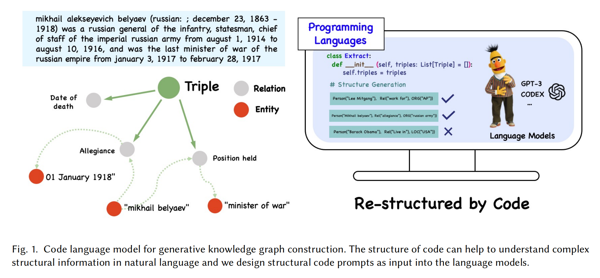

<p align="left">
    <b> English | <a href="https://github.com/zjunlp/DeepKE/blob/main/example/llm/CodeKGC/README_CN.md">简体中文</a> </b>
</p>


# CodeKGC-Code Language Models for Knowledge Graph Construction

To better address Relational Triple Extraction (rte) task in Knowledge Graph Construction, we have designed code-style prompts to model the structure of  Relational Triple, and used Code-LLMs to generate more accurate predictions. The key step of code-style prompt construction is to transform (text, output triples) pairs into semantically equivalent program language written in Python.

<div align=center>

</div>

## Data and Configuration

- Data

  The example data of `conll04` dataset is stored in the `codekgc/data` folder. The entire data is available in [here](https://drive.google.com/drive/folders/1vVKJIUzK4hIipfdEGmS0CCoFmUmZwOQV?usp=share_link). Users can customize your own data, but it is necessary to follow the given data format.

- Configuration

  The `codekgc/config.json` file contains the set parameters. The parameters required to load files and call the openai models are passed in through this file.

  Descriptions of these parameters are as follows:

  - `schema_path` defines the file path of the schema prompt. Schema prompt contains the pre-defined Python classes including **Relation** class, **Entity** class, **Triple** class and **Extract** class.

    The data format of schema prompt is as follows:

    ```python
    from typing import List
    class Rel:
        def __init__(self, name: str):
            self.name = name
    class Work_for(Rel):
    ...
    class Entity:
        def __init__(self, name: str):
            self.name = name
    class person(Entity):
    ...
    class Triple:
        def __init__(self, head: Entity, relation: Rel, tail: Entity):
            self.head = head
            self.relation = relation
            self.tail = tail
    class Extract:
        def __init__(self, triples: List[Triple] = []):
            self.triples = triples
    ```

  - `ICL_path` defines the file path of in-context examples.

    The data format of ICL prompt is as follows:

    ```python
    """ In 1856 , the 28th President of the United States , Thomas Woodrow Wilson , was born in Staunton , Va . """
    extract = Extract([Triple(person('Thomas Woodrow Wilson'), Rel('Live in'), location('Staunton , Va')),])
    ...
    ```

  - `example_path` defines the file path of the test example in conll04 dataset.

  - `openai_key` is your api key of openai.

  - `engine`, `temperature`, `max_tokens`, `n`... are the parameters required to pass in to call the openai api.

## Run and Examples

Once the parameters are set, you can directly run the `codekgc.py`：

```shell
>> cd codekgc
>> python codekgc.py
```

Below are input and output examples for Relational Triple Extraction (rte) task using code-style prompts:

**Input**:

```python
from typing import List
class Rel:
...(schema prompt)

""" In 1856 , the 28th President..."""
extract = Extract([Triple(person('Thomas Woodrow Wilson'), Rel('Live in'), location('Staunton , Va')),])
...(in-context examples)

""" Boston University 's Michael D. Papagiannis said he believes the crater was created 100 million years ago when a 50-mile-wide meteorite slammed into the Earth . """
```

**Output**:

```python
extract = Extract([Triple(person('Michael D. Papagiannis'), Rel('Work for'), organization('Boston University')),])
```
## Citation
If you use the code, please cite the following paper:

```bibtex
@article{DBLP:journals/corr/abs-2304-09048,
  author       = {Zhen Bi and
                  Jing Chen and
                  Yinuo Jiang and
                  Feiyu Xiong and
                  Wei Guo and
                  Huajun Chen and
                  Ningyu Zhang},
  title        = {CodeKGC: Code Language Model for Generative Knowledge Graph Construction},
  journal      = {CoRR},
  volume       = {abs/2304.09048},
  year         = {2023},
  url          = {https://doi.org/10.48550/arXiv.2304.09048},
  doi          = {10.48550/arXiv.2304.09048},
  eprinttype    = {arXiv},
  eprint       = {2304.09048},
  timestamp    = {Mon, 24 Apr 2023 15:03:18 +0200},
  biburl       = {https://dblp.org/rec/journals/corr/abs-2304-09048.bib},
  bibsource    = {dblp computer science bibliography, https://dblp.org}
}
```
