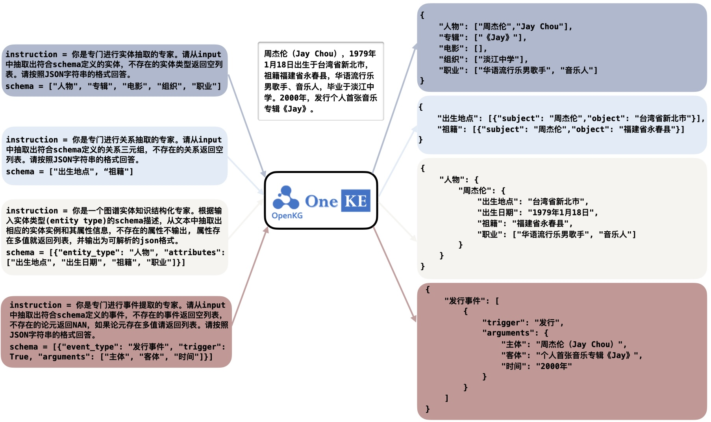

<p align="center">
    <a href="https://github.com/zjunlp/deepke"> </a>
<p>
<p align="center">  
    <a href="https://oneke.openkg.cn/">
        
    </a>
    <a href="https://pypi.org/project/deepke/#files">
        
    </a>
    <a href="https://github.com/zjunlp/DeepKE/blob/master/LICENSE">
        
    </a>
    <a href="http://zjunlp.github.io/DeepKE">
        
    </a>
</p>


<h1 align="center">
    <p>OneKE: A Bilingual Large Language Model for <br>Knowledge Extraction</p>
</h1>

- [什么是OneKE?](#什么是oneke)
- [OneKE是怎么训的?](#oneke是怎么训的)
- [快速上手OneKE](#快速上手oneke)
  - [环境安装](#环境安装)
  - [模型下载](#模型下载)
  - [快速运行](#快速运行)
- [专业使用OneKE](#专业使用oneke)
  - [OneKE指令格式](#oneke指令格式)
  - [OneKE指令格式转换](#oneke指令格式转换)
  - [4bit量化OneKE](#4bit量化oneke)
- [继续训练](#继续训练)
- [项目贡献人员](#项目贡献人员)


## 什么是OneKE?

蚂蚁集团与浙江大学依托多年积累的知识图谱与自然语言处理技术，与2024年联合升级并发布新版中英双语知识抽取大模型OneKE。该模型基于难负采样和Schema轮训式指令构造技术，专门针对提升大模型在结构化信息抽取的泛化能力进行了优化。

<p align="center" width="100%">
<a href="" target="_blank"></a>
</p>

## OneKE是怎么训的?

OneKE主要聚焦基于Schema可泛化的信息抽取。由于现有的抽取指令数据存在格式不统一、数据噪音、多样性弱等问题，如下图所示OneKE采取了抽取指令的归一化与清洗、难负样本采样、基于Schema的轮询指令构造等技术，相关内容可查阅论文“**[IEPile: Unearthing Large-Scale Schema-Based Information Extraction Corpus](https://arxiv.org/abs/2402.14710) [[Github](https://github.com/zjunlp/IEPile)]**”。


OneKE在零样本泛化性上与其他大模型的对比结果
* `NER-en`: CrossNER_AI、CrossNER_literature、CrossNER_music、CrossNER_politics、CrossNER_science
* `NER-zh`: WEIBONER、boson
* `RE-zh`: COAE2016、IPRE、SKE2020
* `RE-en`: FewRel、Wiki-ZSL
* `EE-en`: CrudeOilNews、WikiEvents、RAMS
* `EE-zh`: FewFC、CCF Law


<p align="center" width="50%">
<a href="" target="_blank"></a>
</p>


## 快速上手OneKE


### 环境安装

```bash
conda create -n deepke-llm python=3.9
conda activate deepke-llm
pip install -r requirements.txt
```

注意！！是example/llm文件夹下的 `requirements.txt`


### 模型下载

[OneKE](https://huggingface.co/zjunlp/OneKE)


### 快速运行

```python
import torch
from transformers import (
    AutoConfig,
    AutoTokenizer,
    AutoModelForCausalLM,
    GenerationConfig
)

model_path = 'zjunlp/OneKE'
config = AutoConfig.from_pretrained(model_path, trust_remote_code=True)
tokenizer = AutoTokenizer.from_pretrained(model_path, trust_remote_code=True)

model = AutoModelForCausalLM.from_pretrained(
    model_path,
    config=config,
    device_map="auto",  
    torch_dtype=torch.bfloat16,
    trust_remote_code=True,
)
model.eval()


system_prompt = '<<SYS>>\nYou are a helpful assistant. 你是一个乐于助人的助手。\n<</SYS>>\n\n'
sintruct = "{\"instruction\": \"You are an expert in named entity recognition. Please extract entities that match the schema definition from the input. Return an empty list if the entity type does not exist. Please respond in the format of a JSON string.\", \"schema\": [\"person\", \"organization\", \"else\", \"location\"], \"input\": \"284 Robert Allenby ( Australia ) 69 71 71 73 , Miguel Angel Martin ( Spain ) 75 70 71 68 ( Allenby won at first play-off hole )\"}"
sintruct = '[INST] ' + system_prompt + sintruct + '[/INST]'

input_ids = tokenizer.encode(sintruct, return_tensors="pt")
input_length = input_ids.size(1)
generation_output = model.generate(input_ids=input_ids, generation_config=GenerationConfig(max_length=1024, max_new_tokens=512, return_dict_in_generate=True))
generation_output = generation_output.sequences[0]
generation_output = generation_output[input_length:]
output = tokenizer.decode(generation_output, skip_special_tokens=True)

print(output)
```


## 专业使用OneKE

训练和推理建议至少具备**20GB的显存**


### OneKE指令格式

在OneKE中 **`instruction`** 的格式采用了类JSON字符串的结构，实质上是一种字典类型的字符串。它由以下三个字段构成：
(1) **`'instruction'`**，即任务描述，以自然语言指定模型扮演的角色以及需要完成的任务；
(2) **`'schema'`**，这是一份需提取的标签列表，明确指出了待抽取信息的关键字段，反应用户的需求，是动态可变的；
(3) **`'input'`**，指的是用于信息抽取的源文本。


以下是各个任务的指令示例:

<details>
  <summary><b>实体命名识别(NER)</b></summary>

```json
{
	"instruction": "你是专门进行实体抽取的专家。请从input中抽取出符合schema定义的实体，不存在的实体类型返回空列表。请按照JSON字符串的格式回答。",
	"schema": ["人名", "学历", "职位", "国籍"],
	"input": "刘志坚先生：1956年出生，中国国籍，无境外居留权，中共党员，大专学历，高级经济师。"
}
```

</details>


<details>
  <summary><b>关系识别(RE)</b></summary>

```json
{
	"instruction": "你是专门进行关系抽取的专家。请从input中抽取出符合schema定义的关系三元组，不存在的关系返回空列表。请按照JSON字符串的格式回答。",
	"schema": ["父亲", "丈夫", "邮政编码", "母亲"],
	"input": "于是丁龙拿出自己的毕生积蓄12000美元，在19世纪末的12000美元无疑是一笔巨款，再加上卡朋蒂埃的捐助，两人一起资助哥伦比亚大学的汉学研究"
}
```

</details>


<details>
  <summary><b>事件抽取(EE)</b></summary>

```json
{
    "instruction": "你是专门进行事件提取的专家。请从input中抽取出符合schema定义的事件，不存在的事件返回空列表，不存在的论元返回NAN，如果论元存在多值请返回列表。请按照JSON字符串的格式回答。",
    "schema": [
        {
            "event_type": "财经/交易-加息",
            "trigger": True,
            "arguments": [
                "时间"
            ]
        },
        {
            "event_type": "财经/交易-降息",
            "trigger": True,
            "arguments": [
                "降息幅度"
            ]
        },
        {
            "event_type": "财经/交易-涨价",
            "trigger": True,
            "arguments": [
                "涨价方"
            ]
        },
        {
            "event_type": "财经/交易-降价",
            "trigger": True,
            "arguments": [
                "降价物",
                "时间"
            ]
        }
    ],
    "input": "AI风控解决方案供应商维择科技获数千万美元C+轮融资"
}
```

</details>


<details>
  <summary><b>事件触发词识别(EET)</b></summary>

```json
{
  "instruction": "你是专门进行事件提取的专家。请从input中抽取出符合schema定义的事件类型及事件触发词，不存在的事件返回空列表。请按照JSON字符串的格式回答。", 
  "schema": ["组织关系-解散", "组织关系-裁员", "组织关系-解雇", "竞赛行为-晋级"], 
  "input": "雀巢裁员4000人：时代抛弃你时，连招呼都不会打！"
}
```

</details>


<details>
  <summary><b>事件论元抽取(EEA)</b></summary>

```json
{
  "instruction": "你是专门进行事件论元提取的专家。请从input中抽取出符合schema定义的事件论元及论元角色，不存在的论元返回NAN或空字典，如果论元存在多值请返回列表。请按照JSON字符串的格式回答。", 
  "schema": [{"event_type": "组织关系-辞/离职", "arguments": ["离职者", "时间", "原所属组织"]}], 
  "input": "雀巢裁员4000人：时代抛弃你时，连招呼都不会打！"
}
```

</details>


### OneKE指令格式转换

**指令列表**: 
```python
instruction_mapper = {
    'NERzh': "你是专门进行实体抽取的专家。请从input中抽取出符合schema定义的实体，不存在的实体类型返回空列表。请按照JSON字符串的格式回答。",
    'REzh': "你是专门进行关系抽取的专家。请从input中抽取出符合schema定义的关系三元组，不存在的关系返回空列表。请按照JSON字符串的格式回答。",
    'EEzh': "你是专门进行事件提取的专家。请从input中抽取出符合schema定义的事件，不存在的事件返回空列表，不存在的论元返回NAN，如果论元存在多值请返回列表。请按照JSON字符串的格式回答。",
    'EETzh': "你是专门进行事件提取的专家。请从input中抽取出符合schema定义的事件类型及事件触发词，不存在的事件返回空列表。请按照JSON字符串的格式回答。",
    'EEAzh': "你是专门进行事件论元提取的专家。请从input中抽取出符合schema定义的事件论元及论元角色，不存在的论元返回NAN或空字典，如果论元存在多值请返回列表。请按照JSON字符串的格式回答。",
    'KGzh': '你是一个图谱实体知识结构化专家。根据输入实体类型(entity type)的schema描述，从文本中抽取出相应的实体实例和其属性信息，不存在的属性不输出, 属性存在多值就返回列表，并输出为可解析的json格式。',
    'NERen': "You are an expert in named entity recognition. Please extract entities that match the schema definition from the input. Return an empty list if the entity type does not exist. Please respond in the format of a JSON string.",
    'REen': "You are an expert in relationship extraction. Please extract relationship triples that match the schema definition from the input. Return an empty list for relationships that do not exist. Please respond in the format of a JSON string.",
    'EEen': "You are an expert in event extraction. Please extract events from the input that conform to the schema definition. Return an empty list for events that do not exist, and return NAN for arguments that do not exist. If an argument has multiple values, please return a list. Respond in the format of a JSON string.",
    'EETen': "You are an expert in event extraction. Please extract event types and event trigger words from the input that conform to the schema definition. Return an empty list for non-existent events. Please respond in the format of a JSON string.",
    'EEAen': "You are an expert in event argument extraction. Please extract event arguments and their roles from the input that conform to the schema definition, which already includes event trigger words. If an argument does not exist, return NAN or an empty dictionary. Please respond in the format of a JSON string.", 
    'KGen': 'You are an expert in structured knowledge systems for graph entities. Based on the schema description of the input entity type, you extract the corresponding entity instances and their attribute information from the text. Attributes that do not exist should not be output. If an attribute has multiple values, a list should be returned. The results should be output in a parsable JSON format.',
}
```

各个任务的推荐**切分长度**:

```python
split_num_mapper = {
    'NER':6, 'RE':4, 'EE':4, 'EET':4, 'EEA':4, 'KG':4
}
```

由于一次性预测标签集中的所有schema难度过大, 且不易于扩展, 因此OneKE在训练时采用了轮询方式, 对指令中的schema询问数量进行了切分, 每次询问固定数量的schema, 因此一条数据如果其标签集过长, 将会被切分成多条指令轮流询问模型。


**schema格式**:
```python
NER: ["人名", "学历", "职位", "国籍"]   # 字符串列表
RE: ["父亲", "丈夫", "邮政编码", "母亲"]   # 字符串列表
EE: [{"event_type": "财经/交易-加息", "trigger": True, "arguments": ["时间"]}, {"event_type": "财经/交易-降息", "trigger": True, "arguments": ["降息幅度"]}]  # 字典列表, "event_type"是字符串, "trigger"是bool, "arguments"是列表
EET: ["组织关系-解散", "组织关系-裁员", "组织关系-解雇", "竞赛行为-晋级"]    # 字符串列表
EEA: [{"event_type": "财经/交易-加息", "arguments": ["时间"]}, {"event_type": "财经/交易-降息", "arguments": ["降息幅度"]}]  # 字典列表, "event_type"是字符串, "arguments"是列表
```


下面是简易的**轮询指令生成**脚本:
```python
def get_instruction(language, task, schema, input):
    sintructs = []
    split_num = split_num_mapper[task]
    if type(schema) == dict:
        sintruct = json.dumps({'instruction':instruction_mapper[task+language], 'schema':schema, 'input':input}, ensure_ascii=False)
        sintructs.append(sintruct)
    else:
        split_schemas = [schema[i:i+split_num] for i in range(0, len(schema), split_num)]
        for split_schema in split_schemas:
            sintruct = json.dumps({'instruction':instruction_mapper[task+language], 'schema':split_schema, 'input':input}, ensure_ascii=False)
            sintructs.append(sintruct)
    return sintructs
```

更详细的数据转换可参考[InstructKGC/README_CN.md/2.3测试数据转换](./InstructKGC/README_CN.md/#23测试数据转换)


下面是使用上述简易脚本的示例:

```python
task = 'NER'
language = 'en'
schema = ['person', 'organization', 'else', 'location']
split_num = split_num_mapper[task]
split_schemas = [schema[i:i+split_num] for i in range(0, len(schema), split_num)]
input = '284 Robert Allenby ( Australia ) 69 71 71 73 , Miguel Angel Martin ( Spain ) 75 70 71 68 ( Allenby won at first play-off hole )'
sintructs = []
for split_schema in split_schemas:
    sintruct = json.dumps({'instruction':instruction_mapper[task+language], 'schema':split_schema, 'input':input}, ensure_ascii=False)
    sintructs.append(sintruct)
```

> '{"instruction": "You are an expert in named entity recognition. Please extract entities that match the schema definition from the input. Return an empty list if the entity type does not exist. Please respond in the format of a JSON string.", "schema": ["person", "organization", "else", "location"], "input": "284 Robert Allenby ( Australia ) 69 71 71 73 , Miguel Angel Martin ( Spain ) 75 70 71 68 ( Allenby won at first play-off hole )"}'


### 4bit量化OneKE

```python
import torch
from transformers import BitsAndBytesConfig

quantization_config=BitsAndBytesConfig(     
    load_in_4bit=True,
    llm_int8_threshold=6.0,
    llm_int8_has_fp16_weight=False,
    bnb_4bit_compute_dtype=torch.bfloat16,
    bnb_4bit_use_double_quant=True,
    bnb_4bit_quant_type="nf4",
)
model = AutoModelForCausalLM.from_pretrained(
    model_path,
    config=config,
    device_map="auto", 
    quantization_config=quantization_config,
    torch_dtype=torch.bfloat16,
    trust_remote_code=True,
)
```

从输出文本中提取结构并评估可参考[InstructKGC/README_CN.md/7.评估](./InstructKGC/README_CN.md/#🧾-7评估)


## 继续训练

继续训练OneKE可参考[InstructKGC/4.9领域内数据继续训练](./InstructKGC/README_CN.md/#49领域内数据继续训练)


## 项目贡献人员

张宁豫、桂鸿浩、袁琳、孙梦姝、徐军、王昊奋、梁磊、陈华钧

