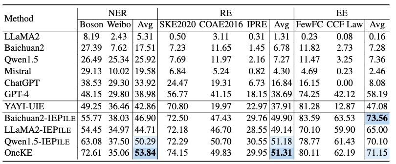
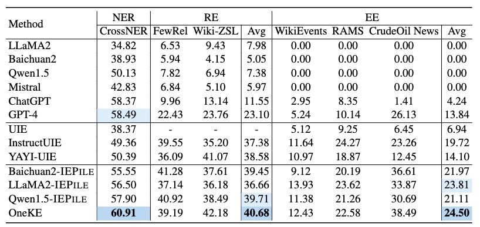
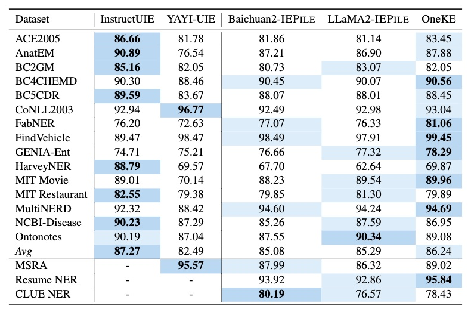
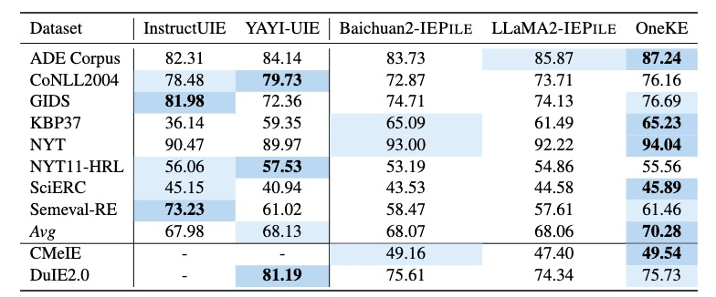
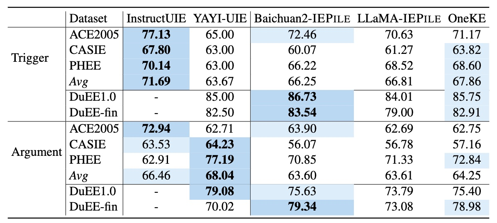

<p align="center">
    <a href="https://github.com/zjunlp/deepke"> </a>
<p>
<p align="center">  
    <a href="https://oneke.openkg.cn/">
        
    </a>
    <a href="https://pypi.org/project/deepke/#files">
        
    </a>
    <a href="https://github.com/zjunlp/DeepKE/blob/master/LICENSE">
        
    </a>
    <a href="http://zjunlp.github.io/DeepKE">
        
    </a>
</p>


<h1 align="center">
    <p>中英双语大模型知识抽取框架</p>
</h1>

- [什么是OneKE?](#什么是oneke)
- [OneKE的开源模型版本是怎么训的?](#oneke的开源模型版本是怎么训的)
- [快速上手OneKE](#快速上手oneke)
  - [环境安装](#环境安装)
  - [模型下载](#模型下载)
  - [快速运行](#快速运行)
- [专业使用OneKE](#专业使用oneke)
  - [OneKE指令格式](#oneke指令格式)
  - [OneKE指令格式转换](#oneke指令格式转换)
  - [定制化schema解释指令](#定制化schema解释指令)
  - [定制化example示例指令](#定制化example示例指令)
- [评估](#评估)
- [继续训练](#继续训练)
- [局限性](#局限性)
- [项目贡献人员](#项目贡献人员)
- [学术指导组](#学术指导组)
- [引用](#引用)


## 什么是OneKE?

OneKE是由蚂蚁集团和浙江大学联合研发的大模型知识抽取框架，具备中英文双语、多领域多任务的泛化知识抽取能力，并提供了完善的工具链支持。OneKE以开源形式贡献给OpenKG开放知识图谱社区。


基于非结构化文档的知识构建一直是知识图谱大规模落地的关键难题之一，因为真实世界的信息高度碎片化、非结构化，大语言模型在处理信息抽取任务时仍因抽取内容与自然语言表述之间的巨大差异导致效果不佳，自然语言文本信息表达中因隐式、长距离上下文关联存在较多的歧义、多义、隐喻等，给知识抽取任务带来较大的挑战。针对上述问题，蚂蚁集团与浙江大学依托多年积累的知识图谱与自然语言处理技术，联合构建和升级蚂蚁百灵大模型在知识抽取领域的能力，并发布中英双语大模型知识抽取框架OneKE，同时开源基于Chinese-Alpaca-2-13B全参数微调的版本。测评指标显示，OneKE在多个全监督及零样本实体/关系/事件抽取任务上取得了相对较好的效果。

统一知识抽取框架有比较广阔的应用场景，可大幅降低领域知识图谱的构建成本。通过从海量的数据中萃取结构化知识，构建高质量知识图谱并建立知识要素间的逻辑关联，可以实现可解释的推理决策，也可用于增强大模型缓解幻觉并提升稳定性，加速大模型垂直领域的落地应用。如应用在医疗领域通过知识抽取实现医生经验的知识化规则化管理，构建可控的辅助诊疗和医疗问答。应用在金融领域抽取金融指标、风险事件、因果逻辑及产业链等，实现自动的金融研报生成、风险预测、产业链分析等。应用在政务场景实现政务法规的知识化，提升政务服务的办事效率和准确决策。

<p align="center" width="100%">
<a href="" target="_blank"></a>
</p>

## OneKE的开源模型版本是怎么训的?

OneKE目前的开源模型版本提供了基于Schema的可泛化信息抽取。由于现有的抽取指令数据存在格式不统一、数据噪音、多样性弱等问题，OneKE采取了基于Schema的轮询指令构造技术，专门针对提升大模型在结构化信息抽取的泛化能力进行了优化，相关内容可查阅论文“**[IEPile: Unearthing Large-Scale Schema-Based Information Extraction Corpus](https://arxiv.org/abs/2402.14710) [[Github](https://github.com/zjunlp/IEPile)]**”。


OneKE在零样本泛化性上与其他大模型的对比结果：
* `NER-en`: CrossNER_AI、CrossNER_literature、CrossNER_music、CrossNER_politics、CrossNER_science
* `NER-zh`: WEIBONER、boson
* `RE-zh`: COAE2016、IPRE、SKE2020
* `RE-en`: FewRel、Wiki-ZSL
* `EE-en`: CrudeOilNews、WikiEvents、RAMS
* `EE-zh`: FewFC、CCF Law


<p align="center" width="50%">
<a href="" target="_blank"></a>
</p>


<details>
  <summary><b>零样本信息抽取结果</b></summary>





</details>

<details>
  <summary><b>全监督数据集结果</b></summary>







</details>


## 快速上手OneKE


### 环境安装

```bash
conda create -n deepke-llm python=3.9
conda activate deepke-llm
pip install -r requirements.txt
```

注意！！是example/llm文件夹下的 `requirements.txt`


### 模型下载

[HuggingFace](https://huggingface.co/zjunlp/OneKE), [ModelScope](https://modelscope.cn/models/ZJUNLP/OneKE), [WiseModel](https://wisemodel.cn/models/zjunlp/OneKE)  


### 快速运行

训练和推理建议至少具备**20GB的显存**

```python
import torch
from transformers import (
    AutoConfig,
    AutoTokenizer,
    AutoModelForCausalLM,
    GenerationConfig,
    BitsAndBytesConfig
)

device = torch.device("cuda" if torch.cuda.is_available() else "cpu")
model_path = 'zjunlp/OneKE'
config = AutoConfig.from_pretrained(model_path, trust_remote_code=True)
tokenizer = AutoTokenizer.from_pretrained(model_path, trust_remote_code=True)


# 4bit量化OneKE
quantization_config=BitsAndBytesConfig(     
    load_in_4bit=True,
    llm_int8_threshold=6.0,
    llm_int8_has_fp16_weight=False,
    bnb_4bit_compute_dtype=torch.bfloat16,
    bnb_4bit_use_double_quant=True,
    bnb_4bit_quant_type="nf4",
)

model = AutoModelForCausalLM.from_pretrained(
    model_path,
    config=config,
    device_map="auto",  
    quantization_config=quantization_config,
    torch_dtype=torch.bfloat16,
    trust_remote_code=True,
)
model.eval()


system_prompt = '<<SYS>>\nYou are a helpful assistant. 你是一个乐于助人的助手。\n<</SYS>>\n\n'
sintruct = "{\"instruction\": \"You are an expert in named entity recognition. Please extract entities that match the schema definition from the input. Return an empty list if the entity type does not exist. Please respond in the format of a JSON string.\", \"schema\": [\"person\", \"organization\", \"else\", \"location\"], \"input\": \"284 Robert Allenby ( Australia ) 69 71 71 73 , Miguel Angel Martin ( Spain ) 75 70 71 68 ( Allenby won at first play-off hole )\"}"
sintruct = '[INST] ' + system_prompt + sintruct + '[/INST]'

input_ids = tokenizer.encode(sintruct, return_tensors="pt").to(device)
input_length = input_ids.size(1)
generation_output = model.generate(input_ids=input_ids, generation_config=GenerationConfig(max_length=1024, max_new_tokens=512, return_dict_in_generate=True), pad_token_id=tokenizer.eos_token_id)
generation_output = generation_output.sequences[0]
generation_output = generation_output[input_length:]
output = tokenizer.decode(generation_output, skip_special_tokens=True)

print(output)
```


## 专业使用OneKE


### OneKE指令格式

在OneKE中 **`instruction`** 的格式采用了类JSON字符串的结构，实质上是一种字典类型的字符串。它由以下三个字段构成：
(1) **`'instruction'`**，即任务描述，以自然语言指定模型扮演的角色以及需要完成的任务；
(2) **`'schema'`**，这是一份需提取的标签列表，明确指出了待抽取信息的关键字段，反应用户的需求，是动态可变的；
(3) **`'input'`**，指的是用于信息抽取的源文本。


以下是各个任务的指令示例:

<details>
  <summary><b>实体命名识别(NER)</b></summary>

```json
{
	"instruction": "你是专门进行实体抽取的专家。请从input中抽取出符合schema定义的实体，不存在的实体类型返回空列表。请按照JSON字符串的格式回答。",
	"schema": ["人名", "学历", "职位", "国籍"],
	"input": "刘志坚先生：1956年出生，中国国籍，无境外居留权，中共党员，大专学历，高级经济师。"
}
```

</details>


<details>
  <summary><b>关系识别(RE)</b></summary>

```json
{
	"instruction": "你是专门进行关系抽取的专家。请从input中抽取出符合schema定义的关系三元组，不存在的关系返回空列表。请按照JSON字符串的格式回答。",
	"schema": ["饰演", "主角", "父亲", "母亲"],
	"input": "古往今来，能饰演古龙小说人物“楚留香”的，无一不是娱乐圈公认的美男子，2011年，36岁的张智尧在《楚留香新传》里饰演楚留香，依旧帅得让人无法自拔"
}
```

</details>


<details>
  <summary><b>知识图谱构建(KGC)</b></summary>

```json
{
    "instruction": "你是一个图谱实体知识结构化专家。根据输入实体类型(entity type)的schema描述，从文本中抽取出相应的实体实例和其属性信息，不存在的属性不输出, 属性存在多值就返回列表，并输出为可解析的json格式。", 
    "schema": [
    {
        "entity_type": "人物", 
        "attributes": [ "中文名","英文名","祖籍","出生日期","出生地点","职业", "毕业学校", "作品","奖项"]
    }
    ], 
    "input": "周杰伦（Jay Chou），1979年1月18日出生于台湾省新北市，祖籍福建省泉州市永春县，华语流行乐男歌手、音乐人、演员、导演、编剧，毕业于淡江中学。2000年，发行个人首张音乐专辑《Jay》。2001年，凭借专辑《范特西》奠定其融合中西方音乐的风格。2002年，举行“The One”世界巡回演唱会；同年，凭借歌曲《爱在西元前》获得第13届台湾金曲奖最佳作曲人奖。"
}
```

</details>


<details>
  <summary><b>事件抽取(EE)</b></summary>

```json
{
    "instruction": "你是专门进行事件提取的专家。请从input中抽取出符合schema定义的事件，不存在的事件返回空列表，不存在的论元返回NAN，如果论元存在多值请返回列表。请按照JSON字符串的格式回答。",
    "schema": [
        {
            "event_type": "财经/交易-加息",
            "trigger": True,
            "arguments": [
                "时间"
            ]
        },
        {
            "event_type": "财经/交易-降息",
            "trigger": True,
            "arguments": [
                "降息幅度"
            ]
        },
        {
            "event_type": "财经/交易-涨价",
            "trigger": True,
            "arguments": [
                "涨价方"
            ]
        },
        {
            "event_type": "灾害/意外-坍/垮塌",
            "trigger": True,
            "arguments": [
                "时间", 
                "死亡人数", 
                "坍塌主体", 
                "受伤人数"
            ]
        }
    ],
    "input": "深圳市体育中心坍塌事故已致3人死亡，5人受伤"
}
```

</details>


<details>
  <summary><b>事件触发词识别(EET)</b></summary>

```json
{
  "instruction": "你是专门进行事件提取的专家。请从input中抽取出符合schema定义的事件类型及事件触发词，不存在的事件返回空列表。请按照JSON字符串的格式回答。", 
  "schema": ["组织关系-解散", "组织关系-裁员", "组织关系-解雇", "竞赛行为-晋级"], 
  "input": "雀巢裁员4000人：时代抛弃你时，连招呼都不会打！"
}
```

</details>


<details>
  <summary><b>事件论元抽取(EEA)</b></summary>

```json
{
  "instruction": "你是专门进行事件论元提取的专家。请从input中抽取出符合schema定义的事件论元及论元角色，不存在的论元返回NAN或空字典，如果论元存在多值请返回列表。请按照JSON字符串的格式回答。", 
  "schema": [{"event_type": "组织关系-裁员", "arguments": ["裁员方", "被裁员方", "裁员人数"]}], 
  "input": "又一网约车巨头倒下：三个月裁员835名员工，滴滴又该何去何从"
}
```

</details>


> 注意：鉴于特定领域内信息抽取的复杂性和对提示的依赖程度较高，我们支持在指令中融入Schema描述和示例（Example）来提升抽取任务的效果, 具体参考[定制化schema解释指令](OneKE.md/#定制化schema解释指令) 和 [定制化example示例指令](OneKE.md/#定制化example示例指令)。由于模型规模有限，模型输出依赖于提示且不同的提示可能会产生不一致的结果，敬请谅解。


### OneKE指令格式转换

**指令列表**: 
```python
instruction_mapper = {
    'NERzh': "你是专门进行实体抽取的专家。请从input中抽取出符合schema定义的实体，不存在的实体类型返回空列表。请按照JSON字符串的格式回答。",
    'REzh': "你是专门进行关系抽取的专家。请从input中抽取出符合schema定义的关系三元组，不存在的关系返回空列表。请按照JSON字符串的格式回答。",
    'EEzh': "你是专门进行事件提取的专家。请从input中抽取出符合schema定义的事件，不存在的事件返回空列表，不存在的论元返回NAN，如果论元存在多值请返回列表。请按照JSON字符串的格式回答。",
    'EETzh': "你是专门进行事件提取的专家。请从input中抽取出符合schema定义的事件类型及事件触发词，不存在的事件返回空列表。请按照JSON字符串的格式回答。",
    'EEAzh': "你是专门进行事件论元提取的专家。请从input中抽取出符合schema定义的事件论元及论元角色，不存在的论元返回NAN或空字典，如果论元存在多值请返回列表。请按照JSON字符串的格式回答。",
    'KGzh': '你是一个图谱实体知识结构化专家。根据输入实体类型(entity type)的schema描述，从文本中抽取出相应的实体实例和其属性信息，不存在的属性不输出, 属性存在多值就返回列表，并输出为可解析的json格式。',
    'NERen': "You are an expert in named entity recognition. Please extract entities that match the schema definition from the input. Return an empty list if the entity type does not exist. Please respond in the format of a JSON string.",
    'REen': "You are an expert in relationship extraction. Please extract relationship triples that match the schema definition from the input. Return an empty list for relationships that do not exist. Please respond in the format of a JSON string.",
    'EEen': "You are an expert in event extraction. Please extract events from the input that conform to the schema definition. Return an empty list for events that do not exist, and return NAN for arguments that do not exist. If an argument has multiple values, please return a list. Respond in the format of a JSON string.",
    'EETen': "You are an expert in event extraction. Please extract event types and event trigger words from the input that conform to the schema definition. Return an empty list for non-existent events. Please respond in the format of a JSON string.",
    'EEAen': "You are an expert in event argument extraction. Please extract event arguments and their roles from the input that conform to the schema definition, which already includes event trigger words. If an argument does not exist, return NAN or an empty dictionary. Please respond in the format of a JSON string.", 
    'KGen': 'You are an expert in structured knowledge systems for graph entities. Based on the schema description of the input entity type, you extract the corresponding entity instances and their attribute information from the text. Attributes that do not exist should not be output. If an attribute has multiple values, a list should be returned. The results should be output in a parsable JSON format.',
}
```

各个任务的推荐**切分长度**:

```python
split_num_mapper = {
    'NER':6, 'RE':4, 'EE':4, 'EET':4, 'EEA':4, 'KG':1
}
```

由于一次性预测标签集中的所有schema难度过大, 且不易于扩展, 因此OneKE在训练时采用了轮询方式, 对指令中的schema询问数量进行了切分, 每次询问固定数量的schema, 因此一条数据如果其标签集过长, 将会被切分成多条指令轮流询问模型。


**schema格式**:
```python
NER: ["人名", "学历", "职位", "国籍"]   # 字符串列表
RE: ["父亲", "丈夫", "邮政编码", "母亲"]   # 字符串列表
EE: [{"event_type": "财经/交易-加息", "trigger": True, "arguments": ["时间"]}, {"event_type": "财经/交易-降息", "trigger": True, "arguments": ["降息幅度"]}]  # 字典列表, "event_type"是字符串, "trigger"是bool, "arguments"是列表
EET: ["组织关系-解散", "组织关系-裁员", "组织关系-解雇", "竞赛行为-晋级"]    # 字符串列表
EEA: [{"event_type": "财经/交易-加息", "arguments": ["时间"]}, {"event_type": "财经/交易-降息", "arguments": ["降息幅度"]}]  # 字典列表, "event_type"是字符串, "arguments"是列表
```


下面是简易的**轮询指令生成**脚本:
```python
def get_instruction(language, task, schema, input):
    sintructs = []
    split_num = split_num_mapper[task]
    if type(schema) == dict:
        sintruct = json.dumps({'instruction':instruction_mapper[task+language], 'schema':schema, 'input':input}, ensure_ascii=False)
        sintructs.append(sintruct)
    else:
        split_schemas = [schema[i:i+split_num] for i in range(0, len(schema), split_num)]
        for split_schema in split_schemas:
            sintruct = json.dumps({'instruction':instruction_mapper[task+language], 'schema':split_schema, 'input':input}, ensure_ascii=False)
            sintructs.append(sintruct)
    return sintructs
```

更详细的数据转换可参考[InstructKGC/README_CN.md/2.3测试数据转换](./InstructKGC/README_CN.md/#23测试数据转换)


下面是使用上述简易脚本的示例:

```python
task = 'NER'
language = 'en'
schema = ['person', 'organization', 'else', 'location']
split_num = split_num_mapper[task]
split_schemas = [schema[i:i+split_num] for i in range(0, len(schema), split_num)]
input = '284 Robert Allenby ( Australia ) 69 71 71 73 , Miguel Angel Martin ( Spain ) 75 70 71 68 ( Allenby won at first play-off hole )'
sintructs = []
for split_schema in split_schemas:
    sintruct = json.dumps({'instruction':instruction_mapper[task+language], 'schema':split_schema, 'input':input}, ensure_ascii=False)
    sintructs.append(sintruct)
```

> '{"instruction": "You are an expert in named entity recognition. Please extract entities that match the schema definition from the input. Return an empty list if the entity type does not exist. Please respond in the format of a JSON string.", "schema": ["person", "organization", "else", "location"], "input": "284 Robert Allenby ( Australia ) 69 71 71 73 , Miguel Angel Martin ( Spain ) 75 70 71 68 ( Allenby won at first play-off hole )"}'


更多详细的推理脚本可查看[InstructKGC/6.1.2IE专用模型](./InstructKGC/README_CN.md/#612ie专用模型)


### 定制化schema解释指令

```json
{
  "instruction": "你是专门进行实体抽取的专家。请从input中抽取出符合schema定义的实体，不存在的实体类型返回空列表。请按照JSON字符串的格式回答。", 
  "schema": {
    "职位": "实体类型描述个人或群体的职业或职务，包括特定角色名称如'制片方'，'报分员'，'苦行僧'，'油画家'。", 
    "景点": "景点实体类型包括建筑物、博物馆、纪念馆、美术馆、河流、山峰等。代表性实体有五角大楼、泰特当代美术馆、郑成功纪念馆、都喜天阙、巴里卡萨、罗博河、gunungbatur、愚公移山LIVE、徐悲鸿纪念馆、杜莎夫人蜡像馆等。", 
    "公司": "公司是一个实体类型，代表任何法人实体或商业组织。这个类型的实体可以是餐饮集团，制造商，零售商，酒店，银行，设计院等各种类型的公司。例如：'香格里拉酒店集团', 'JVC', '上海酷蕾专业电竞外设装备店', 'k2&bull;海棠湾', '武钢', 'louisvuitton', '苏格兰银行', '北京市建筑设计研究院', '7天', '万科集团'。", 
    "地址": "地址实体是指具有地理位置信息的实体，它可以代表一个国家、城市、区域、街道等具体的地方或者一个抽象的地理区域。例如：'曼哈顿下城区东南尖上的河边码头', '图阿普谢', '意大利威尼斯水乡', '湖州温泉高尔夫球场', '北卡罗来纳州', '京津区域', '开心网吧', '颐年护理院', '上塘镇浦东', '内蒙古自治区赤峰市'等。", 
    "组织机构": "组织机构实体是指集体性质的组织，比如公司、商铺、俱乐部、学校等。它们在社会和经济活动中扮演一定角色，并拥有一定的人格权。", 
    "电影": "电影实体包括中文或英文电影名称，有时也包括电影人物角色名。"
  }, 
  "input": "我很难想象在另外一个项目再做一个海渔广场，当时我们拿到这个项目的时候，我正好在三亚，"
}
```


<details>
  <summary><b>关系抽取(RE)解释指令</b></summary>

```json
{
    "instruction": "你是专门进行关系抽取的专家。请从input中抽取出符合schema定义的关系三元组，不存在的关系返回空列表。请按照JSON字符串的格式回答。",
    "schema": {
        "民族": "民族",
        "毕业院校": "该关系类型描述的是人物和其毕业学院之间的关系，人物是主体，毕业学院是客体。通过识别出文本中的人物名称和学校名称，然后通过词语的组合、上下文情境等信息，分析出人物和学院之间的毕业关系。",
        "饰演": "这是一个描述电影、电视剧等视听作品中，某个演员扮演某个角色的关系，主体一般为人，客体为他们在作品中扮演的角色。该关系表示了特定人物在特定作品中所扮演角色的情况，以及由此产生的各种演员、角色间的关系。",
        "父亲": "这个关系类型用来表示人物关系中的父亲和子女之间的亲属关系，即父亲是子女的出生或抚养者。在关系三元组中，'父亲'这个关系类型的主体是子女，客体是父亲。"
    },
    "input": "古往今来，能饰演古龙小说人物“楚留香”的，无一不是娱乐圈公认的美男子，2011年，36岁的张智尧在《楚留香新传》里饰演楚留香，依旧帅得让人无法自拔"
}
```

</details>


<details>
  <summary><b>事件抽取(EE)解释指令</b></summary>

```json
{
    "instruction": "你是专门进行事件提取的专家。请从input中抽取出符合schema定义的事件，不存在的事件返回空列表，不存在的论元返回NAN，如果论元存在多值请返回列表。请按照JSON字符串的格式回答。",
    "schema": {
        "财经/交易-上市": {
            "财经/交易-上市": "金融实体在证券市场上进行上市的行为主要涉及公司、股票等。 正样本包括公司或股票上市的具体信息，负样本则与此类活动无关。",
            "trigger": True,
            "arguments": {
                "融资金额": "指的是公司在上市事件中筹集的资金总额。它综合了所有股份发行的收益，并以货币计量，包括但不限于'亿'、'万'、'美元'、'人民币'等单位。",
                "时间": "描述上市事件发生的具体时间，可以是具体日期或相对时间，也可以包含地点信息和具体的日子和星期。",
                "上市企业": "指的是在某次上市事件中，进行首次公开招股或已经在交易市场挂牌的公司或企业。例如：'上海复宏汉霖生物技术股份'、'三只松鼠'、'宝信软件'、'小熊电器'、'晋商银行'、''人造肉第一股'Beyond Meat(BYND)'、'游戏直播平台斗鱼'、'快餐帝国'以及'自动驾驶激光雷达厂商Velodyne'等。",
                "地点": "财经或交易事件发生的具体地点，比如城市、建筑物或房间。"
            }
        },
        "组织关系-辞/离职": {
            "组织关系-辞/离职": "事件类型'组织关系-辞/离职'是指个人或组织成员与所属组织关系变动的情况，主要包括'辞职'、'请辞'、'卸任'、'离队'、'退休'、'离开'等。常发生在高层人事变动、政府官员变动或运动员转会等场景。例如：'李楠宣布辞职'、'于旭波上任董事会主席3个月就辞职 陈朗接棒'。",
            "trigger": True,
            "arguments": {
                "离职者": "指在组织关系-辞/离职事件中，主动或被动地离开原来的职务或工作岗位的个体或群体，可以是一个人，也可以是一组人，如：'财政大臣', '90后邵阳隆回小伙欧阳恩和', '熊晓鸽', '*ST长生两位副总经理', '杨涛', '飞行员马强', 'HE WEI', '百度5名高管', '优信集团首席运营官彭惟廉', '建科院证券事务代表舒彦铭'等。",
                "时间": "表示辞/离职事件发生的具体时间点或时间段，一般包括具体的日期、周数、时间等信息。如'9月19号', '6月29日晚', '本周六', '7月9日上午10:30', '6月12日早晨', '4月9日', '9月10号', '当地时间周日', '九月十二日', '10月15日上午十点'等。"
            }
        },
        "财经/交易-加息": {
            "财经/交易-加息": "该事件描述银行或金融机构提高利率以收紧货币供应。典型触发词是'加息'。 '加息'表明了财经/交易-加息事件的发生。",
            "trigger": True,
            "arguments": {
                "加息幅度": "加息幅度通常表现为一个百分比或者基点，表示在加息事件中，利率提高的程度或者范围。例如：'至5.75%'，'25基点'，'基准利率从0.25%上升至0.5%'，'25个基点'。",
                "加息机构": "加息机构是指在财经/交易-加息事件中，决定或者执行加息政策的具有货币政策调控权的金融机构，比如各国的中央银行（如英央行、美联储、欧洲央行等）或是金融机构（如英格兰银行）。",
                "时间": "表示财经/交易-加息事件发生的具体日期或时间段，如'6月18日上午'、'1月24日'、'三个月后'等，具体表达形式既包括精确到分钟的时间如'2018年12月28日11时'，也包括相对时间如'昨天（2日）'和特殊的时间表达如'中秋档'等。"
            }
        },
        "组织关系-裁员": {
            "组织关系-裁员": "合同被取消或终止的情况通常在商业、娱乐或体育领域中发生。触发词有'离开', '裁剪', '裁掉', '合约到期', '解除合约', '解除', '解约'等。正例包括'A公司裁员300人'和'B公司将裁减10%的人员'，负例如'彭昱畅解除合约'。",
            "trigger": True,
            "arguments": {
                "裁员方":"在组织关系裁员事件中的角色，是发起裁员、解除协议或合同关系的一方，可能是个人或公司。",
                "被裁员方": "在组织关系裁员事件中的角色，是被解除协议或合同关系的一方，可能是个人或人群。例如，'员工100人'"
            }
        }
    },
    "input": "8月20日消息，据腾讯新闻《一线》报道，知情人士表示，为了控制成本支出，蔚来计划将美国分公司的人员规模除自动驾驶业务相关人员外，减少至200人左右。截至美国时间8月16日，蔚来位于美国硅谷的分公司已裁减100名员工。"
}
```

</details>


<details>
  <summary><b>知识图谱构建(KGC)解释指令</b></summary>

```json
{
  "instruction": "你是一个图谱实体知识结构化专家。根据输入实体类型(entity type)的schema描述，从文本中抽取出相应的实体实例和其属性信息，不存在的属性不输出, 属性存在多值就返回列表，并输出为可解析的json格式。", 
  "schema": [
    {
      "entity_type": "人物",
      "attributes": {
        "中文名": "人物中文名字", 
        "英文名": "人物的英文名", 
        "祖籍": "人物的祖籍地址",
        "出生日期": "生日、出生年月日", 
        "出生地点": "出生的地点、行政区",
        "职业": "人物的职业、职务、身份",
        "毕业学校": "就读毕业的中学、大学、高校",
        "作品": "专辑、歌曲、小说、出版书籍、参演影视作品等",
        "奖项": "人物所获得的各种奖项和荣誉称号"}
    }
  ], 
  "input": "周杰伦（Jay Chou），1979年1月18日出生于台湾省新北市，祖籍福建省泉州市永春县，华语流行乐男歌手、音乐人、演员、导演、编剧，毕业于淡江中学。2000年，发行个人首张音乐专辑《Jay》。2001年，凭借专辑《范特西》奠定其融合中西方音乐的风格。2002年，举行“The One”世界巡回演唱会；同年，凭借歌曲《爱在西元前》获得第13届台湾金曲奖最佳作曲人奖。"
}
```

</details>


### 定制化example示例指令

由于example示例通常较长, 模型训练最大长度有限, 过多的example可能导致模型的效果反而不好, 因此我们建议给2个example, 一个正例, 一个反例, 并且限制schema的数量在1个。

```json
{
    "instruction": "你是专门进行实体抽取的专家。请从input中抽取出符合schema定义的实体，不存在的实体类型返回空列表。请按照JSON字符串的格式回答。你可以参考example进行抽取。",
    "schema": [
        "检查指标"
    ],
    "example": [
        {
            "input": "CKD诊断标准：1.以下任意一项指标持续超过3个月；且至少满足1项。(1)肾损伤标志：白蛋白尿[尿白蛋白排泄率(AER)≥30mg／24h；尿白蛋白肌酐比值(ACR)≥3mg／mmol]；尿沉渣异常；肾小管相关病变；组织学异常；影像学所见结构异常；肾移植病史。(2)肾小球滤过率下降：eGFR≤60ml·min-1·1.73m-2 ",
            "output": {
                "检查指标": [
                    "尿白蛋白排泄率(AER)",
                    "尿白蛋白肌酐比值(ACR)",
                    "肾小球滤过率",
                    "eGFR"
                ]
            }
        },
        {
            "input": "DPP-4抑制剂在特殊人群中的应用",
            "output": {
                "检查指标": []
            }
        }
    ],
    "input": "目前所有磺脲类药物说明书均将重度肝功能不全列为禁忌证。丙氨酸氨基转移酶(alanine transaminase，ALT)>3倍参考值上限可作为肝损害的敏感而特异的指标，若ALT>8~10倍参考值上限或者ALT>3倍参考值上限且血清总胆红素(total bilirubin，TBIL)>2倍参考值上限则是预测重度肝损害的特异指标，表明肝脏实质细胞受到损害，此时应禁用磺脲类药物。在临床使用中，伴有肝性脑病、腹水或凝血障碍的失代偿肝硬化患者应禁用该类药物以防发生低血糖。"
}
```


<details>
  <summary><b>关系抽取(RE)example示例指令</b></summary>

```json
{
    "instruction": "你是专门进行关系抽取的专家。请从input中抽取出符合schema定义的关系三元组，不存在的关系返回空列表。请按照JSON字符串的格式回答。你可以参考example进行抽取。",
    "schema": [
        "疾病的分期分型"
    ],
    "example": [
        {
            "input": "糖尿病的基础治疗包括教育和管理、饮食和运动两方面。缺乏糖尿病防治知识是血糖控制差的最主要原因。重视老年患者的教育和管理是提高糖尿病治疗水平的重要举措。",
            "output": {
                "疾病的分期分型": []
            }
        },
        {
            "input": "格列喹酮的代谢产物无降糖作用且大部分从粪便排泄，仅5.0%经肾脏排泄，受肾功能影响较小，但用于慢性肾脏病患者的大型临床研究有限。曾有研究观察格列喹酮用于GFR10~50mlmin-1.(1.73m2)-1患者，但试验设计不尽完善。格列喹酮可用于慢性肾脏病1~3期的患者且无需调整剂量；4期需谨慎用药；5期禁用。",
            "output": {
                "疾病的分期分型": [
                    {
                        "subject": "慢性肾脏病",
                        "object": "慢性"
                    },
                    {
                        "subject": "慢性肾脏病",
                        "object": "慢性"
                    },
                    {
                        "subject": "慢性肾脏病",
                        "object": "1~3期"
                    },
                    {
                        "subject": "慢性肾脏病",
                        "object": "4期"
                    },
                    {
                        "subject": "慢性肾脏病",
                        "object": "5期"
                    }
                ]
            }
        }
    ],
    "input": "(2)NSAIDs：包括非选择性环氧化酶(COX)抑制剂COX-2抑制剂两种，若无禁忌推荐早期足量使用NSAIDs速效制剂。非选择性COX抑制剂主要存在消化道溃道溃疡，胃肠道穿孔、上消化道出血等胃肠道不良反应，对于不耐受非选择性COX抑制剂的患者可选用COX-2抑制剂，其胃肠道不良反应可降低50％；活动性消化道溃疡／出血，或既往有复发性消化道溃疡／出血病史者为所有NSAIDs使用禁忌症。COX-2抑制剂可能引起心血管事件的危险性增加，合并心肌梗死、心功能不全者避免使用。NSAIDs中使用过程中需监测肾功能，严重慢性肾脏病(G4～5期)未透析患者不建议使用。"
}
```

</details>


<details>
  <summary><b>事件抽取(EE)example示例指令</b></summary>

```json
{
    "instruction": "你是专门进行事件提取的专家。请从input中抽取出符合schema定义的事件，不存在的事件返回空列表，不存在的论元返回NAN，如果论元存在多值请返回列表。请按照JSON字符串的格式回答。你可以参考example进行抽取。",
    "schema": [
        {
            "event_type": "企业融资",
            "trigger": true,
            "arguments": [
                "披露时间",
                "被投资方",
                "融资轮次",
                "领投方",
                "事件时间",
                "投资方",
                "融资金额"
            ]
        }
    ],
    "example": [
        {
            "input": "募资25亿元扩产 均胜电子身患“三高”隐疾：高质押 高商誉 高负债\n本报记者 张家振 北京报道\n手握百亿级大订单的宁波均胜电子股份有限公司（以下简称“均胜电子”，600699.SH）正加紧募集资金扩充产能，以缓解日益紧迫的产能饱和瓶颈。\n近日，均胜电子发布公告称，公司收到证监会《反馈意见通知书》，非公开发行股票事项离获核准更进一步。",
            "output": {
                "企业融资": [
                    {
                        "trigger": "募资",
                        "arguments": {
                            "披露时间": "NAN",
                            "被投资方": "宁波均胜电子股份有限公司",
                            "融资轮次": "NAN",
                            "领投方": "NAN",
                            "事件时间": "NAN",
                            "投资方": "NAN",
                            "融资金额": "25亿元"
                        }
                    }
                ]
            }
        },
        {
            "input": "蔚来汽车盘前跌幅扩大至13% 蔚来汽车二季度亏逾32亿\n原标题：蔚来汽车盘前跌幅扩大至13% 蔚来汽车二季度亏逾32亿\n蔚来汽车盘前股价由涨转跌，跌幅扩至13％，蔚来今日发布了第二季度财报，随后宣布取消原定于今日举行的财报电话会议。\n财报显示，蔚来汽车二季度实现营收15.08亿元，高于市场预期的13.09亿元，去年同期为4600万元；第二季度归属于股东净亏损32.85亿元，高于市场预期的亏损29.44亿元，去年同期亏损61.1亿元。",
            "output": {
                "企业融资": []
            }
        }
    ],
    "input": "【首发】五年第11笔，编程猫宣布完成C+轮2.5亿融资\n芥末堆4月17日讯 今日，编程猫宣布完成C +轮2.5亿元的融资。\n这是去年完成4亿人民币C轮融资后，编程猫时隔5个月补充的新一轮“弹药”。\n本轮投资由招银国际领投，中银集团旗下股权投资基金渤海中盛，及现有股东粤科鑫泰、盛宇投资等跟投。"
}
```

</details>


## 评估

从输出文本中提取结构并评估可参考[InstructKGC/README_CN.md/7.评估](./InstructKGC/README_CN.md/#🧾-7评估)


## 继续训练

继续训练OneKE可参考[InstructKGC/4.9领域内数据继续训练](./InstructKGC/README_CN.md/#49领域内数据继续训练)

## 局限性

OneKE在全监督及多领域泛化性上有比较出色的表现，统一的指令结构也能让业务通过增加更多领域标注数据以获取更好的模型能力。通过OneKE框架，我们证明了基于大模型统一知识构建框架的可行性。然而，在实际的工业应用中，业务对知识要素的覆盖率、准确率要求非常高，统一Schema指令结构难以覆盖所有的知识表示形式，因此OneKE依然存在**抽不全、抽不准以及难以处理较长文本**的问题。由于模型的规模有限，模型输出极大地依赖于输入的提示词（Prompt）。因此，不同的尝试可能会产生不一致的结果，且可能存在幻觉输出。我们也在并行探索开放知识抽取，联动图谱自动构建系统，持续优化和提升OneKE新领域及新类型上的适应性。

## 项目贡献人员

CO-PI：张宁豫（浙江大学）、梁磊（蚂蚁集团）

桂鸿浩（浙江大学）、袁琳（蚂蚁集团）、孙梦姝（蚂蚁集团）、徐军（蚂蚁集团）、渠源（蚂蚁集团）、王昊奋（客座专家，同济大学）、张锦添（浙江大学）、张文（浙江大学）、张强（浙江大学）、乔硕斐（浙江大学）、徐欣（浙江大学）、方继展（浙江大学）、罗玉洁（浙江大学）、张志强（蚂蚁集团）

## 学术指导组

陈华钧（浙江大学）、周俊（蚂蚁集团）、陈文光（清华大学）


## 引用

如果您使用了OneKE， 烦请引用下列论文: 

```bibtex
@article{DBLP:journals/corr/abs-2402-14710,
  author       = {Honghao Gui and
                  Lin Yuan and
                  Hongbin Ye and
                  Ningyu Zhang and
                  Mengshu Sun and
                  Lei Liang and
                  Huajun Chen},
  title        = {IEPile: Unearthing Large-Scale Schema-Based Information Extraction
                  Corpus},
  journal      = {CoRR},
  volume       = {abs/2402.14710},
  year         = {2024},
  url          = {https://doi.org/10.48550/arXiv.2402.14710},
  doi          = {10.48550/ARXIV.2402.14710},
  eprinttype    = {arXiv},
  eprint       = {2402.14710},
  timestamp    = {Tue, 09 Apr 2024 07:32:43 +0200},
  biburl       = {https://dblp.org/rec/journals/corr/abs-2402-14710.bib},
  bibsource    = {dblp computer science bibliography, https://dblp.org}
}
```

