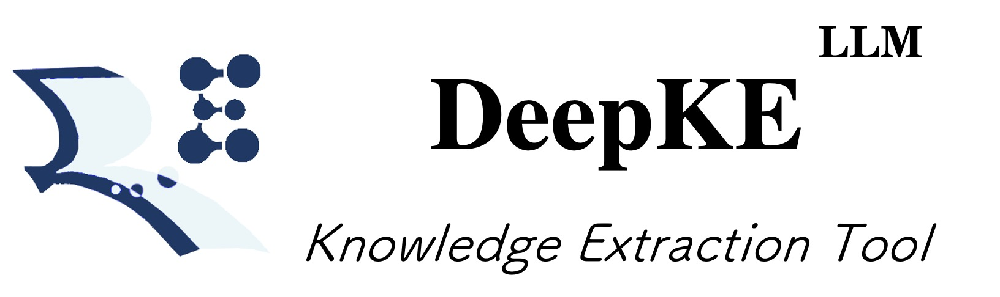
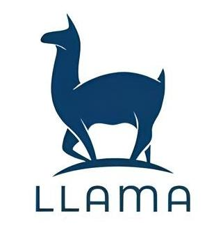

<p align="center">
    <a href="https://github.com/zjunlp/deepke"> </a>
<p>
<p align="center">  
    <a href="http://deepke.zjukg.cn">
        
    </a>
    <a href="https://pypi.org/project/deepke/#files">
        
    </a>
    <a href="https://github.com/zjunlp/DeepKE/blob/master/LICENSE">
        
    </a>
    <a href="http://zjunlp.github.io/DeepKE">
        
    </a>
    <a href="https://colab.research.google.com/drive/1vS8YJhJltzw3hpJczPt24O0Azcs3ZpRi?usp=sharing">
        
    </a>
</p>


<p align="center">
    <b> English | <a href="https://github.com/zjunlp/DeepKE/blob/main/example/llm/README_CN.md">简体中文</a> </b>
</p>

<h1 align="center">
    <p>DeepKE-LLM: A Large Language Model Based<br>Knowledge Extraction Toolkit</p>
</h1>


- [Requirements](#requirements)
- [News](#news)
- [Dataset](#dataset)
- [Models](#models)
  - [LLaMA-series](#llama-series)
    - [Case 1: LoRA Fine-tuning of LLaMA for CCKS2023 Instruction-based KG Construction English | Chinese](#case-1-lora-fine-tuning-of-llama-for-ccks2023-instruction-based-kg-construction-english--chinese)
    - [Case 2: Using ZhiXi for CCKS2023 Instruction-based KG Construction English | Chinese](#case-2-using-zhixi-for-ccks2023-instruction-based-kg-construction-english--chinese)
  - [ChatGLM](#chatglm)
    - [Case 1: LoRA Fine-tuning of ChatGLM for CCKS2023 Instruction-based KG Construction English | Chinese](#case-1-lora-fine-tuning-of-chatglm-for-ccks2023-instruction-based-kg-construction-english--chinese)
    - [Case 2: P-Tuning of ChatGLM for CCKS2023 Instruction-based KG Construction English | Chinese](#case-2-p-tuning-of-chatglm-for-ccks2023-instruction-based-kg-construction-english--chinese)
  - [MOSS](#moss)
    - [Case 1: OpenDelta Fine-tuning of Moss for CCKS2023 Instruction-based KG Construction English | Chinese](#case-1-opendelta-fine-tuning-of-moss-for-ccks2023-instruction-based-kg-construction-english--chinese)
  - [Baichuan](#baichuan)
    - [Case 1: OpenDelta Fine-tuning of Baichuan for CCKS2023 Instruction-based KG Construction English | Chinese](#case-1-opendelta-fine-tuning-of-baichuan-for-ccks2023-instruction-based-kg-construction-english--chinese)
  - [CPM-Bee](#cpm-bee)
    - [Case 1: OpenDelta Fine-tuning of CPM-Bee for CCKS2023 Instruction-based KG Construction English | Chinese](#case-1-opendelta-fine-tuning-of-cpm-bee-for-ccks2023-instruction-based-kg-construction-english--chinese)
  - [GPT-series](#gpt-series)
    - [Case 1: Information Extraction with LLMs English | Chinese](#case-1-information-extraction-with-llms-english--chinese)
    - [Case 2: Data Augmentation with LLMs English | Chinese](#case-2-data-augmentation-with-llms-english--chinese)
    - [Case 3: CCKS2023 Instruction-based KG Construction with LLMs English | Chinese](#case-3-ccks2023-instruction-based-kg-construction-with-llms-english--chinese)
    - [Case 4: Unleash the Power of Large Language Models for Few-shot Relation Extraction English | Chinese](#case-4-unleash-the-power-of-large-language-models-for-few-shot-relation-extraction-english--chinese)
    - [Case 5: CodeKGC-Code Language Models for KG Construction English | Chinese](#case-5-codekgc-code-language-models-for-kg-construction-english--chinese)
- [Methods](#methods)
  - [Method 1: In-Context Learning (ICL)](#method-1-in-context-learning-icl)
  - [Method 2: LoRA](#method-2-lora)
  - [Method 3: P-Tuning](#method-3-p-tuning)
- [Citation](#citation)


# Requirements

In the era of large models, DeepKE-LLM utilizes a completely new environment dependency.

```
conda create -n deepke-llm python=3.9
conda activate deepke-llm

cd example/llm
pip install -r requirements.txt
```

Please note that the `requirements.txt` file is located in the `example/llm` folder.


# News

* [2024/02] We released a large-scale (0.32B tokens) high-quality bilingual (Chinese and English) Information Extraction (IE) instruction tuning dataset named [IEPile](https://huggingface.co/datasets/zjunlp/iepie), along with two models trained on `IEPile`, [baichuan2-13b-iepile-lora](https://huggingface.co/zjunlp/baichuan2-13b-iepile-lora) and [llama2-13b-iepile-lora](https://huggingface.co/zjunlp/llama2-13b-iepile-lora).
* [2023/11] The weights of [knowlm-13b-ie](https://huggingface.co/zjunlp/knowlm-13b-ie/tree/main) have been updated. This update mainly adjusted the NAN outputs, shortened the inference length, and added support for instructions without a specified schema.
* [2023/10] We released a new bilingual (Chinese and English) theme-based Information Extraction (IE) instruction dataset named [InstructIE](https://huggingface.co/datasets/zjunlp/InstructIE).
* [2023/08] A specialized version of KnowLM for information extraction (IE), named [knowlm-13b-ie](https://huggingface.co/zjunlp/knowlm-13b-ie/tree/main), was launched.
* [2023/07] Some of the instruction datasets used for training were released, including [knowlm-ke](https://huggingface.co/datasets/zjunlp/knowlm-ke) and [KnowLM-IE](https://huggingface.co/datasets/zjunlp/KnowLM-IE).
* [2023/06] The first version of pre-trained weights, [knowlm-13b-base-v1.0](https://huggingface.co/zjunlp/knowlm-13b-base-v1.0), and the first version of [zhixi-13b-lora](https://huggingface.co/zjunlp/zhixi-13b-lora) were released.
* [2023/05] We initiated an instruction-based Information Extraction project.


# Dataset

**Existing Datasets**

| Name | Download | Quantity | Description |
| --- | --- | --- | --- |
| InstructIE | [Google Drive](https://drive.google.com/file/d/1raf0h98x3GgIhaDyNn1dLle9_HvwD6wT/view?usp=sharing) <br/> [Hugging Face](https://huggingface.co/datasets/zjunlp/InstructIE) <br/> [ModelScope](https://modelscope.cn/datasets/ZJUNLP/InstructIE)<br/> [WiseModel](https://wisemodel.cn/datasets/zjunlp/InstructIE) | 300k+ | **Bilingual** (Chinese and English) topic-based Information Extraction (IE) instruction dataset |
| IEPile | [Google Drive](https://drive.google.com/file/d/1jPdvXOTTxlAmHkn5XkeaaCFXQkYJk5Ng/view?usp=sharing) <br/> [Hugging Face](https://huggingface.co/datasets/zjunlp/iepile) <br/> [WiseModel](https://wisemodel.cn/datasets/zjunlp/IEPile) <br/> [ModelScope](https://modelscope.cn/datasets/ZJUNLP/IEPile) | 2 million+ | Large-scale (`0.32B` tokens) high-quality **bilingual** (Chinese and English) Information Extraction (IE) instruction fine-tuning dataset |


<details>
  <summary><b>Details of InstructIE</b></summary>

**An example of a single data entry**

```json
{
  "id": "841ef2af4cfe766dd9295fb7daf321c299df0fd0cef14820dfcb421161eed4a1", 
  "text": "NGC1313 is a galaxy in the constellation of Reticulum. It was discovered by the Australian astronomer James Dunlop on September 27, 1826. It has a prominent uneven shape, and its axis does not completely revolve around its center. Near NGC1313, there is another galaxy, NGC1309.", 
  "relation": [
    {"head": "NGC1313", "head_type": "astronomical object type", "relation": "time of discovery", "tail": "September 27, 1826", "tail_type": "time"}, 
    {"head": "NGC1313", "head_type": "astronomical object type", "relation": "discoverer or inventor", "tail": "James Dunlop", "tail_type": "organization/human"}, 
    {"head": "NGC1313", "head_type": "astronomical object type", "relation": "of", "tail": "Reticulum", "tail_type": "astronomical object type"}
  ]
}
```

| Field       | Description                                                      |
| ----------- | ---------------------------------------------------------------- |
| id          | The unique identifier for each data point.                       |
| cate        | The category of the text's subject, with a total of 12 different thematic categories. |
| text       | The input text for the model, with the goal of extracting all the involved relationship triples. |
| relation    | Describes the relationship triples contained in the text, i.e., (head, head_type, relation, tail, tail_type). |


</details>


<details>
  <summary><b>Details of IEPile</b></summary>

Each instance in `IEPile` contains four fields: `task`, `source`, `instruction`, and `output`. Below are the explanations for each field:


| Field | Description |
| :---: | :---: |
| task | The task to which the instance belongs, one of the five types (`NER`, `RE`, `EE`, `EET`, `EEA`). |
| source | The dataset to which the instance belongs. |
| instruction | The instruction for inputting into the model, processed into a JSON string via json.dumps, including three fields: `"instruction"`, `"schema"`, and `"input"`. |
| output | The output in the format of a dictionary's JSON string, where the key is the schema, and the value is the extracted content. |


In `IEPile`, the **instruction** format of `IEPile` adopts a JSON-like string structure, which is essentially a dictionary-type string composed of the following three main components:
(1) **`'instruction'`**: Task description, which outlines the task to be performed by the instruction (one of `NER`, `RE`, `EE`, `EET`, `EEA`).
(2) **`'schema'`**: A list of schemas to be extracted (`entity types`, `relation types`, `event types`).
(3) **`'input'`**: The text from which information is to be extracted.

The file [instruction.py](./ie2instruction/convert/utils/instruction.py) provides instructions for various tasks.

Below is a **data example**:

```json
{
    "task": "NER", 
    "source": "CoNLL2003", 
    "instruction": "{\"instruction\": \"You are an expert in named entity recognition. Please extract entities that match the schema definition from the input. Return an empty list if the entity type does not exist. Please respond in the format of a JSON string.\", \"schema\": [\"person\", \"organization\", \"else\", \"location\"], \"input\": \"284 Robert Allenby ( Australia ) 69 71 71 73 , Miguel Angel Martin ( Spain ) 75 70 71 68 ( Allenby won at first play-off hole )\"}", 
    "output": "{\"person\": [\"Robert Allenby\", \"Allenby\", \"Miguel Angel Martin\"], \"organization\": [], \"else\": [], \"location\": [\"Australia\", \"Spain\"]}"
}
```

The data instance belongs to the `NER` task, is part of the `CoNLL2003` dataset, the schema list to be extracted includes ["`person`", "`organization`", "`else`", "`location`"], and the text to be extracted from is "*284 Robert Allenby ( Australia ) 69 71 71 73 , Miguel Angel Martin ( Spain ) 75 70 71 68 ( Allenby won at first play-off hole )*". The output is `{"person": ["Robert Allenby", "Allenby", "Miguel Angel Martin"], "organization": [], "else": [], "location": ["Australia", "Spain"]}`.


</details>


# Models

## LLaMA-series

<p align="center" width="100%">
<a href="" target="_blank"></a>

LLaMA, a collection of foundation language models ranging from 7B to 65B parameters. We also provide a bilingual LLM for knowledge extraction named `ZhiXi (智析)` (which means intelligent analysis of data for knowledge extraction) based on [KnowLM](https://github.com/zjunlp/KnowLM).

ZhiXi follows a two-step approach: (1) It performs further full pre-training on `LLaMA (13B)` using Chinese/English corpora to enhance the model's Chinese comprehension and knowledge while preserving its English and code capabilities as much as possible. (2) It fine-tunes the model using an instruction dataset to improve the language model's understanding of human instructions. For detailed information about the model, please refer to [KnowLM](https://github.com/zjunlp/KnowLM).


### Case 1: LoRA Fine-tuning of LLaMA for CCKS2023 Instruction-based KG Construction [English](./InstructKGC/README.md/#42lora-fine-tuning-with-llama) | [Chinese](./InstructKGC/README_CN.md/#42lora微调llama)

### Case 2: Using ZhiXi for CCKS2023 Instruction-based KG Construction [English](./InstructKGC/README.md/#44lora-fine-tuning-with-zhixi-智析) | [Chinese](./InstructKGC/README_CN.md/#44lora微调智析)


## ChatGLM
<p align="center" width="100%">
<a href="" target="_blank"></a>
</p>

### Case 1: LoRA Fine-tuning of ChatGLM for CCKS2023 Instruction-based KG Construction [English](./InstructKGC//README.md/#46lora-fine-tuning-with-chatglm) | [Chinese](./InstructKGC//README_CN.md/#46lora微调chatglm) 
### Case 2: P-Tuning of ChatGLM for CCKS2023 Instruction-based KG Construction [English](./InstructKGC/README.md/#51p-tuning-fine-tuning-with-chatglm) | [Chinese](./InstructKGC/README_CN.md/#51p-tuning微调chatglm)


## MOSS
<p align="center" width="100%">
<a href="" target="_blank"></a>


### Case 1: OpenDelta Fine-tuning of Moss for CCKS2023 Instruction-based KG Construction [English](./InstructKGC//README.md/#47lora-fine-tuning-with-moss) | [Chinese](./InstructKGC//README_CN.md/#47lora微调moss) 


## Baichuan
<p align="center" width="100%">
<a href="" target="_blank"></a>


### Case 1: OpenDelta Fine-tuning of Baichuan for CCKS2023 Instruction-based KG Construction [English](./InstructKGC//README.md/#48lora-fine-tuning-with-baichuan) | [Chinese](./InstructKGC//README_CN.md/#48lora微调baichuan) 


## CPM-Bee
### Case 1: OpenDelta Fine-tuning of CPM-Bee for CCKS2023 Instruction-based KG Construction [English](./CPM-Bee/README.md) | [Chinese](./CPM-Bee/README_CN.md) 


## GPT-series

<p align="center" width="100%">
<a href="" target="_blank"></a>
</p>


### Case 1: Information Extraction with LLMs [English](./LLMICL/README.md/#ie-with-large-language-models) | [Chinese](./LLMICL/README_CN.md/#使用大语言模型进行信息抽取)


### Case 2: Data Augmentation with LLMs [English](./LLMICL/README.md/#data-augmentation-with-large-language-models) | [Chinese](./LLMICL/README_CN.md/#使用大语言模型进行数据增强)


### Case 3: CCKS2023 Instruction-based KG Construction with LLMs [English](./LLMICL/README.md/#ccks2023-instruction-based-knowledge-graph-construction-with-large-language-models) | [Chinese](./LLMICL/README_CN.md/#使用大语言模型完成ccks2023指令驱动的知识图谱构建)

### Case 4: Unleash the Power of Large Language Models for Few-shot Relation Extraction [English](./UnleashLLMRE/README.md) | [Chinese](./UnleashLLMRE/README_CN.md)

### Case 5: CodeKGC-Code Language Models for KG Construction [English](./CodeKGC/README.md) | [Chinese](./CodeKGC/README_CN.md)

To better address Relational Triple Extraction (rte) task in Knowledge Graph Construction, we have designed code-style prompts to model the structure of  Relational Triple, and used Code-LLMs to generate more accurate predictions. The key step of code-style prompt construction is to transform (text, output triples) pairs into semantically equivalent program language written in Python.

---

# Methods

## Method 1: In-Context Learning (ICL)
[In-Context Learning](http://arxiv.org/abs/2301.00234) is an approach to guide large language models to improve their performance on specific tasks. It involves iterative fine-tuning and training of the model in a specific context to better understand and address the requirements of a particular domain. Through In-Context Learning, we can enable large language models to perform tasks such as information extraction, data augmentation, and instruction-driven knowledge graph construction.

## Method 2: LoRA
LoRA (Low-Rank Adaptation of Large Language Models) reduces the number of trainable parameters by learning low-rank decomposition matrices while freezing the original weights. This significantly reduces the storage requirements of large language models for specific tasks and enables efficient task switching during deployment without introducing inference latency. For more details, please refer to the original paper [LoRA: Low-Rank Adaptation of Large Language Models](https://arxiv.org/abs/2106.09685).

## Method 3: P-Tuning
The PT (P-Tuning) method, as referred to in the official code of ChatGLM, is a soft-prompt method specifically designed for large models. 
[P-Tuning](https://link.zhihu.com/?target=https%3A//arxiv.org/abs/2103.10385) introduces new parameters only to the embeddings of large models. 
[P-Tuning-V2](https://link.zhihu.com/?target=https%3A//arxiv.org/abs/2110.07602) adds new parameters to both the embeddings and the preceding layers of large models.

# Citation

If you use this project, please cite the following papers:

```bibtex
@misc{knowlm,
  author = {Ningyu Zhang and Jintian Zhang and Xiaohan Wang and Honghao Gui and Kangwei Liu and Yinuo Jiang and Xiang Chen and Shengyu Mao and Shuofei Qiao and Yuqi Zhu and Zhen Bi and Jing Chen and Xiaozhuan Liang and Yixin Ou and Runnan Fang and Zekun Xi and Xin Xu and Lei Li and Peng Wang and Mengru Wang and Yunzhi Yao and Bozhong Tian and Yin Fang and Guozhou Zheng and Huajun Chen},
  title = {KnowLM Technical Report},
  year = {2023},
 url = {http://knowlm.zjukg.cn/},
}
```
