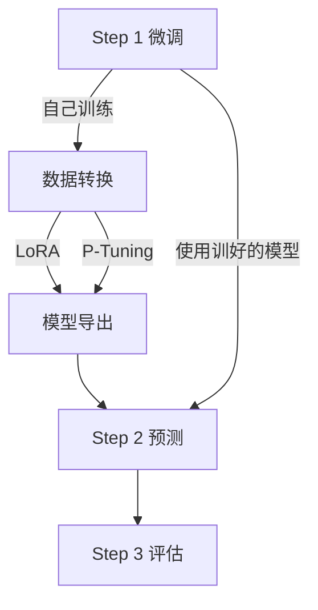

# 1 整体介绍

==1里面加致谢 1 里 加一个动图 就是到时候做的前端演示系统==

# 2 快速启动

==包含prompt 例子一个和sft 例子一个 用qwen==

注意：操作请于 example/llm 目录进行

```bash
cd example/llm
```

### 2-1 环境

大模型时代， DeepKE-LLM 采用全新的环境依赖：

```bash
conda create -n deepke-llm python=3.9
conda activate deepke-llm
pip install -r requirements.txt
```

注意！！是example/llm文件夹下的 `requirements.txt`

### 2-2 Fine-tune

步骤：



#### 2-2-1 Step 1 微调

##### 2-2-1-1 自己训练

**现有数据集**

| 名称       | 下载                                                         | 数量  | 描述                                                         |
| ---------- | ------------------------------------------------------------ | ----- | ------------------------------------------------------------ |
| InstructIE | [Google drive](https://drive.google.com/file/d/1raf0h98x3GgIhaDyNn1dLle9_HvwD6wT/view?usp=sharing) [Hugging Face](https://huggingface.co/datasets/zjunlp/InstructIE) [ModelScope](https://modelscope.cn/datasets/ZJUNLP/InstructIE) [WiseModel](https://wisemodel.cn/datasets/zjunlp/InstructIE) | 30w+  | **双语**(中文和英文)基于主题的信息抽取(IE)指令数据集         |
| IEPile     | [Google Drive](https://drive.google.com/file/d/1jPdvXOTTxlAmHkn5XkeaaCFXQkYJk5Ng/view?usp=sharing) [Hugging Face](https://huggingface.co/datasets/zjunlp/iepile) [WiseModel](https://wisemodel.cn/datasets/zjunlp/IEPile) [ModelScpoe](https://modelscope.cn/datasets/ZJUNLP/IEPile) | 200w+ | 大规模(`0.32B` tokens)高质量**双语**(中文和英文)信息抽取(IE)指令微调数据集 |

**InstructIE详细信息**

**一条数据的示例**

```json
{
  "id": "bac7c32c47fddd20966e4ece5111690c9ce3f4f798c7c9dfff7721f67d0c54a5",
  "cate": "地理地区",
  "text": "阿尔夫达尔（挪威语：Alvdal）是挪威的一个市镇，位于内陆郡，行政中心为阿尔夫达尔村。市镇面积为943平方公里，人口数量为2,424人（2018年），人口密度为每平方公里2.6人。",
  "relation": [
    {"head": "阿尔夫达尔", "head_type": "地理地区", "relation": "面积", "tail": "943平方公里", "tail_type": "度量"},
    {"head": "阿尔夫达尔", "head_type": "地理地区", "relation": "别名", "tail": "Alvdal", "tail_type": "地理地区"},
    {"head": "内陆郡", "head_type": "地理地区", "relation": "位于", "tail": "挪威", "tail_type": "地理地区"},
    {"head": "阿尔夫达尔", "head_type": "地理地区", "relation": "位于", "tail": "内陆郡", "tail_type": "地理地区"},
    {"head": "阿尔夫达尔", "head_type": "地理地区", "relation": "人口", "tail": "2,424人", "tail_type": "度量"}
  ]
}
```

各字段的说明:

| 字段     | 说明                                                         |
| -------- | ------------------------------------------------------------ |
| id       | 每个数据点的唯一标识符。                                     |
| cate     | 文本的主题类别，总计12种不同的主题分类。                     |
| text     | 模型的输入文本，目标是从中抽取涉及的所有关系三元组。         |
| relation | 描述文本中包含的关系三元组，即(head, head_type, relation, tail, tail_type)。 |

需要参考数据转换

**IEPile详细信息**

`IEPile` 中的每条数据均包含 `task`, `source`, `instruction`, `output` 4个字段, 以下是各字段的说明

| 字段        | 说明                                                         |
| ----------- | ------------------------------------------------------------ |
| task        | 该实例所属的任务, (`NER`、`RE`、`EE`、`EET`、`EEA`) 5种任务之一。 |
| source      | 该实例所属的数据集                                           |
| instruction | 输入模型的指令, 经过json.dumps处理成JSON字符串, 包括`"instruction"`, `"schema"`, `"input"`三个字段 |
| output      | 输出, 采用字典的json字符串的格式, key是schema, value是抽取出的内容 |

在`IEPile`中, **`instruction`** 的格式采纳了类JSON字符串的结构，实质上是一种字典型字符串，它由以下三个主要部分构成： (1) **`'instruction'`**: 任务描述, 它概述了指令的执行任务(`NER`、`RE`、`EE`、`EET`、`EEA`之一)。 (2) **`'schema'`**: 待抽取的schema(`实体类型`, `关系类型`, `事件类型`)列表。 (3) **`'input'`**: 待抽取的文本。

以下是一条**数据实例**：

```json
{
  "task": "NER",
  "source": "MSRA",
  "instruction": "{\"instruction\": \"你是专门进行实体抽取的专家。请从input中抽取出符合schema定义的实体，不存在的实体类型返回空列表。请按照JSON字符串的格式回答。\", \"schema\": [\"组织机构\", \"地理位置\", \"人物\"], \"input\": \"对于康有为、梁启超、谭嗣同、严复这些从旧文化营垒中走来的年轻“布衣”，他们背负着沉重的历史包袱，能够挣脱旧传统的束缚，为拯救民族的危亡而献身，实在是中华民族的脊梁。\"}",
  "output": "{\"组织机构\": [], \"地理位置\": [\"中华\"], \"人物\": [\"康有为\", \"梁启超\", \"谭嗣同\", \"严复\"]}"
}
```

该数据实例所属任务是 `NER`, 所属数据集是 `MSRA`, 待抽取的schema列表是 ["组织机构", "地理位置", "人物"], 待抽取的文本是"*对于康有为、梁启超、谭嗣同、严复这些从旧文化营垒中走来的年轻“布衣”，他们背负着沉重的历史包袱，能够挣脱旧传统的束缚，为拯救民族的危亡而献身，实在是中华民族的脊梁。*", 输出是 `{"组织机构": [], "地理位置": ["中华"], "人物": ["康有为", "梁启超", "谭嗣同", "严复"]}`

**训练数据转换**

首先, 需要将**数据格式化**以包含`instruction`、`output`字段。为此，我们提供了一个脚本 [convert_func.py]()，它可以将数据批量转换成模型可以直接使用的格式。

> 在使用 [convert_func.py]() 脚本之前，请确保参考了 [data]() 目录。该目录详细说明了每种任务所需的数据格式要求。 `sample.json` 描述了转换前数据的格式，`schema.json` 展示了 schema 的组织结构， `train.json` 描述了转换后的数据格式。

> 此外，可直接使用包含12个主题（如人物、交通工具、艺术作品、自然科学、人造物品、天文对象等）的中英双语信息抽取数据集 [zjunlp/InstructIE](https://huggingface.co/datasets/zjunlp/InstructIE)。

```bash
python ie2instruction/convert_func.py \
    --src_path data/NER/sample.json \
    --tgt_path data/NER/train.json \
    --schema_path data/NER/schema.json \
    --language zh \
    --task NER \
    --split_num 6 \
    --random_sort \
    --split train
```

- `language`: 支持`zh`, `en`两种语言, 不同语言使用的指令模版不同。
- `task`: 目前支持['`RE`', '`NER`', '`EE`', '`EET`', '`EEA`', 'KG']任务。
- `split_num`: 定义单个指令中可包含的最大schema数目。默认值为4，设置为-1则不进行切分。推荐的任务切分数量依任务而异：**NER建议为6，RE、EE、EET、EEA均推荐为4、KG推荐为1**。
- `random_sort`: 是否对指令中的schema随机排序, 默认为False, 即按字母顺序排序。
- `split`(必选): 指定数据集类型，`train`(训练集train.json、验证集dev.json均使用`train`)或`test`。

转换后的训练数据将包含 `task`, `source`, `instruction`, `output` 四个字段。

**测试数据转换**

在准备测试数据转换之前，请访问 [data]() 目录以了解各任务所需的数据结构：1）输入数据格式参见 `sample.json`；2）schema格式请查看 `schema.json`；3）转换后数据格式可参照 `train.json`。**与训练数据不同, 测试数据的输入无需包含标注字段（`entity`, `relation`, `event`）**。

```bash
python ie2instruction/convert_func.py \
    --src_path data/NER/sample.json \
    --tgt_path data/NER/test.json \
    --schema_path data/NER/schema.json \
    --language zh \
    --task NER \
    --split_num 6 \
    --split test
```

设置 `split` 为 **test** 时，请根据任务类型选择适当的schema数量：**NER推荐为6，而RE、EE、EET、EEA推荐为4**。转换后的测试数据将含有`id`, `task`, `source`, `instruction`, `label`五个字段。

`label` 字段将用于后续评估。若输入数据中缺少标注字段（`entity`, `relation`, `event`），则转换后的测试数据将不包含`label`字段，适用于那些无原始标注数据的场景。

**微调前准备**

```bash
mkdir results
mkdir lora
mkdir data
```

数据放在目录 ./data 中。

###### 2-2-1-1-1 LoRA 微调

**基础参数**

> 重要提示：以下的所有命令均应在InstrctKGC目录下执行。例如，如果您想运行微调脚本，您应该使用如下命令：bash scripts/fine_tuning/fine_llama.bash。请确保您的当前工作目录正确。

**单机单卡训练**

```bash
output_dir='lora/llama2-13b-chat-v1'
mkdir -p ${output_dir}
CUDA_VISIBLE_DEVICES="0" python3 src/finetune.py \
    --do_train --do_eval \
    --overwrite_output_dir \
    --model_name_or_path 'models/llama2-13b-chat' \
    --stage 'sft' \
    --model_name 'llama' \
    --template 'llama2' \
    --train_file 'data/train.json' \
    --valid_file 'data/dev.json' \
    --output_dir=${output_dir} \
    --per_device_train_batch_size 2 \
    --per_device_eval_batch_size 2 \
    --gradient_accumulation_steps 4 \
    --preprocessing_num_workers 16 \
    --num_train_epochs 10 \
    --learning_rate 5e-5 \
    --max_grad_norm 0.5 \
    --optim "adamw_torch" \
    --max_source_length 400 \
    --cutoff_len 700 \
    --max_target_length 300 \
    --evaluation_strategy "epoch" \
    --save_strategy "epoch" \
    --save_total_limit 10 \
    --lora_r 16 \
    --lora_alpha 32 \
    --lora_dropout 0.05 \
    --bf16 \
    --bits 4
```

**单机多卡训练**

```bash
output_dir='lora/llama2-13b-chat-v1'
mkdir -p ${output_dir}
CUDA_VISIBLE_DEVICES="0,1,2,3" torchrun --nproc_per_node=4 --master_port=1287 src/finetune.py \
    ...其余同上
```

- `model_name`: 指定所需的**模型架构名称**(7B、13B、Base、Chat属于同一模型架构)。当前支持的模型包括：["`llama`", "`alpaca`", "`vicuna`", "`zhixi`", "`falcon`", "`baichuan`", "`chatglm`", "`qwen`", "`moss`", "`openba`"]。**请注意**，此参数应与 `--model_name_or_path` 区分。
- `model_name_or_path`: 模型路径, 请到 [HuggingFace](https://huggingface.co/models) 下载相应模型。
- `template`: 使用的**模板名称**，包括：`alpaca`, `baichuan`, `baichuan2`, `chatglm3`等, 请参考 [src/datamodule/template.py](https://github.com/zjunlp/DeepKE/blob/main/example/llm/InstructKGC/src/datamodule/template.py) 查看所有支持的模版名称, 默认使用的是`alpaca`模板, **`Chat`版本的模型建议使用配套的模版, Base版本模型可默认使用`alpaca`**。
- `train_file`, `valid_file（可选）`: 训练集和验证集的**文件路径**。注意：目前仅支持json格式的文件。`valid_file`不能指定为`test.json`文件(不包含output字段,会报错)，可以通过指定`val_set_size`参数替代`valid_file`。
- `output_dir`: LoRA微调后的**权重参数保存路径**。
- `val_set_size`: **验证集的样本数量**, 默认为1000。若没有指定`valid_file`, 将会从`train_file`中划分出对应数量的样本作为验证集。
- `per_device_train_batch_size`, `per_device_eval_batch_size`: 每台GPU设备上的`batch_size`, 根据显存大小调整, RTX3090建议设置2~4。
- `max_source_length`, `max_target_length`, `cutoff_len`: 最大输入、输出长度、截断长度, 截断长度可以简单地视作最大输入长度 + 最大输出长度, 需根据具体需求和显存大小设置合适值。
- 使用`deepspeed`, 可设置 `--deeepspeed configs/ds_config_bf16_stage2.json`

> 可通过设置 `bits` = 4 进行量化, RTX3090建议量化。

- 要了解更多关于**参数配置**的信息，请参考 [src/utils/args](https://github.com/zjunlp/DeepKE/blob/main/example/llm/InstructKGC/src/args) 目录。

###### 2-2-1-1-1 P-Tuning 微调

**示例：P-Tuning微调ChatGLM**

你可以通过下面的命令使用P-Tuning方法来finetune模型:

```bash
deepspeed --include localhost:0 src/finetuning_pt.py \
  --train_path data/train.json \
  --model_dir /model \
  --num_train_epochs 20 \
  --train_batch_size 2 \
  --gradient_accumulation_steps 1 \
  --output_dir output_dir_pt \
  --log_steps 10 \
  --max_len 768 \
  --max_src_len 450 \
  --pre_seq_len 16 \
  --prefix_projection true
```

##### 2-2-1-2 训好的模型

下面是一些已经经过充分信息抽取指令数据训练的模型：

- [zjunlp/llama2-13b-iepile-lora](https://huggingface.co/zjunlp/llama2-13b-iepile-lora/tree/main) （底座模型是LLaMA2-13B-Chat）
- [zjunlp/baichuan2-13b-iepile-lora](https://huggingface.co/zjunlp/baichuan2-13b-iepile-lora) （底座模型是BaiChuan2-13B-Chat）
- [zjunlp/llama3-8b-iepile-lora](https://huggingface.co/zjunlp/llama3-8b-iepile-lora)
- [zjunlp/qwen1.5-14b-iepile-lora](https://huggingface.co/zjunlp/qwen1.5-14b-iepile-lora)
- [zjunlp/OneKE](https://huggingface.co/zjunlp/OneKE)

##### 2-2-1-3 领域内数据继续训练

尽管 [zjunlp/llama2-13b-iepile-lora](https://huggingface.co/zjunlp/llama2-13b-iepile-lora/tree/main) | [zjunlp/baichuan2-13b-iepile-lora](https://huggingface.co/zjunlp/baichuan2-13b-iepile-lora) | [zjunlp/llama3-8b-iepile-lora](https://huggingface.co/zjunlp/llama3-8b-iepile-lora) | [zjunlp/qwen1.5-14b-iepile-lora](https://huggingface.co/zjunlp/qwen1.5-14b-iepile-lora) | [zjunlp/OneKE](https://huggingface.co/zjunlp/OneKE) 等模型已在多个通用数据集上接受了广泛的指令微调，并因此获得了一定的**通用信息抽取能力**，但它们在**特定领域**（如`法律`、`教育`、`科学`、`电信`）的数据处理上可能仍显示出一定的局限性。针对这一挑战，建议对这些模型在特定领域的数据集上进行**二次训练**。这将有助于模型更好地适应特定领域的语义和结构特征，从而增强其在**该领域内的信息抽取能力**。

| checkpoint_dir            | model_name_or_path | moadel_name | fp16/bf16 | template  |
| ------------------------- | ------------------ | ----------- | --------- | --------- |
| llama2-13b-iepile-lora    | LLaMA2-13B-Chat    | llama       | bf16      | llama2    |
| baichuan2-13b-iepile-lora | BaiChuan2-13B-Chat | baichuan    | bf16      | baichuan2 |
| llama3-8b-iepile-lora     | LLaMA3-8B-Instruct | llama       | bf16      | alpaca    |
| qwen1.5-14b-iepile-lora   | Qwen1.5-14B-Chat   | qwen2       | bf16      | qwen      |
| OneKE                     | OneKE              | llama       | bf16      | llama2_zh |

**Lora微调**

```bash
output_dir='lora/oneke-continue'
mkdir -p ${output_dir}
CUDA_VISIBLE_DEVICES="0,1,2,3" torchrun --nproc_per_node=4 --master_port=1287 src/finetune.py \
    --do_train --do_eval \
    --overwrite_output_dir \
    --model_name_or_path 'models/OneKE' \
    --stage 'sft' \
    --model_name 'llama' \
    --template 'llama2_zh' \
    --train_file 'data/train.json' \
    --valid_file 'data/dev.json' \
    --output_dir=${output_dir} \
    --per_device_train_batch_size 2 \
    --per_device_eval_batch_size 2 \
    --gradient_accumulation_steps 4 \
    --preprocessing_num_workers 16 \
    --num_train_epochs 10 \
    --learning_rate 5e-5 \
    --max_grad_norm 0.5 \
    --optim "adamw_torch" \
    --max_source_length 400 \
    --cutoff_len 700 \
    --max_target_length 300 \
    --evaluation_strategy "epoch" \
    --save_strategy "epoch" \
    --save_total_limit 10 \
    --lora_r 64 \
    --lora_alpha 64 \
    --lora_dropout 0.05 \
    --bf16 \
    --bits 4
```

- 若要基于微调后的LoRA权重继续训练，仅需将 `checkpoint_dir` 参数指向LoRA权重路径，例如设置为`'zjunlp/llama2-13b-iepile-lora'`。
- 使用`deepspeed`, 可设置 `--deeepspeed configs/ds_config_bf16_stage2.json`

> 可通过设置 `bits` = 4 进行量化, RTX3090建议量化。

> 请注意，在使用 `llama2-13b-iepile-lora`、`baichuan2-13b-iepile-lora` 时，保持lora_r和lora_alpha均为64，对于这些参数，我们不提供推荐设置。

- 若要基于微调后的模型权重继续训练，只需设定 `model_name_or_path` 参数为权重路径，如`'zjunlp/OneKE'`，无需设置`checkpoint_dir`。

**全量微调**

```bash
output_dir='lora/oneke-continue'
mkdir -p ${output_dir}
CUDA_VISIBLE_DEVICES="0,1,2,3" torchrun --nproc_per_node=4 --master_port=1287 src/finetune.py \
    --do_train --do_eval \
    --overwrite_output_dir \
    --model_name_or_path 'models/OneKE' \
    --stage 'sft' \
    --finetuning_type 'full' \
    --model_name 'llama' \
    --template 'llama2_zh' \
    --train_file 'data/train.json' \
    --valid_file 'data/dev.json' \
    --output_dir=${output_dir} \
    --per_device_train_batch_size 2 \
    --per_device_eval_batch_size 2 \
    --gradient_accumulation_steps 4 \
    --preprocessing_num_workers 16 \
    --num_train_epochs 10 \
    --learning_rate 5e-5 \
    --max_grad_norm 0.5 \
    --optim "adamw_torch" \
    --max_source_length 400 \
    --cutoff_len 700 \
    --max_target_length 300 \
    --evaluation_strategy "epoch" \
    --save_strategy "epoch" \
    --save_total_limit 10 \
    --lora_dropout 0.05 \
    --bf16
```

脚本可以在 [scripts/fine_turning/fine_continue.bash]()、[scripts/fine_turning/fine_continue_oneke.bash](h) 中找到。

#### 2-2-2 Step 2 预测

##### 2-2-2-1 基础模型+Lora

以下是一些经过LoRA技术训练优化的模型(**Lora权重**)：

**V2版本(推荐)**

- [zjunlp/llama2-13b-iepile-lora](https://huggingface.co/zjunlp/llama2-13b-iepile-lora/tree/main)
- [zjunlp/baichuan2-13b-iepile-lora](https://huggingface.co/zjunlp/baichuan2-13b-iepile-lora)
- [zjunlp/llama3-8b-iepile-lora](https://huggingface.co/zjunlp/llama3-8b-iepile-lora)
- [zjunlp/qwen1.5-14b-iepile-lora](https://huggingface.co/zjunlp/qwen1.5-14b-iepile-lora)

| checkpoint_dir            | model_name_or_path | moadel_name | fp16/bf16 | template  |
| ------------------------- | ------------------ | ----------- | --------- | --------- |
| llama2-13b-iepile-lora    | LLaMA2-13B-Chat    | llama       | bf16      | llama2    |
| baichuan2-13b-iepile-lora | BaiChuan2-13B-Chat | baichuan    | bf16      | baichuan2 |
| llama3-8b-iepile-lora     | LLaMA3-8B-Instruct | llama       | bf16      | alpaca    |
| qwen1.5-14b-iepile-lora   | Qwen1.5-14B-Chat   | qwen2       | bf16      | qwen      |

要使用这些**训练好的**LoRA模型进行预测，可以执行以下命令：

```bash
CUDA_VISIBLE_DEVICES=0 python src/inference.py \
    --stage sft \
    --model_name_or_path 'models/llama2-13B-Chat' \
    --checkpoint_dir 'lora/llama2-13b-IEPile-lora' \
    --model_name 'llama' \
    --template 'llama2' \
    --do_predict \
    --input_file 'data/input.json' \
    --output_file 'results/llama2-13b-IEPile-lora_output.json' \
    --finetuning_type lora \
    --output_dir 'lora/test' \
    --predict_with_generate \
    --cutoff_len 512 \
    --bf16 \
    --max_new_tokens 300 \
    --bits 4
```

- 在进行推理时，`model_name`, `template`, 和 `bf16` 必须与训练时的设置相同。
- `model_name_or_path`: 指定所使用的基础模型路径，必须与相应的LoRA模型匹配。
- `checkpoint_dir`: LoRA的权重文件路径。
- `output_dir`: 此参数在推理时不起作用，可以随意指定一个路径。
- `input_file`, `output_file`: 分别指定输入的测试文件路径和预测结果的输出文件路径。
- `cutoff_len`, `max_new_tokens`: 设置最大的输入长度和生成的新token数量，根据显存大小进行调整。

> 可通过设置 `bits` = 4 进行量化, RTX3090建议量化。

##### 2-2-2-2 IE专用模型

| checkpoint_dir | model_name_or_path | moadel_name | fp16/bf16 | template  |
| -------------- | ------------------ | ----------- | --------- | --------- |
| OneKE          | OneKE              | llama       | bf16      | llama2_zh |

**`OneKE(based on chinese-alpaca2)`** 模型下载链接：[zjunlp/OneKE](https://huggingface.co/zjunlp/OneKE)

若要使用**已训练的模型**（无LoRA或LoRA已集成到模型参数中），可以执行以下命令进行预测：

```bash
CUDA_VISIBLE_DEVICES=0 python src/inference.py \
    --stage sft \
    --model_name_or_path 'models/OneKE' \
    --model_name 'llama' \
    --template 'llama2_zh' \
    --do_predict \
    --input_file 'data/input.json' \
    --output_file 'results/OneKE_output.json' \
    --output_dir 'lora/test' \
    --predict_with_generate \
    --cutoff_len 512 \
    --bf16 \
    --max_new_tokens 300 \
    --bits 4
```

`model_name_or_path`: IE专用模型权重路径

##### 2-2-2-3 合并基础模型+Lora导出

将底座模型和训练的Lora权重合并, 导出模型

```
python src/export_model.py \
    --model_name_or_path 'models/Baichuan2-13B-Chat' \
    --checkpoint_dir 'lora_results/baichuan2-13b-v1/checkpoint-xxx' \
    --export_dir 'lora_results/baichuan2-13b-v1/baichuan2-13b-v1' \
    --stage 'sft' \
    --model_name 'baichuan' \
    --template 'baichuan2' \
    --output_dir 'lora_results/test'
```

注意 `template`、`model_name` 与训练时保持一致。

##### 2-2-2-4 vllm加速推理

推荐环境:

```bash
pip install tiktoken
pip install peft==0.7.1
pip install transformers==4.41.2

pip install vllm==0.3.0
pip install jinja2==3.0.1
pip install pydantic==1.9.2

ip route add 8.8.8.8 via 127.0.0.1
```


```bash
python src/inference_vllm.py \
    --stage sft \
    --model_name_or_path 'lora_results/baichuan2-13b-v1/baichuan2-13b-v1' \
    --model_name 'baichuan' \
    --template 'baichuan2' \
    --do_predict \
    --input_file 'data/input.json' \
    --output_file 'results/baichuan2-13b-IEPile-lora_output.json' \
    --output_dir 'lora_results/test' \
    --batch_size 4 \
    --predict_with_generate \
    --max_source_length 1024 \
    --bf16 \
    --max_new_tokens 512
```

##### P-Tuning预测

你可以通过下面的命令使用训练好的P-Tuning模型在比赛测试集上预测输出:

```bash
CUDA_VISIBLE_DEVICES=0 python src/inference_pt.py \
  --test_path data/valid.json \
  --device 0 \
  --ori_model_dir /model \
  --model_dir /output_dir_lora/global_step- \
  --max_len 768 \
  --max_src_len 450
```

#### 2-2-3 Step 3 评估

我们提供了评估各个任务F1分数的脚本。

```bash
python ie2instruction/eval_func.py \
  --path1 results/llm_output.json \
  --task NER
```

- `path1` 是模型的输出文件, 其中一条数据样本如下所示, 经测试数据转换脚本转换后的数据(`test.json`)具有`id`、`instruction`、`label`字段, `output`字段是经过模型预测脚本后的模型真实输出。

```json
{
  "id": "e88d2b42f8ca14af1b77474fcb18671ed3cacc0c75cf91f63375e966574bd187",
  "instruction": "{\"instruction\": \"你是专门进行实体抽取的专家。请从input中抽取出符合schema定义的实体，不存在的实体类型返回空列表。请按照JSON字符串的格式回答。\", \"schema\": [\"组织机构\", \"地理位置\", \"人物\"], \"input\": \"相比之下，青岛海牛队和广州松日队的雨中之战虽然也是0∶0，但乏善可陈。\"}",
  "label": "[{\"entity\": \"广州松日队\", \"entity_type\": \"组织机构\"}, {\"entity\": \"青岛海牛队\", \"entity_type\": \"组织机构\"}]",
  "output": "{\"组织机构\": [\"广州松日队\", \"青岛海牛队\"], \"人物\": [], \"地理位置\": []}"
}
```

- `task`: 目前支持['RE', 'NER', 'EE', 'EET', 'EEA']五类任务。
- 可以设置 `sort_by` 为 `source`, 分别计算每个数据集上的F1分数。

### 2-3 In-context Learning

#### 2-3-1 单次推理

运行示例：

```bash
bash scripts/incontext_learning/icl_da_qwen.bash
```

即：

```bash
python src/incontext_learning.py \
    --engine "Qwen" \
    --model_id "damo/qwen-7b-chat" \
    --max_tokens 400 \
    --task "da" \
    --language "ch" \
    --in_context true \
    --text_input "创立" \
    --labels "人物，公司"
```

更多脚本样例见于： `scripts/incontext_learning` 目录

脚本全参数说明：

| 参数名称    | 类型  | 意义                                                         | 限定                                                         |
| ----------- | ----- | ------------------------------------------------------------ | ------------------------------------------------------------ |
| engine      | str   | 表示所用的大模型名称。                                       | **必须**要有，且**必须**为 `MODEL_LIST `之一。               |
| api_key     | str   | 用户的API密钥。                                              | 若模型为闭源，则**必须**提供。                               |
| base_url    | str   | 基础 URL，用于指定 API 请求的基础地址。                      |                                                              |
| temperature | float | 用于控制生成文本的随机性。                                   |                                                              |
| top_p       | float | 核采样（Top-p）参数，用于控制生成文本的多样性。              |                                                              |
| max_tokens  | int   | 最大 token 数，用于限制生成文本的长度。                      |                                                              |
| stop        | str   | 停止词，用于指定生成文本时的终止条件。                       |                                                              |
| task        | str   | 参数用于指定任务类型，其中`ner`表示命名实体识别任务，`re`表示关系抽取任务`ee`表示事件抽取任务，`rte`表示三元组抽取任务。 | **必须**要有，且**必须**为 `TASK_LIST` 之一。                |
| language    | str   | 表示任务的语言。                                             | **必须**要有，且**必须**为 `LANGUAGE_LIST` 之一。            |
| in_context  | bool  | 是否为零样本设定，为`False`时表示只使用instruction提示模型进行信息抽取，为`True`时表示使用in-context的形式进行信息抽取。 |                                                              |
| instruction | str   | 规定用户自定义的提示指令，当为空时采用默认的指令。           | （不建议使用）                                               |
| data_path   | str   | 表示in-context examples的存储目录，默认为`data`文件夹。      |                                                              |
| text_input  | str   | 在命名实体识别任务(`ner`)中，`text_input`参数为预测文本；在关系抽取任务(`re`)中，`text_input`参数为文本；在事件抽取任务(`ee`)中，`text_input`参数为待预测文本；在三元组抽取任务(`rte`)中，`text_input`参数为待预测文本。 | 所有任务**必须**要有。                                       |
| domain      | str   | 在命名实体识别任务(`ner`)中，`domain`为预测文本所属领域，可为空；在关系抽取任务(`re`)中，`domain`为文本所属领域，可为空；在事件抽取任务(`ee`)中，`domain`为预测文本所属领域，可为空；在三元组抽取任务(`rte`)中，`domain`为预测文本所属领域，可为空。 | 任务为 ner、re、ee、rte 之一时，建议设置。                   |
| labels      | str   | 在命名实体识别任务(`ner`)中，`labels`为实体标签集，如无自定义的标签集，该参数可为空；在关系抽取任务(`re`)中，`labels`为关系类型标签集，如无自定义的标签集，该参数可为空。`da`中`lables`为头尾实体被预先分类的类型。 | 任务为 da 时，**必须**要有。任务为 ner、re 之一时，建议设置。多个标签时，用逗号分割。 |
| head_entity | str   | 待预测关系的头实体和尾实体。                                 | 任务为 re 时，**必须**要有。                                 |
| tail_entity | str   | 待预测关系的头实体和尾实体。                                 | 任务为 re 时，**必须**要有。                                 |
| head_type   | str   | 待预测关系的头尾实体类型。                                   | 任务为 re 时，**必须**要有。                                 |
| tail_type   | str   | 待预测关系的头尾实体类型。                                   | 任务为 re 时，**必须**要有。                                 |

#### 2-3-2 批量推理

数据集支持：

| 名称       | 下载                                                         | 数量  | 描述                                                         |
| ---------- | ------------------------------------------------------------ | ----- | ------------------------------------------------------------ |
| InstructIE | [Google drive](https://drive.google.com/file/d/1raf0h98x3GgIhaDyNn1dLle9_HvwD6wT/view?usp=sharing) [Hugging Face](https://huggingface.co/datasets/zjunlp/InstructIE) [ModelScope](https://modelscope.cn/datasets/ZJUNLP/InstructIE) [WiseModel](https://wisemodel.cn/datasets/zjunlp/InstructIE) | 30w+  | **双语**(中文和英文)基于主题的信息抽取(IE)指令数据集         |
| IEPile     | [Google Drive](https://drive.google.com/file/d/1jPdvXOTTxlAmHkn5XkeaaCFXQkYJk5Ng/view?usp=sharing) [Hugging Face](https://huggingface.co/datasets/zjunlp/iepile) [WiseModel](https://wisemodel.cn/datasets/zjunlp/IEPile) [ModelScpoe](https://modelscope.cn/datasets/ZJUNLP/IEPile) | 200w+ | 大规模(`0.32B` tokens)高质量**双语**(中文和英文)信息抽取(IE)指令微调数据集 |


# 3  具体例子

==包含 qwen llama chatgpt 和自定义训好的模型llama吧   里面需要有脚本 和输入输出例子  3里单独加一个 以qwen为例 输入不同类型的数据==


# 4 一些注意事项 如常见错误


# 5 limitation


