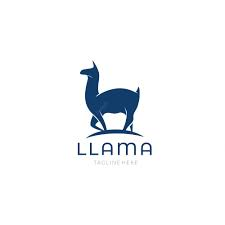

    <b> English | <a href="https://github.com/zjunlp/DeepKE/blob/llm/example/llm/README_CN.md">简体中文</a> </b>

- [CaMA](#cama)
  - [Training](#training)
  - [Usage](#usage)
- [LLaMA](#llama)
  - [Method 1: LoRA](#method-1-lora)
    - [Case 1: CodeKGC-Code Language Models for Knowledge Graph Construction English | Chinese](#case-1-codekgc-code-language-models-for-knowledge-graph-construction-english--chinese)
    - [Case 2: Instruction-based Knowledge Graph Construction(CCKS2023) with LLaMA using LoRA Fine-tuning driven by English | Chinese](#case-2-instruction-based-knowledge-graph-constructionccks2023-with-llama-using-lora-fine-tuning-driven-by-english--chinese)
- [ChatGLM](#chatglm)
- [GPT series](#gpt-series)
  - [Method 1: Instruct Large Language Models(LLMs) using In-Context Learning](#method-1-instruct-large-language-modelsllms-using-in-context-learning)
    - [Case 1: Information Extraction with LLMs English | Chinese](#case-1-information-extraction-with-llms-english--chinese)
    - [Case 2: Data Augmentation with LLMs English | Chinese](#case-2-data-augmentation-with-llms-english--chinese)
    - [Case 3: CCKS2023 Instruction-based Knowledge Graph Construction with LLMs English | Chinese](#case-3-ccks2023-instruction-based-knowledge-graph-construction-with-llms-english--chinese)
    - [Case 4: Unleash the Power of Large Language Models for Few-shot Relation Extraction English | Chinese](#case-4unleash-the-power-of-large-language-models-for-few-shot-relation-extraction-english--chinese)

---

## CaMA

### Training

### Usage
 
---

## LLaMA

### Method 1: LoRA

LoRA reduces the number of trainable parameters by learning pairs of rank-decompostion matrices while freezing the original weights. This vastly reduces the storage requirement for large language models adapted to specific tasks and enables efficient task-switching during deployment all without introducing inference latency. LoRA also outperforms several other adaptation methods including adapter, prefix-tuning, and fine-tuning. For more details, please refer to the original paper [LoRA: Low-Rank Adaptation of Large Language Models](https://arxiv.org/abs/2106.09685).

#### Case 1: CodeKGC-Code Language Models for Knowledge Graph Construction [English](./CodeKGC/README.md) | [Chinese](./CodeKGC/README_CN.md)

To better address Relational Triple Extraction (rte) task in Knowledge Graph Construction, we have designed code-style prompts to model the structure of  Relational Triple, and used Code-LLMs to generate more accurate predictions. The key step of code-style prompt construction is to transform (text, output triples) pairs into semantically equivalent program language written in Python.

#### Case 2: Instruction-based Knowledge Graph Construction(CCKS2023) with LLaMA using LoRA Fine-tuning driven by [English](./InstructKGC/README.md) | [Chinese](./InstructKGC/README_CN.md)

--- 

## ChatGLM

---

## GPT series

### Method 1: Instruct Large Language Models(LLMs) using In-Context Learning

[In-Context Learning](http://arxiv.org/abs/2301.00234) is a method for instructing large language models to improve their performance on specific tasks. It involves iterative learning within specific contexts to fine-tune and train the model, enabling it to better understand and respond to the demands of a particular domain. Through In-Context Learning, we can empower large language models with capabilities such as information extraction, data augmentation, and instruction-driven knowledge graph construction.

#### Case 1: Information Extraction with LLMs [English](./LLMICL/README.md/#ie-with-large-language-models) | [Chinese](./LLMICL/README_CN.md/#使用大语言模型进行信息抽取)

#### Case 2: Data Augmentation with LLMs [English](./LLMICL/README.md/#data-augmentation-with-large-language-models) | [Chinese](./LLMICL/README_CN.md/#使用大语言模型进行数据增强)

#### Case 3: CCKS2023 Instruction-based Knowledge Graph Construction with LLMs [English](./LLMICL/README.md/#ccks2023-instruction-based-knowledge-graph-construction-with-large-language-models) | [Chinese](./LLMICL/README_CN.md/#使用大语言模型完成ccks2023指令驱动的知识图谱构建)

#### Case 4: Unleash the Power of Large Language Models for Few-shot Relation Extraction [English](./UnleashLLMRE/README.md) | [Chinese](./UnleashLLMRE/README_CN.md)

