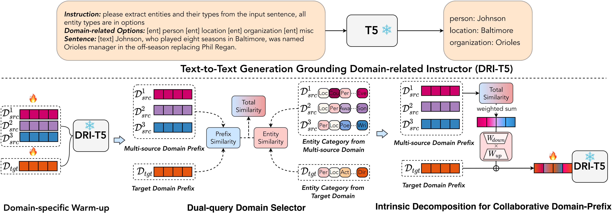

# Easy Start

<p align="left">
    <b> English | <a href="https://github.com/zjunlp/DeepKE/blob/main/example/ner/cross/README_CN.md">简体中文</a> </b>
</p>

## Model

<div align=center>

</div>

Illustration of Collaborative Domain-Prefix Tuning for cross-domain NER (**CP-NER**) based on text-to-text generative PLMs (Details in the IJCAI2023 paper [One Model for All Domains: Collaborative Domain-Prefix Tuning for Cross-Domain NER](https://arxiv.org/abs/2301.10410)).


## Requirements

> python == 3.8

- torch == 1.11
- transformers == 4.26.0
- datasets
- deepke

## Download Code

```bash
git clone https://github.com/zjunlp/DeepKE.git
cd DeepKE/example/ner/cross
```

## Install with Pip

- Create and enter the python virtual environment.
- Install dependencies: `pip install -r requirements.txt`.

## Dataset

  - Download the dataset to this directory.

    ```bash
    wget 120.27.214.45/Data/ner/cross/data.tar.gz
    tar -xzvf data.tar.gz
    ```

  - The datasets are stored in `data`, including CoNLL-2003, MIT-movie, MIT-restaurant, Ai, Literature, Music, Politics and science.

  - Each dataset has the following data format:
    - `train.json`: Training set
    - `val.json `: Validation set
    - `test.json`: Test set
    - `entity.schema`: In-domain training set
    - `event.schema`: In-domain training set
    - `record.schema`: In-domain training set
    - `relation.schema`: In-domain training set

## Train

1. Tuned Prefix as Domain Controller

    - We first leverage domain corpus to warm up the corresponding prefixes. 

    - Parameters, model paths and configuration for training are in the `hydra/run/train.yaml` and users can modify them before training.

      Take the `CoNLL03` domain as an example, you can modify the parameters to:
      ```yaml
      train_file: 'data/conll03/train.json'
      validation_file: 'data/conll03/val.json'
      test_file: 'data/conll03/test.json'
      record_schema: '../../data/conll03/record.schema'
      output_dir: 'output/conll03-t5-base'        # output path
      logging_dir: 'output/conll03-t5-base_log'   # log path
      model_name_or_path: '../../hf_models/t5-base' # model path
      ```

      Then run the following script:
      ```bash 
      python run.py
      ```
    - The best checkpoint, trainning details and evaluation resutls will be saved in `logs/xxx/output/conll03-t5-base`.

    - We released the best checkpoints of this step at this [Google Drive](https://drive.google.com/file/d/1u7jg0AWzCB_dlExGG3RGgxJecc5A_3Rb/view?usp=sharing). 


2. Transfer from Single-Domain (Cross-NER)

    - First modify the `model_name_or_path`, `source_prefix_path` and `targets_prefix_path` of `hydra/run/single_transfer.yaml` (Generally `model_path` and `targets_prefix_path` are the same, `source_prefix_path` is the trained model of source domain)
    
    - Take transfer the source domain `CoNLL03` to target domain `AI` as an example, you can modify the parameters to:
      ```yaml
      train_file: 'data/ai/train.json'  # train file of AI
      validation_file: 'data/ai/val.json'
      test_file: 'data/ai/test.json'
      record_schema: '../../data/ai/record.schema'
      output_dir: 'output/conll_to_ai-t5-base'
      logging_dir: 'output/conll_to_ai-t5-base_log'
      model_name_or_path: '../xxx/output/ai-t5-base'
      source_prefix_path: '../xxx/output//conll-t5-base'  # the tuned model of source doamin CoNLL03
      target_prefix_path: '../xxx/output/ai-t5-base'      # the tuned model of target doamin AI
      ```

    - Then run following script:
      ```bash
      python run.py hydra/run=single_transfer.yaml
      ```

3. Transfer from Multiple Source Domains
    - Save prefixes and label words for each domain. We use dual-query domain selector to aggregate multiple source domains. Take `CoNLL03` as an exmaple, you can modify the parameters of `hydra/run/save_prefix_label.yaml` to:
      ```yaml
      output_dir: '../xxx/output/conll-t5-base'
      model_name_or_path: '../xxx/output/conll-t5-base' # the tuned model of CoNLL03
      model_ckpt_path: '../xxx/output/conll-t5-base'    # the tuned model of CoNLL03
      save_prefix: true
      save_label_word: true
      ```
      Then run the following script and the prefix and label words will be save into `output_dir`.
      ```bash
      python run.py hydra/run=save_prefix_label.yaml
      ```

    - Let's run. Modify the `model_name_or_path`, `model_ckpt_path` and `multi_source_path` of `hydra/run/multi_transfer.yaml`. Note that that the different source domain paths in `multi_source_path` are separated by commas(,). Take transfer the source domains `CoNLL03`, `Politics`, `Music` and `Literature` to the target domain AI as an example, you can modify the parameters to:
      ```yaml
      model_name_or_path: '../xxx/output/ai-t5-base' # the tuned model of target domain AI
      model_ckpt_path: '../xxx/output/ai-t5-bases'  # the tuned model of target domain AI
      multi_source_path: '../xxx/output/conll-t5-base,../xxx/output/politics-t5-base,../xxx/output/music-t5-base,../xxx/output/literature-t5-base' # the tuned model of source domains (separated by commas)
      ```
      Last run following script:
      ```bash
      python run.py hydra/run=multi_transfer.yaml
      ```

## Acknowledgement
Our code are based on [UIE](https://github.com/universal-ie/UIE), many thanks.

## Cite

If you use or extend our work, please cite the following paper:

```bibtex
@article{DBLP:journals/corr/abs-2301-10410,
  author    = {Xiang Chen and
               Lei Li and
               Shuofei Qiao and
               Ningyu Zhang and
               Chuanqi Tan and
               Yong Jiang and
               Fei Huang and
               Huajun Chen},
  title     = {One Model for All Domains: Collaborative Domain-Prefix Tuning for
               Cross-Domain {NER}},
  journal   = {CoRR},
  volume    = {abs/2301.10410},
  year      = {2023},
  url       = {https://doi.org/10.48550/arXiv.2301.10410},
  doi       = {10.48550/arXiv.2301.10410},
  eprinttype = {arXiv},
  eprint    = {2301.10410},
  timestamp = {Mon, 13 Mar 2023 11:20:37 +0100},
  biburl    = {https://dblp.org/rec/journals/corr/abs-2301-10410.bib},
  bibsource = {dblp computer science bibliography, https://dblp.org}
}
```
