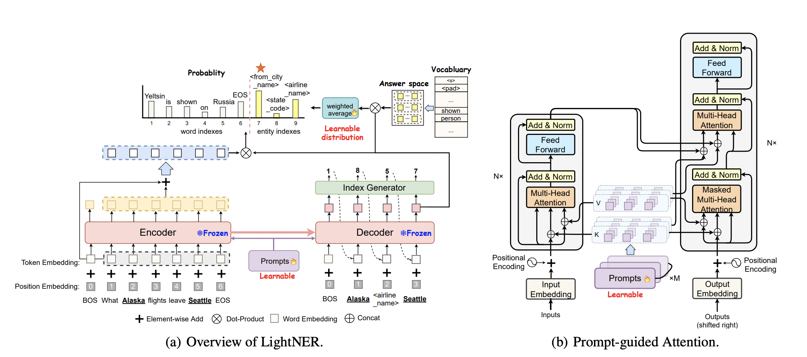

# Easy Start

<p align="left">
    <b> English | <a href="https://github.com/zjunlp/DeepKE/blob/main/example/ner/few-shot/README_CN.md">简体中文</a> </b>
</p>

## Model

<div align=center>

</div>

Illustration of LightNER (COLING'22) for few-shot named entity recognition (Details in paper [https://aclanthology.org/2022.coling-1.209.pdf](https://aclanthology.org/2022.coling-1.209.pdf)).

## Requirements

> python == 3.8

- torch == 1.5
- transformers == 3.4.0
- deepke

## Download Code

```bash
git clone https://github.com/zjunlp/DeepKE.git
cd DeepKE/example/ner/few-shot
```

## Install with Pip

- Create and enter the python virtual environment.
- Install dependencies: `pip install -r requirements.txt`.

## Train and Predict

- Dataset

  - Download the dataset to this directory.

    ```bash
    wget 120.27.214.45/Data/ner/few_shot/data.tar.gz
    tar -xzvf data.tar.gz
    ```

  - The datasets are stored in `data`, including CoNLL-2003, MIT-movie, MIT-restaurant and ATIS.
    
  - **CoNLL-2003**
    
    - `train.txt`: Training set
    - `valid.txt `: Validation set
    - `test.txt`: Test set
    - `indomain-train.txt`: In-domain training set

  - **MIT-movie, MIT-restaurant and ATIS**
    - `k-shot-train.txt`: k=[10, 20, 50, 100, 200, 500], Training set
    - `test.txt`: Testing set

- Training

  - Parameters, model paths and configuration for training are in the `conf` folder and users can modify them before training.

  - Training on CoNLL-2003

    ```bash
    python run.py
    ```

  - Few-shot Training

    If the model need to be uploaded, modify `load_path` in `few_shot.yaml`

    ```bash
    python run.py +train=few_shot
    ```

  - Few-shot Training for **Chinese**

    > Full data fine-tuning can achieve the best performance.

    Pretrained weights need to be provided in the directory defined in `few_shot_cn.yaml`
    ```bash
    python run.py +train=few_shot_cn
    ```

  - Logs for training are in the `log` folder. The path of the trained model can be customized.

- Prediction

  - Add `- predict` in `config.yaml`

  - Modify `load_path` as the path of the trained model and `write_path` as the path of predicted results in `predict.yaml` 

  - ```bash
    python predict.py
    ```

### Custom Tokenizer

If you need to customize your own Tokenizer (eg `MBartTokenizer` for multilingual processing).

You can customize the tokenizer in <a href="https://github.com/zjunlp/DeepKE/blob/main/src/deepke/name_entity_re/few_shot/module/datasets.py#L18">tokenizer</a>

## Cite

If you use or extend our work, please cite the following paper:

```bibtex
@inproceedings{chen-etal-2022-lightner,
    title = "{L}ight{NER}: A Lightweight Tuning Paradigm for Low-resource {NER} via Pluggable Prompting",
    author = "Chen, Xiang  and
      Li, Lei  and
      Deng, Shumin  and
      Tan, Chuanqi  and
      Xu, Changliang  and
      Huang, Fei  and
      Si, Luo  and
      Chen, Huajun  and
      Zhang, Ningyu",
    booktitle = "Proceedings of the 29th International Conference on Computational Linguistics",
    month = oct,
    year = "2022",
    address = "Gyeongju, Republic of Korea",
    publisher = "International Committee on Computational Linguistics",
    url = "https://aclanthology.org/2022.coling-1.209",
    pages = "2374--2387"
   }
```
