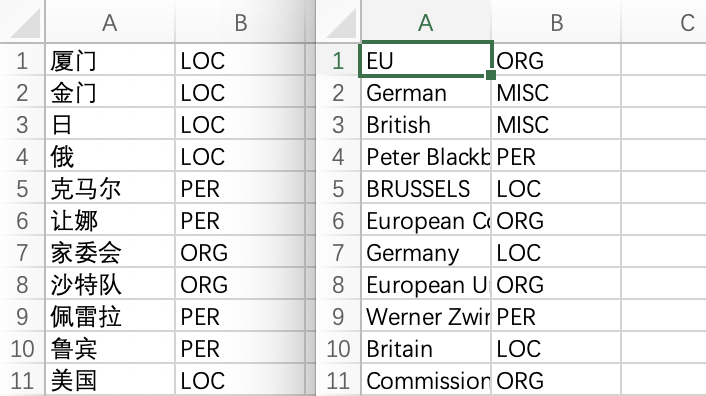
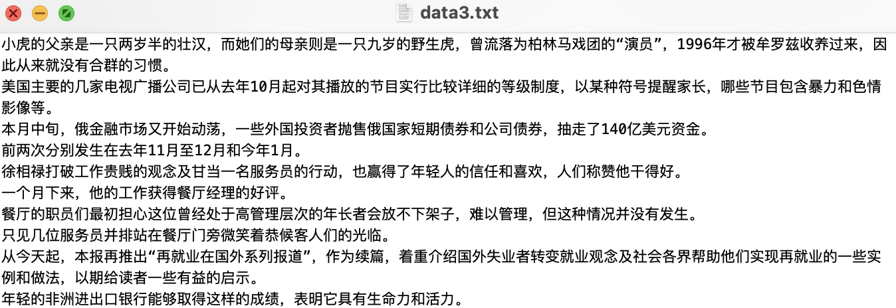
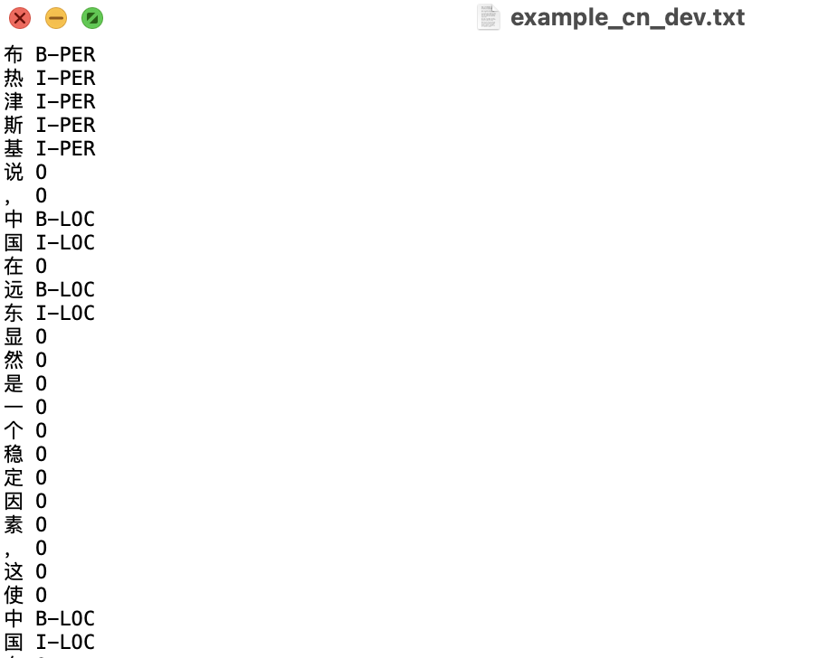

<p align="left">
    <b> <a href="https://github.com/zjunlp/DeepKE/blob/main/example/ner/prepare-data/README.md">English</a> | 简体中文 </b>
</p>

为了用户更好的使用`DeepKE`完成实体识别任务，我们提供一个简单易用的**基于词典匹配**的实体识别**自动标注工具**。

## 词典
- 词典格式如下所示：
    <h3 align="left">
        
    </h3>
- 预提供了两个实体词典（中英文各一个），使用实体词典+jieba词性标注对样本进行自动标注。

    - 中文示例词典中, 我们采用[(人民日报)数据集](https://github.com/OYE93/Chinese-NLP-Corpus/tree/master/NER/People's%20Daily). 它是NER相关的数据集，包含人员 (PER)、位置 (LOC) 和组织 (ORG) 相关的命名实体识别。

    - 英文示例词典中，我们采用Conll数据集。它包含人员 (PER)、位置 (LOC) 和其他 (MISC) 相关的命名实体识别。你可通过如下命令获得Conll数据集

    ```shell
    wget 120.27.214.45/Data/ner/few_shot/data.tar.gz
    ```

    - 预提供词典Google Drive下载链接： 
        - [中文(vocab_dict_cn), 英文(vocab_dict_en)](https://drive.google.com/drive/folders/1PGANizeTsvEQFYTL8O1jrDLZwk_MPqO0?usp=sharing)
    - 百度网盘下载链接： 
        - [中文(vocab_dict_cn), 英文(vocab_dict_en)](https://pan.baidu.com/s/1a07W42ZByeZ00MZp5pZgxg) 
        - 提取码(x7ba)

- **若需要构建领域自建词典，请参照预提供词典格式(csv)**

    | 实体 | 词性 |
    |  --------  | ------  |
    |  杭州  | LOC  |
    |  ...  | ...  |

## 源文件

- **输入的词典**格式为`csv`（包含两列，分别是实体以及对应的标签）。

- **待自动打标的数据**（txt格式按行分隔，如下图所示）应放在`source_data`路径下，脚本会遍历此文件夹下的所有txt格式的文件，逐行进行自动打标。具体示例如下：
    <h3 align="left">
        
    </h3>


## 输出文件

- 输出文件包含三个：`example_train_cn.txt`, `example_dev_cn.txt`, `example_test_cn.txt`，分别对应训练集、验证集和测试集。我们自动将源文件数据划分为三份，比例为`0.8:0.1:0.1`。输出文件的格式如下：
    <h3 align="left">
        
    </h3>


## 环境
运行环境:  
- jieba = 0.42.1

## 参数解释

- `language`: 可选cn(中文)或en(英文)
- `source_dir`: 语料库路径（遍历此文件夹下的所有txt格式的文件，逐行进行自动打标，默认为`source_data`）
- `dict_dir`: 实体词典路径（默认为`vocab_dict.csv`）
- `test_rate, dev_rate, test_rate`: 训练集、验证集、测试集占比（请确保总和为`1`，默认`0.8:0.1:0.1`）

## 运行

- **中文**
```bash
python prepare_weaksupervised_data.py --language cn --dict_dir vocab_dict_cn.csv
```

- **英文**
```bash
python prepare_weaksupervised_data.py --language en --dict_dir vocab_dict_en.csv
```
