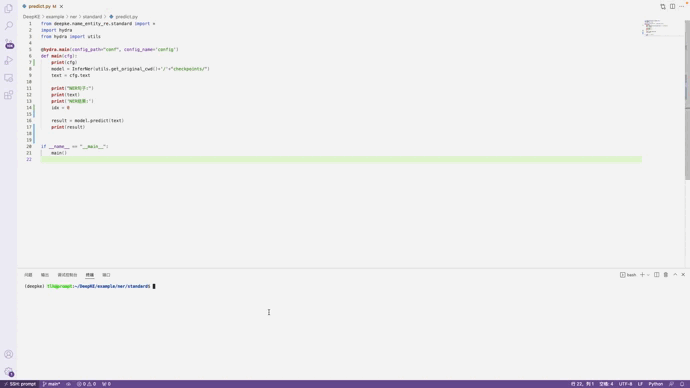

# cnSchema

我们预先处理数据集，并将其关系类型与实体类型与[cnSchema](https://github.com/OpenKG-ORG/cnSchema)对齐。cnSchema是面向中文信息处理，利用先进的知识图谱、自然语言处理和机器学习技术，融合结构化与文本数据，支持快速领域知识建模，支持跨数据源、跨领域、跨语言的开放数据自动化处理，为智能机器人、语义搜索、智能计算等新兴应用市场提供schema层面的支持与服务。

cnSchema基于的原则
* 完全开放，源自schema.org，OpenKG自主发布的Web Schema
* 立足中文，对接世界
* 面向应用，支持开放数据生态
* 社区共识，知识图谱专家指导

# 实体类型

经过对齐后数据集中所拥有的实体类型如下

| 序号  | 实体类型 | 唯一ID| 序号  | 实体类型 | 唯一ID| 
| --- | :--- | :---: | --- | :--- | :---: | 
| 1  | 人物| YAS |  2 | 影视作品| TOJ | 
| 3  | 目| NGS |  4 | 生物| QCV | 
| 5  | Number| OKB |  6 | Date| BQF | 
| 7  | 国家| CAR |  8 | 网站| ZFM | 
| 9  | 网络小说| EMT |  10 | 图书作品| UER | 
| 11  | 歌曲| QEE |  12 | 地点| UFT | 
| 13  | 气候| GJS |  14 | 行政区| SVA | 
| 15  | TEXT| ANO |  16 | 历史人物| KEJ | 
| 17  | 学校| ZDI |  18 | 企业| CAT | 
| 19  | 出版社| GCK |  20 | 书籍| FQK | 
| 21  | 音乐专辑| BAK |  22 | 城市| RET | 
| 23  | 经典| QZP |  24 | 电视综艺| QAQ | 
| 25 | 机构| ZRE |  26 | 作品| TDZ | 
| 27 | 语言| CVC |  28 | 学科专业| PMN | 


在这之上使用[`chinese-bert-wwm`](https://drive.google.com/drive/folders/1OLx5tjEriMyzbv0iv_s9lihtXWIjB6OS)和[`chinese-roberta-wwm-ext`](https://drive.google.com/drive/folders/1T3xf_MXRaVqLV-ST4VqvKoaQqQgRpp67)为基础训练了DeepKE-cnschema(NER)模型。模型所使用的超参数为所给的参数。最终经过训练后可以得到如下表的效果

<table>
	<tr>
		<th>模型</th>
		<th>P</th>
		<th>R</th>
		<th>F1</th>
	</tr>
	<tr>
		<td>chinese-roberta-wwm-ext(micro)</td>
		<td>0.8028</td>
		<td>0.8612</td>
		<td>0.8310</td>
	</tr>
  <tr>
		<td>chinese-roberta-wwm-ext(macro)</td>
		<td>0.6990</td>
		<td>0.7295</td>
		<td>0.7021</td>
	</tr>
  <tr>
		<td>chinese-bert-wwm(micro)</td>
		<td>0.7841</td>
		<td>0.8587</td>
		<td>0.8197</td>
	</tr>
  <tr>
		<td>chinese-bert-wwm(macro)</td>
		<td>0.6921</td>
		<td>0.7393</td>
		<td>0.7078</td>
	</tr>
	
</table>

# 预测

使用者可以直接下载[模型](https://drive.google.com/drive/folders/1zA8Ichx9nzU3GD92ptdyR_nmARB_7ovg)进行预测，步骤如下：

1、只需将下载文件夹命名为`checkpoints`

2、只需修改 `predict.yaml`中的参数`text`为需要预测的文本

3、进行预测。需要预测的文本及实体对通过终端返回给程序。

```bash
python predict.py
```
# 训练

如果需要使用其他模型进行训练，步骤如下：

1、也可先下载[数据集](https://drive.google.com/drive/folders/1zA8Ichx9nzU3GD92ptdyR_nmARB_7ovg)，将其放入命名为`data`的文件夹中

2、将`conf`文件夹中的`train.yaml`中的`bert_model`修改为指定模型

3、修改[源码](https://github.com/zjunlp/DeepKE/blob/main/src/deepke/name_entity_re/standard/tools/preprocess.py)中的get_labels函数，返回的标签为所给`type.txt`中所用到的标签

4、进行训练。
```bash
python run.py
```
# 样例

使用训练好的模型，只需输入句子“《星空黑夜传奇》是连载于起点中文网的网络小说，作者是啤酒的罪孽”，运行```python predict.py```后可得到结果，结果显示“星空黑夜传奇”实体类型为经过cnschema对齐后的“网络小说”，“起点中文网”为“网站”，“啤酒的罪孽”为“人物。

## 代码部分

修改 `predict.yaml`中的参数`text`为需要预测的文本
```bash
text=“《星空黑夜传奇》是连载于起点中文网的网络小说，作者是啤酒的罪孽”
```

最终输出结果

```bash
NER句子：
《星空黑夜传奇》是连载于起点中文网的网络小说，作者是啤酒的罪孽
NER结果：
[('星','B-UER'),('空','I-UER'),('黑','I-UER'),('夜','I-UER'),('传','I-UER'),('奇','I-UER'),('起','B-ZFM'),('点','I-ZFM'),('中','I-ZFM'),('文','I-ZFM'),('网','I-ZFM'),('啤','B-YAS'),('酒','I-YAS'),('的','I-YAS'),('罪','I-YAS'),('孽','I-YAS')]
```
## 演示gif

具体流程如下gif所示：




