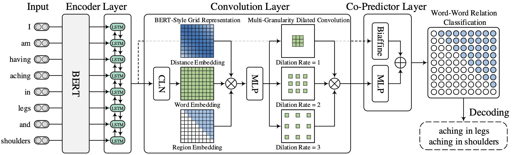

## 快速上手

<p align="left">
    <b> <a href="https://github.com/zjunlp/DeepKE/blob/main/example/ner/standard/w2ner/README.md">English</a> | 简体中文 </b>
</p>

### 模型内容

基于**W2NER** (AAAI’22)的应对多种场景的实体识别方法 (详情请查阅论文[Unified Named Entity Recognition as Word-Word Relation Classification](https://arxiv.org/pdf/2112.10070.pdf)).


<div align=center>

</div>

命名实体识别 (NER) 涉及三种主要类型，包括平面、重叠（又名嵌套）和不连续的 NER，它们大多是单独研究的。最近，人们对统一 NER 越来越感兴趣，
`W2NER`使用一个模型同时处理上述三项工作。具体而言，它将统一的NER建模为词-词的关系分类，是一种新颖的替代方案。 该架构通过有效地建模实体
词与Next-Neighboring-Word(NNW)和Tail-Head-Word-* (THW-* ，其中*代表label)关系之间的相邻关系，提供了统一NER的一种尝试。

### 实验结果
| 数据集 | MSRA  | People's Daily |
|-----|-------|----------------|
| 准确率 | 96.33 | 96.76          |                                                                                            |
| 召回率 | 95.49 | 96.11          |                                                                                                  |
| F1值 | 95.91 | 96.43          |                                                                                                    |
### 环境依赖

> python == 3.8 

- pytorch-transformers == 1.2.0
- torch == 1.5.0
- hydra-core == 1.0.6
- seqeval == 1.2.2
- tqdm == 4.60.0
- matplotlib == 3.4.1
- prettytable == 2.4.0
- numpy (1.21.4)
- pandas (1.3.4)
- deepke


### 克隆代码

```
git clone https://github.com/zjunlp/DeepKE.git
cd DeepKE/example/ner/standard/w2ner
```


### 使用pip安装

首先创建python虚拟环境，再进入虚拟环境

- 安装依赖：`pip install -r requirements.txt`

### 参数设置

#### 1.model parameters

`conf/model.yaml`路径下为模型的参数配置，例如控制模型的隐藏层维度、`Dropout`概率......

#### 2.other parameters

环境路径以及训练过程中的其他超参数在`train.yaml`、`custom.yaml`中进行设置。

> 注： 训练过程中所用到的词典
> 
> 使用`W2NER`模型时vocab来自huggingface的预训练权重(bert)

### 使用数据进行训练预测

- 支持三种类型文件格式，包含json格式、docx格式以及txt格式，详细可参考`data`文件夹。模型采用的数据是People's Daily(中文NER)，文本数据采用{word, label}对格式
- **默认支持中文数据集，如需使用英文数据集，prediction前需修改config.yaml中的lan，并安装nltk，下载nltk.download('punkt')**

- 存放数据： 可先下载数据 ```wget 120.27.214.45/Data/ner/standard/data.tar.gz```在此目录下

  在`data`文件夹下存放数据：
  
  - `train.txt`：存放训练数据集
  - `valid.txt`：存放验证数据集
  - `test.txt`：存放测试数据集
- 开始训练：
  1. ```cd w2ner ---> python run.py``` (w2ner超参设置在`model.yaml`中，训练所用到参数都在conf文件夹中，修改即可。其中`device`为指定GPU的编号，若只有单卡GPU，设置为0)

- 每次训练的日志保存在 `logs` 文件夹内，模型结果保存在 `checkpoints` 文件夹内。

- 模型加载和保存位置以及配置可以在conf的 `*.yaml`文件中修改

- 进行预测 ```python predict.py```

> 注：在预测过程中遇到的`DeprecationWarning: In future, it will be an error for np.bool_ ...` 不会对您的实验结果有任何影响。
> 下个`Release`版本的`DeepKE`会将依赖包和方法更新，届时将会解决这个`Warning`。

### 样本自动化打标

如果您只有文本数据和对应的词典，而没有规范的训练数据。

您可以通过自动化打标方法得到弱监督的格式化训练数据，请确保：

- 提供高质量的词典
- 充足的文本数据

<p align="left">
<a href="https://github.com/zjunlp/DeepKE/blob/main/example/ner/prepare-data/README.md">prepare-data</a> </b>
</p>

## 引用

```bibtex
@inproceedings{DBLP:conf/acl/ZhengWCYZZZQMZ20,
  author    = {Hengyi Zheng and
               Rui Wen and
               Xi Chen and
               Yifan Yang and
               Yunyan Zhang and
               Ziheng Zhang and
               Ningyu Zhang and
               Bin Qin and
               Xu Ming and
               Yefeng Zheng},
  editor    = {Chengqing Zong and
               Fei Xia and
               Wenjie Li and
               Roberto Navigli},
  title     = {{PRGC:} Potential Relation and Global Correspondence Based Joint Relational
               Triple Extraction},
  booktitle = {Proceedings of the 59th Annual Meeting of the Association for Computational
               Linguistics and the 11th International Joint Conference on Natural
               Language Processing, {ACL/IJCNLP} 2021, (Volume 1: Long Papers), Virtual
               Event, August 1-6, 2021},
  pages     = {6225--6235},
  publisher = {Association for Computational Linguistics},
  year      = {2021},
  url       = {https://doi.org/10.18653/v1/2021.acl-long.486},
  doi       = {10.18653/v1/2021.acl-long.486},
  timestamp = {Tue, 24 Jan 2023 18:41:07 +0100},
  biburl    = {https://dblp.org/rec/conf/acl/ZhengWCYZZZQMZ20.bib},
  bibsource = {dblp computer science bibliography, https://dblp.org}
}
```

