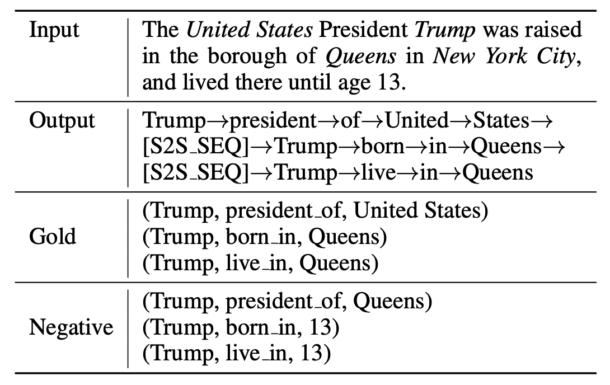

# Easy Start

This is a simple impementation of generative knowledge base population (GenKBP).

This branch is still under development and a stable version is comming soon.

# Overview

<div align=center>

</div>

We encourage the model to generate gold triples and does not generate negative ones.

## Requirements

python==3.6

apex==0.1

scipy==1.5.0

tqdm==4.47.0

transformers==3.0.2

pytorch==1.1.0

tensorflow-gpu==1.12.0

jieba==0.42.1

## Download Code

```bash
git clone https://github.com/zjunlp/DeepKE.git
cd DeepKE/example/ner/generative
```

## Install with Pip

- Create and enter the python virtual environment.
- Install dependencies: `pip install -r requirements.txt`.

## Data Preparation

NYT, WebNLP and MIE datasets you need to download from the following link before running the code
The pre-processed data is avaliable in:

NYT dataset:

https://drive.google.com/open?id=10f24s9gM7NdyO3z5OqQxJgYud4NnCJg3

WebNLG dataset:

https://drive.google.com/open?id=1zISxYa-8ROe2Zv8iRc82jY9QsQrfY1Vj

MIE dataset:

https://github.com/nlpir2020/MIE-ACL-2020/tree/master/data

For convenience, we have placed the data sets needed for the experimental project under each subfolder of /data_prepare.

## Data Preprocessing

The preprocessing and evaluation procedures for each data set are placed under the corresponding subfiles of each data set in /data_prepare.

```
>> python build_data.py       # build positive
>> python build_neg_sents.py  # build negative
```

## Download Pre-trained Language Model

The links to the pre-trained unilm1-large-cased models. Please place it in the pre-trained_model folder after downloading:

- [unilm1-large-cased](https://unilm.blob.core.windows.net/ckpt/unilm1-large-cased.bin): 24-layer, 1024-hidden, 16-heads, 340M parameters

## How to Run

### Model training:

```
python GenKBP_seq2seq.py --do_train --fp16 --amp --num_workers 0 \
  --bert_model /pre-trained_model --new_segment_ids  --data_dir data_prepare/NYT \
  --src_file date_source.txt --tgt_file date_target.txt --neg_src_file neg_source.txt \
  --neg_tgt_file neg_target.txt --output_dir /fine-tuned_model/bert_save \
  --log_dir /fine-tuned_model/bert_log  --model_recover_path /pre-trained_model/unilm1-large-cased.bin  \
  --max_seq_length 192 --max_position_embeddings 192   --trunc_seg a --always_truncate_tail --max_len_b 64 \
  --mask_prob 0.7 --max_pred 64   --train_batch_size 64 --gradient_accumulation_steps 1  \
  --learning_rate 0.00001 --warmup_proportion 0.1 --label_smoothing 0.1 \
  --num_train_epochs 50
```

### Model evaluation:

```
python GenKBP_decoder.py --fp16 --amp --bert_model /pre-trained_model \
  --new_segment_ids --mode s2s --input_file /data_prepare/NYT/test_date_source.txt \
  --split test --model_recover_path /fine-tuned_model/bert_save/finetune-model.bin \
  --max_seq_length 192 --max_tgt_length 32 --batch_size 64 --beam_size 5 \
  --length_penalty 0 --forbid_duplicate_ngrams --forbid_ignore_word "." \
  --output_file /data_prepare/NYT/test_neg_decorder.txt
```

## Experimental results

NYT results

| Model | GenKBP(UniLM) | GenKBP(Random) | CopyRE | CopyMTL | CasRel(Extractive) |
| ----- | ------------- | -------------- | ------ | ------- | ------------------ |
| P     | 94.7%         | 90.8%          | 61.0%  | 75.7%   | 89.7%              |
| R     | 84.2%         | 77.7%          | 56.6%  | 68.7%   | 89.5%              |
| F     | 89.1%         | 83.7%          | 58.7%  | 72.0%   | 89.6%              |

WebNLG results

| Model | GenKBP(UniLM) | GenKBP(Random) | CopyRE | CopyMTL | CasRel(Extractive) |
| ----- | ------------- | -------------- | ------ | ------- | ------------------ |
| P     | 92.9%         | 87.6%          | 37.7%  | 58.0%   | 93.4%              |
| R     | 75.6%         | 70.5%          | 36.4%  | 54.9%   | 90.1%              |
| F     | 83.4%         | 78.1%          | 37.1%  | 56.4%   | 91.8%              |

MIE results

| Model | GenKBP(UniLM) | GenKBP(random) | Bi-LSTM | MIE-multi |
| ----- | ------------- | -------------- | ------- | --------- |
| P     | 80.53%        | 70.75%         | 53.13%  | 70.24%    |
| R     | 78.83%        | 66.96%         | 49.46%  | 64.96%    |
| F     | 79.42%        | 68.80%         | 50.69%  | 66.40%    |

## Acknowledgments

Our code is based on [UniLM-v1](https://github.com/microsoft/unilm) and [UniLM-cn](https://github.com/YunwenTechnology/Unilm). We thank the authors for their wonderful open-source efforts.
