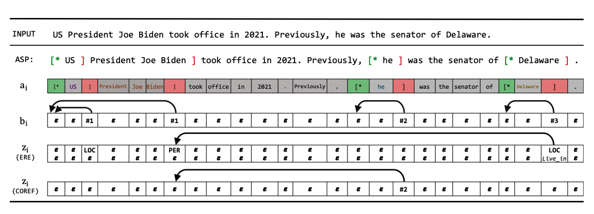

## 快速上手


<b> <a href="./README.md">English</a> | 简体中文 </b>


## 模型

<div align=center>

</div>

实体关系抽取模型**ASP** (EMNLP'22) (详情请查阅论文[Autoregressive Structured Prediction with Language Models](https://aclanthology.org/2022.findings-emnlp.70.pdf)).


### 环境依赖

> python == 3.8.16

- tqdm==4.64.1
- numpy==1.24.1
- scipy==1.10.1
- torch==1.13.1+cu116
- huggingface_hub==0.12.1
- truecase==0.0.14
- pyhocon==0.3.60
- sentencepiece==0.1.97
- wandb==0.13.9
- hydra-core==1.3.1
- transformers==4.26.0

### 克隆代码

```
git clone https://github.com/zjunlp/DeepKE.git
cd DeepKE/example/triple/ASP
```

### 使用pip或conda创建虚拟环境

- 通过pip或者conda创建python虚拟环境，再进入虚拟环境

  1. pip

  ```
  python -m venv <path_to_venv>/asp  # <path_to_venv>对应的是存放asp虚拟环境的目录路径
  source <path_to_venv>/asp/bin/activate
  pip install -r requirements.txt
  ```

  2. conda

  ```
  conda create -n asp python=3.8.16 # create a new environment (asp)
  ```

- 安装依赖

  1. 下载deepke

     注意：需要提前将DeepKE目录下的requirement.txt中的numpy==1.18.5改为1.24.1
  
  ```
  cd ~/DeepKE
  python setup.py build
  python setup.py install
  ```
  
  2. pip下载依赖
  
  ```
  pip install -r requirements.txt
  ```

  3. 安装apex加速训练包
  
  ```
  cd ~/DeepKE/example/triple/ASP
  git clone https://github.com/NVIDIA/apex
  cd apex
  ```
  
  - ​	由于cuda版本，需要将apex下面的setup.py第32行进行修改，将警告注释掉，加上一行pass，如下所示：
  
       ```
        if (bare_metal_version != torch_binary_version):
           	pass
           	#raise RuntimeError(
           	#   "Cuda extensions are being compiled with a version of Cuda that does "
           	#    "not match the version used to compile Pytorch binaries.  "
           	#    "Pytorch binaries were compiled with Cuda {}.\n".format(torch.version.cuda)
           	#    + "In some cases, a minor-version mismatch will not cause later errors:  "
           	#    "https://github.com/NVIDIA/apex/pull/323#discussion_r287021798.  "
           	#    "You can try commenting out this check (at your own risk)."
           	#)
       ```
  
  - ​	最后运行如下命令：
  
    ```
    pip install -v --disable-pip-version-check --no-cache-dir --global-option="--cpp_ext" --global-option="--cuda_ext" ./
    ```

### 使用数据进行训练预测

- 下载数据 

  ```
  cd ~/DeepKE/example/triple/ASP/data
  wget 120.27.214.45/Data/triple/ASP/CMeIE.zip
  unzip ./CMeIE.zip
  rm ./CMeIE.zip
  cd ..
  ```

  CMeIE数据集文件如下：

  - `train.json`：存放训练数据集
  - `dev.json` ：存放验证数据集
  - `test.json`：存放测试数据集

- 开始训练

  `python run_ere.py <config_name> <gpu_id>` ，训练所用到参数都在conf文件夹中，可进行调整。该任务支持多卡训练，`run_ere.py`后的两个参数中，`config_name`是数据集的名称，需要和配置文件中的一致，`gpu_id`设置为所选计算主卡，需使用略多内存，运行如下命令：

  ```
  export ASP=$PWD
  python run_ere.py CMeIE 0
  ```

- 每次训练的日志保存在 `data/CMeIE` 文件夹的`CMeIE`子文件夹内，模型结果一同保存在此。

- 进行评估 ，`CUDA_VISIBLE_DEVICES=0 python evaluate_ere.py <config_name> <saved_suffix> <gpu_id>`，其中`config_name`是数据集的名称，需要和配置文件中的一致，`saved_suffix`是在`data/CMeIE` 文件夹的`CMeIE`子文件夹内保存的模型结果（需要根据实际所存模型名，修改参数值），`gpu_id`设置为所选计算主卡，需使用略多内存，运行如下命令：

  ```
  CUDA_VISIBLE_DEVICES=0 python evaluate_ere.py CMeIE Mar05_19-39-56_2000 0
  ```


## 模型内容

1、ASP （基于论文["Autoregressive Structured Prediction with Language Models"](https://arxiv.org/abs/2210.14698))

## 数据标注

如果您只有句子和实体对但没有可用的关系标签，我们提供了基于远程监督的[关系标注工具](https://github.com/zjunlp/DeepKE/blob/main/example/re/prepare-data)。

请您在使用前确认：

- 使用我们提供的三元组文件或确保您自定义的三元组文件质量较高
- 拥有足够的源数据

## 引用 

```bibtex
@inproceedings{DBLP:conf/emnlp/LiuJMCS22,
  author    = {Tianyu Liu and
               Yuchen Eleanor Jiang and
               Nicholas Monath and
               Ryan Cotterell and
               Mrinmaya Sachan},
  editor    = {Yoav Goldberg and
               Zornitsa Kozareva and
               Yue Zhang},
  title     = {Autoregressive Structured Prediction with Language Models},
  booktitle = {Findings of the Association for Computational Linguistics: {EMNLP}
               2022, Abu Dhabi, United Arab Emirates, December 7-11, 2022},
  pages     = {993--1005},
  publisher = {Association for Computational Linguistics},
  year      = {2022},
  url       = {https://aclanthology.org/2022.findings-emnlp.70},
  timestamp = {Tue, 07 Feb 2023 17:10:51 +0100},
  biburl    = {https://dblp.org/rec/conf/emnlp/LiuJMCS22.bib},
  bibsource = {dblp computer science bibliography, https://dblp.org}
}
```
