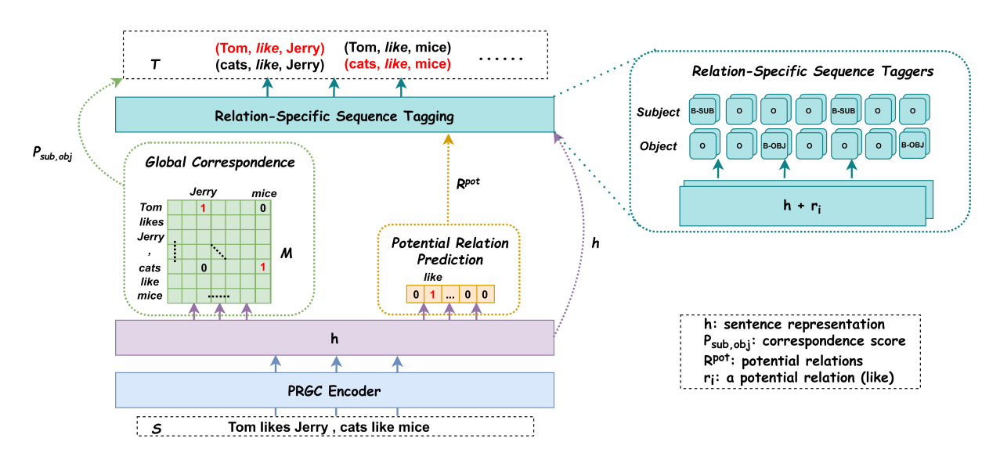

# Easy Start


<b> English | <a href="https://github.com/zjunlp/DeepKE/blob/dev/example/triple/PRGC/README_CN.md">简体中文</a> </b>


## Model
<div align=center>

</div>

Illustration of **PRGC** (ACL'21) for entity and relation extraction (Details in paper [PRGC: Potential Relation and Global Correspondence Based Joint Relational Triple Extraction](https://aclanthology.org/2021.acl-long.486.pdf)).

## Requirements

> python == 3.8

- torch == 1.10
- hydra-core == 1.3.0
- tensorboard == 2.4.1
- matplotlib == 3.4.1
- scikit-learn == 0.24.1
- transformers==4.20.0
- jieba == 0.42.1
- wandb == 0.13.9
- pandas == 1.5.3
- deepke 

## Download Code

```bash
git clone https://github.com/zjunlp/DeepKE.git
cd DeepKE/example/triple/PRGC
```

## Install with Pip

- Create and enter the python virtual environment.
- Install dependencies: `pip install -r requirements.txt`.

## Train and Predict

- Dataset

  - Download the dataset to this directory.

    ```bash
    wget 120.27.214.45/Data/triple/PRGC/CMeIE.zip
    unzip ./CMeIE.zip
    ```

  - The dataset [CMeIE](https://tianchi.aliyun.com/dataset/95414)/ [NYT](https://drive.google.com/file/d/1kAVwR051gjfKn3p6oKc7CzNT9g2Cjy6N/view)/ [NYT*](https://github.com/weizhepei/CasRel/tree/master/data/NYT)/ [WebNLG](https://github.com/yubowen-ph/JointER/tree/master/dataset/WebNLG/data)/ [WebNLG*](https://github.com/weizhepei/CasRel/tree/master/data/WebNLG) is stored in `data`:
    - `rel2id.json`：Relation Labels / Answer words - ID

    - `test_triples.json`： Test set

    - `train_triples.json`: Training set

    - `val_triples.json`：Validation set
  
- Get pre-trained BERT model for PyTorch
  - Download [BERT-Base-Cased](https://huggingface.co/bert-base-cased)/ [BERT-Base-chinese](https://huggingface.co/bert-base-chinese) which contains pytroch_model.bin, vocab.txt and config.json. Put these under ./pretrain_models.
  - Rename config.json to bert_config.json
  - Replace '-' in folder name with '_' 

- Training

  - Parameters, model paths and configuration for training are in the `conf` folder and users can modify them before training.

    ```bash
    python run.py
    ```

  - The trained model is stored in ./model directory by default.

  - Logs for training are stored in the ./logs directory by default.

- Prediction

  ```bash
  python predict.py
  ```

## Cite

```bibtex
@inproceedings{DBLP:conf/acl/ZhengWCYZZZQMZ20,
  author    = {Hengyi Zheng and
               Rui Wen and
               Xi Chen and
               Yifan Yang and
               Yunyan Zhang and
               Ziheng Zhang and
               Ningyu Zhang and
               Bin Qin and
               Xu Ming and
               Yefeng Zheng},
  editor    = {Chengqing Zong and
               Fei Xia and
               Wenjie Li and
               Roberto Navigli},
  title     = {{PRGC:} Potential Relation and Global Correspondence Based Joint Relational
               Triple Extraction},
  booktitle = {Proceedings of the 59th Annual Meeting of the Association for Computational
               Linguistics and the 11th International Joint Conference on Natural
               Language Processing, {ACL/IJCNLP} 2021, (Volume 1: Long Papers), Virtual
               Event, August 1-6, 2021},
  pages     = {6225--6235},
  publisher = {Association for Computational Linguistics},
  year      = {2021},
  url       = {https://doi.org/10.18653/v1/2021.acl-long.486},
  doi       = {10.18653/v1/2021.acl-long.486},
  timestamp = {Tue, 24 Jan 2023 18:41:07 +0100},
  biburl    = {https://dblp.org/rec/conf/acl/ZhengWCYZZZQMZ20.bib},
  bibsource = {dblp computer science bibliography, https://dblp.org}
}
```
