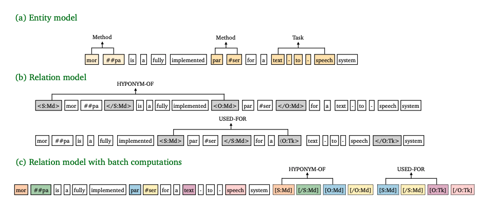

# Easy Start


<b> English | <a href="./README_CN.md">简体中文</a> </b>


## Model

<div align=center>

</div>

Illustration of **PURE** (NAACL'21) for entity and relation extraction (Details in paper [A Frustratingly Easy Approach for Entity and Relation Extraction](https://aclanthology.org/2021.naacl-main.5.pdf)).

## Requirements

> python == 3.8

- torch<1.13.0
- torchvision<0.14.0
- torchaudio<0.13.0
- tqdm==4.62.0
- allennlp==2.10.1
- transformers==4.20.0
- wandb==0.12.7
- hydra-core==1.3.1
- overrides
- requests


If you want to use a higher version of transformers, such as transformers 4.26.0, you can download [allennlp](https://github.com/allenai/allennlp). The source code is placed in the `example/triple/PURE` folder.

Modify the entityModels.py and relationModels.py in the `models` folder. The following are the required dependencies. You can copy them to the `requirement.txt` file for download.

> python == 3.8

- torch<1.13.0
- torchvision<0.14.0
- tqdm==4.62.0
- transformers==4.26.0
- wandb==0.13.9
- hydra-core==1.3.1
- huggingface_hub==0.11.1
- overrides==7.3.1
- requests==2.28.2
- dill>=0.3.4
- base58>=2.1.1
- more_itertools>=8.12.0
- cached-path>=1.1.3
- protobuf==3.19.5
- spacy>=2.1.0
- fairscale==0.4.6
- jsonnet>=0.10.0 ; sys.platform != 'win32'
- nltk>=3.6.5
- numpy>=1.21.4
- tensorboardX>=1.2
- requests>=2.28
- tqdm>=4.62
- h5py>=3.6.0
- scikit-learn>=1.0.1
- scipy>=1.7.3
- pytest>=6.2.5
- sentencepiece>=0.1.96
- dataclasses;python_version<'3.7'
- filelock>=3.3
- lmdb>=1.2.1
- termcolor==1.1.0

## Download Code

```bash
git clone https://github.com/zjunlp/DeepKE.git
cd DeepKE/example/triple/PURE
```

## Install with Pip

- Create and enter the python virtual environment.
- If your cuda verision is 11.6, please install torch==1.12.0+cu116: `pip install torch==1.12.0+cu116 torchvision==0.13.0+cu116 torchaudio==0.12.0 --extra-index-url https://download.pytorch.org/whl/cu116`.
- Install dependencies: `pip install -r requirements.txt`.

## Train and Predict

- Dataset

  - Download the dataset to this directory.

    ```bash
    cd data/
    wget 120.27.214.45/Data/triple/PURE/CMeIE.zip
    unzip CMeIE.zip
    ```
  
  - One types of data formats are supported,including `json`. The dataset  is stored in `data/CMeIE/json`:
    
    - `train.json`: Training set
    -  `dev.json `: Validation set
    - `test.json`: Test set
    
    Relation types stored in `src/deepke/triple_extraction/PURE/models/const.py`.
  
- Training

  - Parameters for training are in the `conf` folder and users can modify them before training. You can modify `trian.yaml` parameter to get the result you want. You can also download some the pre-trained entity model or full relation model and put them in the `pretrain_models`folder.

  - some important parameters are as follows:

    - data_dir: path to the preprocessed dataset.

    `Entity model's parameters:`

    - entity_do_train: whether to run training.

    - entity_do_eval: whether to run evaluation.

    - entity_eval_test: whether to evaluate on test set (If entity_do_eval is true and entity_eval_test is false, evaluating on dev set).

    - entity_single_card: Whether to use single card training (default is False)

    - entity_learning_rate: learning rate for the BERT encoder.

    - entity_task_learning_rate: learning rate for task-specific parameters, i.e., classification head.

    - entity_train_batch_size: batch size during training.

    - entity_num_epoch: number of the training epochs.

    - entity_context_window: the context window size W for the entity model.

    - entity_model: the base model name (a huggingface model) (Please keep the relation_model and entity_model consistent).

    - entity_output_dir: output directory of the entity model (include log, trained model, entity prediction, etc).

    - entity_test_pred_filename: the prediction filename for the tese set.

    - entity_dev_pred_filename: the prediction filename for the dev set.

    `relation model's parameters:`

    - no_cuda: Whether not to use CUDA when available
    - relation_train_file: The path of the training data.
    - relation_do_lower_case: Set this flag if you are using an uncased model.
    - relation_single_card: Whether to use single card training (default is False)
    - relation_train_batch_size: Total batch size for training.
    - relation_eval_batch_size: Total batch size for eval.
    - relation_learning_rate: The initial learning rate for Adam.
    - relation_num_train_epochs: Total number of training epochs to perform.
    - relation_max_seq_length: The maximum total input sequence length after WordPiece tokenization. Sequences longer than this will be truncated, and sequences shorter than this will be padded.
    - relation_prediction_file: The prediction filename for the relation model.
    - relation_output_dir: The output directory where the model predictions and checkpoints will be written.

  - Logs for training are in the `pretrain_models` folder and the trained model is saved in `pretrain_models` .  

  ```bash
  python run.py
  ```

- Prediction

    The model predictions and checkpoints will be written in `relation_output_dir`(default: `pretrain_models/rel-cmeie-ctx0/` ).
  ```bash
  python predict.py
  ```

## Cite

```bibtex
@inproceedings{DBLP:conf/naacl/ZhongC21,
  author    = {Zexuan Zhong and
               Danqi Chen},
  editor    = {Kristina Toutanova and
               Anna Rumshisky and
               Luke Zettlemoyer and
               Dilek Hakkani{-}T{\"{u}}r and
               Iz Beltagy and
               Steven Bethard and
               Ryan Cotterell and
               Tanmoy Chakraborty and
               Yichao Zhou},
  title     = {A Frustratingly Easy Approach for Entity and Relation Extraction},
  booktitle = {Proceedings of the 2021 Conference of the North American Chapter of
               the Association for Computational Linguistics: Human Language Technologies,
               {NAACL-HLT} 2021, Online, June 6-11, 2021},
  pages     = {50--61},
  publisher = {Association for Computational Linguistics},
  year      = {2021},
  url       = {https://doi.org/10.18653/v1/2021.naacl-main.5},
  doi       = {10.18653/v1/2021.naacl-main.5},
  timestamp = {Fri, 06 Aug 2021 00:41:31 +0200},
  biburl    = {https://dblp.org/rec/conf/naacl/ZhongC21.bib},
  bibsource = {dblp computer science bibliography, https://dblp.org}
}
```
